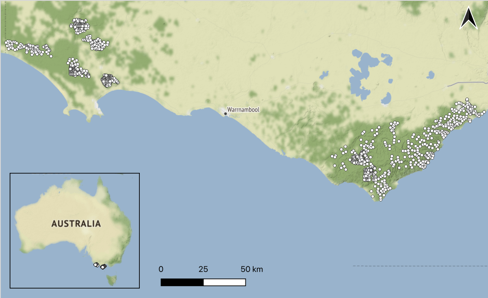
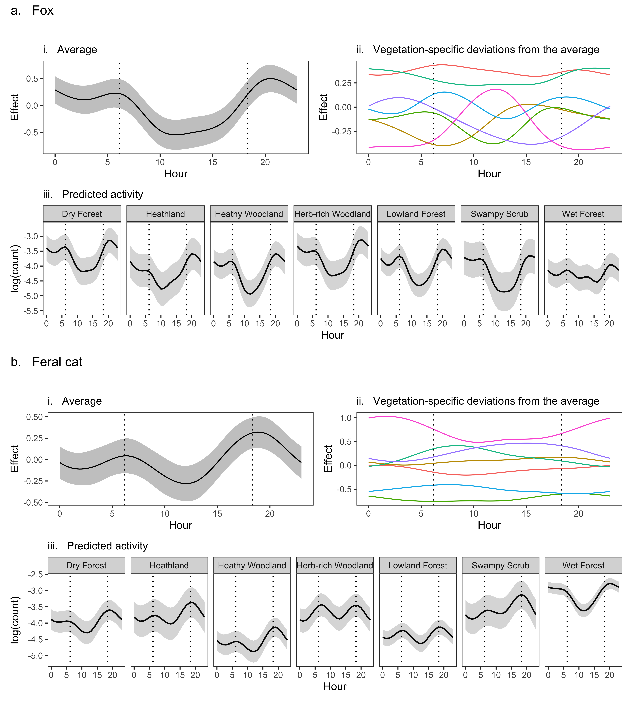
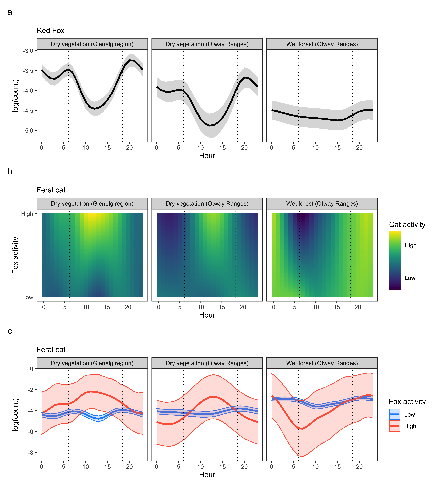
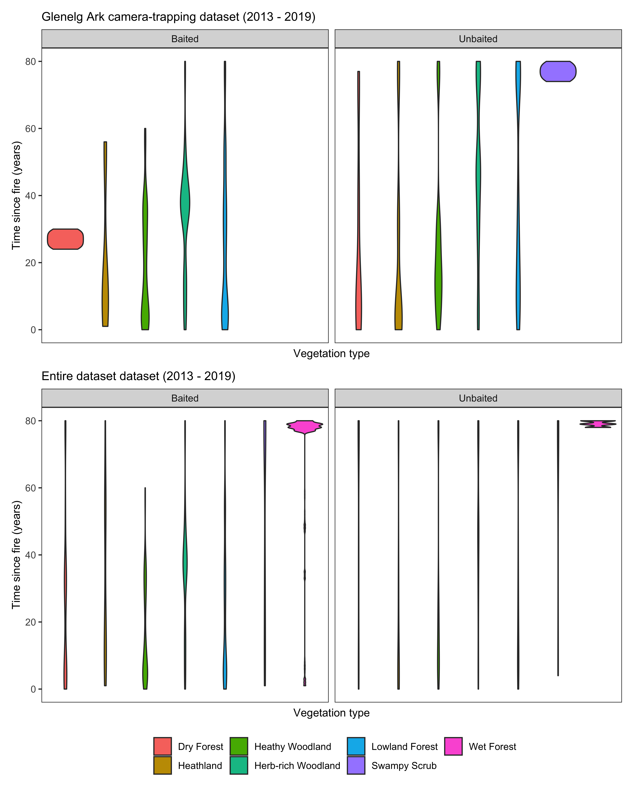

---
# *============================================================================*
#                UNIVERSITY OF MELBOURNE RMARKDOWN THESIS
# *============================================================================*

# +----------------------------------------------------------------------------+
#  This bookdown template can be used to create a thesis for the University of
#  Melbourne.
#  
#  This document defines all the metadata associated with the thesis in a YAML
#  (YAML Ain't Markup Language) header. Your text should be placed in other 
#  RMarkdown documents (usually one per chapter). Edit the `_bookdown.yml` file
#  to change the order etc. of the other files. See 
#  https://bookdown.org/yihui/bookdown/ for more details on how to use bookdown.
# +----------------------------------------------------------------------------+

# *============================================================================*
#  TITLE PAGE
# *============================================================================*

# +-----Title------------------------------------------------------------------+

title: "Managing Interacting Invasive Predators for Biodiversity Conservation"

# +-----Author-----------------------------------------------------------------+
author: "Matthew W. Rees"
orcid: "0000-0003-2549-3772"

# +-----Degree-----------------------------------------------------------------+
degree: "Doctor of Philosophy"

# +-----Submission date--------------------------------------------------------+
#  By default these are set based on when the document is built but that they
#  also be manually controlled.
# +----------------------------------------------------------------------------+

submissionmonth: "`r format(Sys.Date(), '%B')`"
submissionyear: "`r format(Sys.Date(), '%Y')`"

# +-----Institute--------------------------------------------------------------+
#  Whatever is in the `department` field is placed first with the `university`
#  below it. If you are assoicated with multiple departments/institutes you
#  might need to adjust the format or consider how to include your information.
# +----------------------------------------------------------------------------+

department: "School of Ecosystem and Forest Sciences"
university: "The University of Melbourne"

# +-----Statement--------------------------------------------------------------+

statement: |
  Submitted in total fulfilment of the requirements of the degree of Doctor of Philosophy.

# *============================================================================*
#  FRONT MATTER
#
#  Other sections that come after the title page but before the main text.
#
#  By default these are pulled from other files (for PDF output) but they can
#  also be included directly here. Setting any of these sections to `FALSE` will
#  remove them from the final document.
# *============================================================================*

# +-----Abstract---------------------------------------------------------------+

abstract: |
  `r if(knitr:::is_latex_output()) paste(readLines("00_frontmatter/00-01-abstract.Rmd"), collapse = "\n  ")`

# +-----Declaration------------------------------------------------------------+

declaration: |
  `r if(knitr:::is_latex_output()) paste(readLines("00_frontmatter/00-02-declaration.Rmd"), collapse = "\n  ")`

# +-----Preface----------------------------------------------------------------+

preface: |
  `r if(knitr:::is_latex_output()) paste(readLines("00_frontmatter/00-03-preface.Rmd"), collapse = "\n  ")`

# +-----Acknowledgements-------------------------------------------------------+

acknowledgements: |
  `r if(knitr:::is_latex_output()) paste(readLines("00_frontmatter/00-04-acknowledge.Rmd"), collapse = "\n  ")`

# +-----List of tables---------------------------------------------------------+
#  Should only be included if you have at least 10 tables
# +----------------------------------------------------------------------------+

lot: true

# +-----List of figures--------------------------------------------------------+
#  Should only be included if you have at least 10 figures
# +----------------------------------------------------------------------------+

lof: true

# +-----List of copyright------------------------------------------------------+
#  List of all third party copyright material included in the thesis and whether
#  permissions have been obtained to include this content in the open access
#  version of the thesis.
# +----------------------------------------------------------------------------+

copyrightlist: |
  `r if(knitr:::is_latex_output()) paste(readLines("00_frontmatter/00-05-copyrightlist.Rmd"), collapse = "\n  ")`

# *============================================================================*
#  CITATIONS
# *============================================================================*

# +-----Bibliography-----------------------------------------------------------+
#  Export your bibliography database as a bibtex file and refer to it here.
# +----------------------------------------------------------------------------+

bibliography: "bib/thesis.bib"

# +-----Citation style---------------------------------------------------------+
#  To change your citation style download a Citation Style Language file from 
#  https://www.zotero.org/styles and refer to it to change the appearance of
#  your citations. See https://citationstyles.org/ for more details.
# +----------------------------------------------------------------------------+

csl: "style/ecology_letters.csl"

# *============================================================================*
#  OUTPUT FORMATS
#
#  These options control the various output formats. You may be able to control
#  some things but editing these, other things will require editing the template
#  files or the underlying functions.
# *============================================================================*

knit: "bookdown::render_book"
site: "bookdown::bookdown_site"
output: 
    unimelbdown::thesis_pdf:
        template: "style/template.tex"
        toc: true
        toc_depth: 3
    # unimelbdown::thesis_gitbook: default
    # unimelbdown::thesis_word:
    #     reference_docx: "style/template.docx"
    #     toc: true
    #     toc_depth: 3
    #     fig_caption: true
    # unimelbdown::thesis_epub: default
---

```{r install-package, include = FALSE}
# This chunk ensures that the unimelb package is installed and loaded. This
# unimelb package includes the template files for the thesis.
if(!require(devtools))
  install.packages("devtools", repos = "http://cran.rstudio.com")
if(!require(unimelbdown))
  devtools::install_github("lazappi/unimelbdown")
library(unimelbdown)

#if(!require(devtools))
#  install.packages("devtools", repos = "http://cran.rstudio.com")
#if(!require(unimelbdown)){
#  library(devtools)
#  devtools::install_github("lazappi/unimelbdown")
#}
library(unimelbdown)
library(secr)
library(magick)
library(tidyverse)
library(kableExtra)
library(mgcv)            
library(camtrapR)        
library(RColorBrewer)    
library(pander)          
library(gratia)
library(patchwork)
library(viridis)         
library(sf) 
library(sp) 
library(terra)
```

```{r knitr-options, include = FALSE}
knitr::opts_chunk$set(
  echo      = FALSE,
  warning   = FALSE,
  message   = FALSE,
  error     = FALSE,
  cache     = FALSE,
  fig.path  = "figure/",
  fig.align = "center",
  out.width = "100%",
  optipng   = knitr::hook_optipng
)
```


<!-- This is required for HTML output. If there is no text in index.Rmd then
index.html will not be created. -->
`r if(knitr:::is_html_output()) '# Front matter {-}'`

<!--chapter:end:index.Rmd-->

<!-- This document is used to add the front matter to formats other than LaTeX
(mostly word). These sections can be removed if you don't want them or the whole
file excluded from _bookdown.yml.--->

```{r frontmatter}
tex  <- TRUE
docx <- FALSE
html <- FALSE

if (!knitr:::is_latex_output()) {
    tex <- FALSE
    if (knitr:::is_html_output()) {
        html <- TRUE
    } else {
        docx <- TRUE
    }
}
```

`r if (html) '## Abstract {-}'`
`r if (docx) '######### Abstract {-}'`

`r if (!tex) paste(readLines("00_frontmatter/00-01-abstract.Rmd"), collapse = "\n  ")`

`r if (html) '## Declaration {-}'`
`r if (docx) '######### Declaration {-}'`

`r if (!tex) paste(readLines("00_frontmatter/00-02-declaration.Rmd"), collapse = "\n  ")`

`r if (html) '## Preface {-}'`
`r if (docx) '######### Preface {-}'`

`r if (!tex) paste(readLines("00_frontmatter/00-03-preface.Rmd"), collapse = "\n  ")`

`r if (html) '## Acknowledgements {-}'`
`r if (docx) '######### Acknowledgements {-}'`

`r if (!tex) paste(readLines("00_frontmatter/00-04-acknowledge.Rmd"), collapse = "\n  ")`

`r if (html) '## List of copyright {-}'`
`r if (docx) '######### List of copyright {-}'`

`r if (!tex) paste(readLines("00_frontmatter/00-05-copyrightlist.Rmd"), collapse = "\n  ")`

<!--chapter:end:00_frontmatter/00_00_frontmatter.Rmd-->

# General Introduction 

## Mesopredator release hypothesis 


"In the absence of large predators, smaller predators can become more abundant (mesopredator release) and, in turn, may cause the local extinction of vulnerable prey species." - @soule1988reconstructed. 
 
Against a backdrop of growing evidence that subordinate predator species ‘undergo population explosions’ in the absence of dominant predators, @soule1988reconstructed first coined the term 'mesopredator release'. @soule1988reconstructed found that where coyotes *Canis latrans* were absent in California, U.S.A, domestic cats *Felis catus* were more prevalent and populations of native birds succumbed to extinction. There have since been many other high-profile examples of the mesopredator release across a wide range of taxa, spanning Europe [@elmhagen2007trophic], Africa [@gorman1998high], Australia [@johnson2007rarity] and in many marine systems [@baum2009cascading]. Grounded in traditional-food web ecological theory, the mesopredator release hypothesis (hereafter 'MRH') is a simple and intuitive hypothesis. So why, 33 years later, does the MRH remain highly contentious [e.g., @allen2017can].
 
Firstly, there is a lack of replicated, robust evidence for the MRH for many ecosystems. This is partly because it is often difficult to obtain sufficient data to quantify changes in subordinate predator behaviour and density, particularly within an experimental design [@glen2007evaluating]. Predators are typically cryptic and occur widely across broad landscapes, at low densities. Hence very large areas may need to be surveyed intensively to obtain sufficient sample sizes [@royle2008statistical]. Furthermore, spatially-independent but otherwise similar landscapes without top predator declines can be difficult to find [e.g. @dexter2009impact]. Without robust experimental designs, it is difficult to attribute changes in mesopredator populations to apex predator declines [@hayward2015ecologists; @treves2019predator]. 
 
Secondly, evidence for the MRH often relies on vague population metrics. Dominant predators can suppress subordinate predators through direct killing, resource competition and/or fear-induced behavioural changes [@ritchie2009predator]. Mesopredator release was originally defined as a numerical increase in subordinate predator population density following apex predator decline [@soule1988reconstructed], but has since been expanded to also include changes in distribution and behaviour [@brashares2010ecological]. Many of the North American field studies reviewed by @jachowski2020identifying provided mixed support for MRH because different population metrics provided conflicting inference. @jachowski2020identifying called for clearer separation of spatial, numerical and behavioural processes, which are often wrapped together in commonly used "abundance" indices [@stephens2015management]. It is particularly important to account for changes in subordinate predator detectability when testing mesopredator release, because a relaxation of subordinate predator behaviour may be falsely interpreted as an increase in abundance. The few examples of mesopredator release that have directly estimated changes in mesopredator population density (rather than rely on an index) have mostly used live capture-rates to infer mesopredator population density [e.g. @arjo2007changes; @karki2007effects; @thompson2007food; @berger2008indirect; @jones2008sudden]. This approach still fails to account for behavioural changes which may have, for example, made individuals more trappable. Moreover, these traditional survey and statistical methods have an ill-defined spatial extent; this is problematic because sampling scale can bias perceived species interactions [@guillaume2020co; @efford2012occupancy].  
 
Thirdly, the MRH can be an overly simplistic representation of complex ecosystems [@haswell2017large]. Most evidence for mesopredator release comes from North America and other regions with many co-occurring apex predators [@ritchie2009predator]. MRH refers to a singular, direct negative association between a dominant and a subordinate predator species, overlooking the complex webs of positive, negative, direct, indirect and probably nonlinear interactions which occur in multi-predator systems [@levi2012wolves; @prugh2020enemies; @finke2004predator; @johnson2007rarity]. Additionally, bottom-up processes (such as ecosystem productivity and prey availability) can interact with top-down processes to determine the prevalence and strength of mesopredator release [@elmhagen2007trophic; @greenville2014bottom; @oksanen2000logic]. In these circumstances, intensive multispecies monitoring and sophisticated statistical analyses are likely to be required to distinguish mesopredator release from the background drivers of predator populations, but this has rarely taken place [@jachowski2020identifying]. 
 
In the context of the MRH, the dominant predator species is often referred to as an ‘apex’ or ‘top’ predator, and subordinate species as ‘meso-’ or ‘middle-rank’ predators. This can be confusing because a particular species may function as a dominant predator in one system or context, and a subordinate predator in another. For example, in the classic Californian MRH example, coyotes *Canis latrans* are described as an apex predator as they are the largest carnivore present [@crooks1999mesopredator]; however, coyotes evolved as mesopredators in systems with larger carnivores, such as wolves *Canis lupus* [e.g. @berger2008indirect]. @wallach2015apex argues that the term apex predator should be reserved for predators that self-regulate their own population densities, by limiting their reproductive and recruitment rates, and exhibit cooperative and territorial behaviours. These tend to be large species above 13 – 16 kg [@wallach2015apex]. Meanwhile, they define mesopredators as predators that are regulated by extrinsic factors (top-down and bottom-up control) and have fast reproductive rates. These species tend to be smaller, generalists and more susceptible to mesopredator release, responding quickly to the removal of top-down control [@wallach2015apex; @prugh2009rise]. Mesopredators may even exploit the available prey more thoroughly than apex predators following release, as their honed behaviours allow them to use resources efficiently while under persecution. Hence mesopredators often thrive in human-dominated landscapes and become successful invasive species in locations outside their natural distribution [where they may be the largest predator present; @prugh2009rise; @vance2007influence; @holt1997theoretical]. However, for consistency with the MRH literature, I will refer in this thesis to the dominant predator of a particular ecosystem as the apex predator, and subordinate species as a mesopredator.
 
A lack of understanding of the conditions that lead to mesopredator release hinders effective conservation management. Around the world, the functioning of ecosystems has been degraded by apex predator declines [@ripple2014status; @heithaus2008predicting]. Managers need to be able to predict outcomes of continued apex predator declines [@estes2011trophic], as well as improvements [@chapron2014recovery] and reintroductions [@baker2017ensemble]. Simultaneously, some mesopredators have spread far beyond their native range [@wallach2015novel]; these ‘invasive’ predators are a leading cause of global biodiversity and economic decline [@bellard2016global; @doherty2016invasive], particularly if they are the dominant predator in the new ecosystem. Accordingly, lethal control of invasive predators is a prevalent management strategy worldwide. However, when a system is invaded by multiple predator species, controlling a single invasive predator species can backfire and worsen outcomes for native species [@ballari2016potential; @doherty2017stop]. This is most likely due to the release of subordinate invasive species [e.g. @rayner2007spatial]. A better understanding of the interactions between invasive predator species is key to improving conservation outcomes [@zavaleta2001viewing]. 
 
Debate over the MRH rages in Australia--a continent that has 'institutionalised' poisoning of predators [@philip2019institutionalisation]. The dingo *Canis familiaris* is Australia's native mammalian apex predator and widely persecuted, mainly for purported agricultural benefits [@smith2015dingo]. This is thought to have promoted the spread and increased the density and impact of two invasive mesopredators, the red fox *Vulpes vulpes* (hereafter 'fox') and feral cat (hereafter 'cat'), in turn contributing to Australia’s ongoing extinction crisis [@wallach2010predator; @johnson2007rarity; @newsome2017top; @woinarski2015ongoing]. Literature covering the dingo-debate hypothesises that both foxes and cats can benefit from dingo decline, however, alternative theory predicts an among-carnivore cascade [@levi2012wolves]: in a dingo (~15 kg) - fox (~6 kg) - cat (~4 kg) hierarchy, dingo suppression would benefit foxes and consequently disadvantage cats. Competition between these invasive predators should be high: foxes and cats occupy a similar niche with high dietary overlap [@glen2005complex; @stobo2021reptiles; @stobo2021sharing; @woinarski2021compounding]. 
 
Evidence that foxes exert top-down pressure on cats in Australia is unclear [@hunter2018not]. The strongest evidence comes from targeted lethal fox control programs in southern Australia. In these regions, dingoes are often absent and so the medium-large mammalian carnivore guild comprises only these two invasive mesopredators. Here, the larger fox is expected to fill the role of an apex predator, with the cat being subordinate [@glen2005complex]. In these regions, foxes are also widely managed for biodiversity conservation within protected areas; however, few fox management programs have demonstrated improvements in native biodiversity and several long-term studies have reported perverse outcomes [@wayne2017recoveries; @marlow2015cats; @lindenmayer2018conservation; @duncan2020eruptive; @dexter2009impact; @kinnear2016fox]. Mesopredator release of cats is commonly suspected to be the cause [although, @duncan2020eruptive offers an alternative hypothesis regarding prey overshooting carrying capacities]. The @risbey2000impacts exclusion experiment offers a compelling case study: shared prey abundance declined in a landscape with targeted fox control, but prey trajectories improved in a landscape where both foxes and cats were controlled, relative to a landscape without any predator management.
 
On average, cat activity (i.e., abundance indices) appears to increase following targeted fox control, but this estimate is uncertain [@hunter2018not], and fails to distinguish changes in cat behaviour from changes in cat density. Notably, @molsher2017mesopredator found no difference in the relative abundance of cats (spotlight counts) but observed changes in cat diet (increased invertebrate and carrion consumption) and space use (smaller home-ranges and increased foraging in relatively open habitats) following fox control. Changes in feral cat density in response to fox control have not been directly estimated. Distinguishing numerical population change from behavioural changes is a clear priority for improving the understanding of fox-cat interactions, mesopredator release and invasive predator management approaches in Australia [@hayward2015ecologists]. 
 
My thesis aims to examine the mesopredator release of cats following fox control from several different angles, using experimental designs replicated across two regions of south-eastern Australia. In accordance with the MRH, I expected that lethal control of foxes would increase cat occurrence and density, and alter cat behaviour. I firstly investigated whether apex predator control effort was associated with an increase in the occupancy rates of a mesopredator (Chapter 3). I secondly estimated direct changes in mesopredator density following apex predator suppression using traditional experimental designs, while accounting for changes in detectability (Chapter 4). In doing so, I also derived the first estimates of cat density for wet forest environments (Chapter 2). I thirdly investigated how top predator activity influenced the spatiotemporal activity of a mesopredator through a 'landscape of fear' [@laundre2001wolves]; Chapter 5). These chapters highlight the different ways in which mesopredator release can manifest and how different population metrics provide different inferences on the MRH.  
 
Testing the MRH in a simple predator guild comprising the invasive fox and cat, and experimentally surveying landscapes with and without lethal fox control (1080 poison-baiting) allowed a sharp focus on the interactions between these two invasive predators across experimental gradients of top predator activity [@kreyling2018replicate], without the complicating effect of having a genuine top predator (dingo) in the system. It also facilitated some examination of the resulting impacts on two threatened native prey species, and an investigation of the bottom-up drivers of invasive predator and threatened native mammal occurrence, including the effect of fire across different vegetation types, rainfall patterns and habitat fragmentation (Chapter 3).  
 
Much of our current understanding of the ecology and impacts of invasive predators in Australia comes from semi-arid and arid regions [@legge2017enumerating; @doherty2015critical]; my research provides some of the first investigations of invasive predator density, distributions and interactions within temperate forest ecosystems, particularly wet and cool temperate rainforests. Experimental invasive predator studies in these environments have been previously called for [@glen2005complex; @doherty2015critical; @legge2017enumerating; @hayward2015ecologists]. My work sheds light on optimal methods for monitoring and managing invasive predators for the benefit native fauna in temperate, heterogeneous landscapes.  


## Study species
 
This thesis focuses on two invasive predators, the red fox and feral cat. Foxes and cats in Australia share a similar functional niche and compete for many of the same resources [@glen2005complex]. Chapter 3 also investigates the impact of fox control on two of their shared native mammalian prey species, the southern brown bandicoot (hereafter 'SBB') *Isodon obesulus* and long-nosed potoroo (hereafter 'LNP') *Potorous tridactylus*. These native marsupials are both solitary, medium-sized, ground-dwellings, and listed as threatened under federal legislation (*Environmental Protection and Biodiversity Conservation Act 1999*).  They are also flagship species for the Ark fox-baiting programs that formed the experiments for this thesis. SBBs and LNPs nest in dense understorey vegetation during the day and turn over large quantities of soil to feed on invertebrates, plant material and fungi at night–key behaviours which sustain ecosystem function [@nuske2017redundancy; @fleming2014loss]. More species-specific ecological information is provided below. 
 
### Red fox 
Introduced to Australia in the early 1870s, European red foxes (~6 kg) are now ubiquitous across the Australian mainland except for tropical areas to the north [@fairfax2019dispersal]. Foxes can be highly territorial [@cavallini1996variation]. They live in family groups comprising a dominant pair and their juvenile cubs [@cavallini1996variation]. In productive areas, fox territories are smaller, more rigidly defended and adult offspring are more likely to remain with the group and help the dominant vixen raise cubs - resulting in higher population densities [@cavallini1996variation]. Foxes are classically considered mesopredators  [@wallach2015apex], particularly because many of these behaviours break down in highly productive agricultural environments and urban areas, reaching high population densities (> 4 foxes km^-2^). However, foxes can have many apex predator-like self-regulating behaviours, as characterised by [@wallach2015apex] including reproductive limitation, infanticide, alloparental care and strong territoriality [@moehlman1997cooperative; @baker2004polygynandry; @braastad1993maternal]. Foxes follow seasonal behavioural patterns: mating occurs in winter, cubs are born in spring (average litter sizes being 3 to 6 cubs), and dispersal occurs in autumn [@hradsky2019foxnet]. Foxes are omnivorous and true generalists; taking advantage of all available prey and frequently scavenge carcasses [@fleming2021diet], making them easy targets of poison-baiting campaigns [@mcleod2014fertility]. Notable differences from the diet of cats include small livestock, large macropods and fruits [@stobo2021sharing; @stobo2021reptiles; @woinarski2021compounding].
 
### Feral cat 
The feral cat (~4 kg) is one of the most  adaptable and widely distributed terrestrial mammalian predators. It took less than a century for cats to spread across the entire Australian continent following colonisation, owing to their wide thermal tolerance and non-reliance on free-standing drinking water [@abbott2008spread]. Cats are largely solitary across Australia’s typical natural environments, although they can form dense matrilineal societies in areas with rich resources [e.g., farms, rubbish tips, seabird colonies; @denny2002social]. Densities in more natural Australian environments range from 0.01 to 1.5 cats km^-2^ [@legge2017enumerating; @hamer2021differing]. Female cat home-range size scales negatively with landscape productivity [@bengsen2016feral], from less than 100 ha to more than 600 ha [@hamer2021differing]. Male cat home-range size varies with that of females, but is larger on average because dominant males typically overlap the ranges of two to three females  [@bengsen2016feral]. Home ranges often overlap [@glen2005complex] and some individuals do not have a fixed home-range [@roshier2021space]. Feral cats can breed several times a year with litters of up to five kittens [@jones1982ecology]. Feral cats are obligate carnivores, they prefer live prey but occasionally scavenge [@doherty2015continental]. They do not readily take most types of meat bait, particularly in temperate regions with abundant prey [@fisher2015cat].
Feral cats are indeed archetypal mesopredators. 
 
### Southern brown bandicoot
The 'SBB' (~1.2 kg) *Isodon obesulus* occurs in isolated populations across the southern coast of the Australia mainland and in Tasmania, mostly found in heathy landscapes, woodlands and dry forests [@van2008mammals]. SBBs are solitary, with home-range size varying from 0.5 - 6 ha [@lobert1990home]. Females have remarkable reproductive rates: a gestation period of 11 days, producing two - three litters per breeding season (six month duration), averaging two to four young, who become independent after 60 days [@brown2010national]. Estimates of mainland SBB density average approximately 130 individuals km^-2^ [@pentland1999population].
 
### Long-nosed potoroo 
The LNP (~1.3 kg) *Potorous tridactylus* has a patchy distribution down the eastern coast of Australia from south-eastern Queensland to south-eastern South Australia; it also occurs throughout the north and east coasts of Tasmania [@van2008mammals]. LNPs occupy a wide range of vegetation communities, from heathlands to rainforests [@van2008mammals]. Females give birth to a single young up to four times a year, and provide each with ~133 days of lactation in the pouch [@frankham2011population]. In south-west Victoria, LNPs have a home range size of 1.4 - 2 ha [@bennett1987conservation]. LNP populations are generally small, at densities of 20 - 60 individuals km^-2^, with low rates of juvenile recruitment and individual turnover [@mason1998habitat; @frankham2011population].


\newpage

$~$

$~$

$~$

```{r intro-conceptual, out.width = "70%", fig.cap = "Conceptual diagram of direct (solid line) and indirect (dashed line) positive (blue) and negative (red) interactions tested in this thesis. Fox control in Australia (in this case via 1080 poison-baiting) aims to suppress invasive red foxes, thereby benefiting two threatened prey species - the southern brown bandicoot and long-nosed potoroo. However, fox control may cause mesopredator release of feral cats (because foxes may exert top-down and competitive pressure on cats), which could lead to a net negative impact on their shared prey such as these two threatened native mammals."}

```

<!--chapter:end:01_chapters/01-01-introduction.Rmd-->


# Unexpectedly high densities of feral cats in a rugged temperate forest {#otways17}

## Abstract {-}

Effective invasive predator management requires accurate knowledge of population density. However, density can be difficult to estimate for wide-ranging, cryptic and trap-shy species, such as the feral cat *Felis catus*. Consequently, few density estimates exist for this invasive predator of global significance, particularly from rugged, mesic or structurally complex habitats where detection is challenging. In this study, we estimated feral cat density in the wet forests and cool temperate rainforests of the Otway Ranges, south-eastern Australia, to (1) provide a density estimate for this rarely surveyed habitat type, and (2) verify predictions from a continental-scale model of feral cat density. We deployed 140 camera traps across two independent 49 km^2^ grids and identified individual feral cats based on unique pelage markings. Using spatially explicit mark-resight models, we estimated that there were 1.14 cats km^-2^ (95% CI: 0.88 – 1.47). This is more than three times the average cat density in natural environments across Australia, and at least five times higher than model-based predictions for the Otway Ranges. Such high densities of feral cats likely reflect the abundance of small native mammals and lack of apex predators in our study area. Our findings contradict the widespread assumption that feral cats occur at very low densities in mesic and rugged habitats. Underestimating the density of feral cats in these environments has significant implications for pest animal management and biodiversity conservation.

\newpage

## Introduction

Accurate estimates of the distribution and abundance of invasive predators are essential to determine ecosystem impacts, inform effective management and target control efforts. However, this information is difficult to obtain as predators are often cryptic, trap-shy and occur at low densities [@royle2008statistical]. A prominent example is the feral cat *Felis catus*, which is implicated in the extinction or decline of 430 species globally [@doherty2017impacts]. A better understanding of feral cat density has been highlighted as a priority for effective management of both this species and its threatened native prey [@woinarski2014action; @legge2017enumerating; @moseby2019understanding].

@legge2017enumerating developed a continental-scale model of feral cat density for Australia which has had considerable implications for feral cat research and management. For instance, the model has been used to estimate the number of birds, reptiles and mammals killed annually across Australia by feral cats [@woinarski2017birds; @woinarski2018reptiles; @murphy2019introduced]. As the model estimated that there were considerably fewer feral cats in Australia than previously expected, it also casts doubt on the feasibility of Australian Federal Government’s plan to cull two million feral cats between 2015 and 2020 [@doherty2019conservation]. Given the importance of feral cat density estimates for policy, planning and management, it is vital to verify and refine the model’s predictions.

The underlying data used by @legge2017enumerating had several limitations, including that feral cat density estimates were not available for any wetland, mangrove, dense heath or rainforest environments in Australia [@legge2017enumerating]. This likely reflects the difficulty of access and ineffectiveness of traditional feral cat monitoring methods (track counts and spotlight counts) in these structurally complex habitats [@denny2010review]. @legge2017enumerating highlighted the need for more site-based density surveys, particularly in these under-studied environments. Further, nearly all of the density estimates collated by @legge2017enumerating were based on studies that did not identify individual cats or account for imperfect detection (i.e. the possibility that some individuals were not detected). Such methods can be unreliable when inferring across sites, times, ecological contexts and different detection methods [@edwards2000evaluation; @hayward2015ecologists], particularly for species such as cats whose densities may fluctuate substantially over time in some regions [@legge2017enumerating]. Concurrent surveys of cats on Kangaroo Island and the adjacent Australian mainland suggests that the @legge2017enumerating model may substantially underestimate this variation in density [@taggart2019evidence].

Robust population density estimates for cryptic and wide-ranging species based on individual identification are now more feasible due to recent advances in technology and statistical models. Camera-traps that sense temperature-in-motion provide an efficient survey approach across diverse environments and are particularly beneficial for studies of trap-shy species with unique markings, such as feral cats [@bengsen2011estimating]. Concurrently, spatial mark-resight (SMR) models, an extension of spatial capture-recapture models, enable population density estimates when a portion of the population can be individually identified [@royle2013spatial]. These models consider both the distribution and movement of individuals across the landscape in relation to the placement of detectors, and account for imperfect detection [@royle2013spatial]. The combination of camera-trap surveys to identify individuals and spatial capture-recapture methods to estimate density has shown promise for both feral and domestic cats [@cove2018free; @jimenez2017estimating; @mcgregor2015density; @robley2017towards; @robley2018estimating].

The small number of studies that have estimated feral cat density in the mesic regions of south-eastern Australia indicate that these habitats support few feral cats relative to other regions [@legge2017enumerating]. However, survey effort for feral cats in these environments has been low compared to more arid regions. Our study therefore aimed to provide: (1) a density estimate for a rarely surveyed environment – a matrix of wet forest and cool temperate rainforest, and (2) an independent verification of the prediction from the @legge2017enumerating continental-scale model of feral cat density for the Otway region. To achieve these aims, we undertook a camera-trap survey over 8,230 trap nights at 140 sites in the Otway Ranges, south-eastern Australia. We derived feral cat density estimates by applying SMR analysis to our camera survey data.


\newpage

## Methods

### Study area
Our study was conducted in the Great Otway National Park and Otway Forest Park, Victoria, Australia (38.42 &deg;S, 142.24 &deg;E). The locality is 90 – 440 m a.s.l. and has a cool-temperate climate: maximum daily temperatures average 19.3 &deg;C in summer and 9.5 &deg;C in winter; annual rainfall averages 1955 mm [@BOM2021]. The vegetation is a mosaic of old-growth shrubby wet forest, wet forest and cool temperate rainforest, with an overstorey of tall eucalyptus spp. (primarily *Eucalyptus regnans*), *Acacia melanoxylon* and *Nothofagus cunninghamii*, and a midstorey dominated by tree ferns, *Acacia verticillata*, *Pomaderris aspera* and *Olearia argophylla*. The understorey predominantly comprises a dense layer of ferns and graminoids, but is relatively open in steep gullies. The terrestrial predator guild is depauperate, with the introduced red fox *Vulpes vulpes* being the only other significant competitor of feral cats. Our camera survey and other live-trapping surveys indicate an abundance of small native mammals within the study region, particularly native rats and antechinus [@banikos2018responses].

### Study design
We deployed camera traps in two grids, each approximately 49 km^2^ and separated by more than five kilometres (Fig. \@ref(fig:otways17-map)). The northern grid comprised 67 survey sites, spaced an average of 526 m apart (86 – 848 m). The southern grid comprised 73 survey sites, spaced an average of 547 m apart (352 – 719 m). We deployed a Reconyx Hyperfire HC600 survey camera, with infrared flash and temperature-in-motion detector (Reconyx, Holmen, Wisconsin), at each site. Cameras functioned for 37 – 68 days (mean 59) from 26 June to 2 September 2017, totalling 8230 trap nights. Each camera was placed on a tree approximately 30 cm above the ground and faced towards a lure 2 – 2.5 m away. Vegetation in the camera’s line of sight was cleared to prevent false triggers. The lure comprised an oil-absorbing cloth doused in tuna oil and placed inside a PVC pipe container with a mesh top. Ten to 30 small white feathers were also attached to the outside of the PVC pipe container. Each lure was fastened near the top of a one-metre wooden stake. Cameras took five immediately consecutive photographs when triggered, with no quiet period between trigger events.

### Individual cat identification
Images of feral cats were first grouped as marked or unmarked (black) individuals. Although some black cats had small white neck/chest coat splotches, these were not always visible (cats often moved with their heads down), and so all black cats were considered unmarked to avoid double-counting. The marked portion were tabby cats with naturally unique coat markings. These were further classified into distinct groups: stripes & spots, thick swirls, other markings (ginger, distinctive breeds etc.) and unknown (due to poor image quality). At least two independent observers identified individual cats from these groups based on matches in unique markings, predominantly on the front legs, torso and across both flanks. Observers collated folders of images of unique individuals for reference. Discrepancies between observers were reviewed together until consensus was reached. If no consensus was reached, the marked cat was considered unidentifiable.

### Estimating population density
We used conventional SMR models for an unknown number of marked individuals (sighting-only) to estimate feral cat density. These models assume that uniquely marked cats are a random sample of the population, with the same movement ecology as unmarked cats. We fitted models using the 'secr' R-package [v. 3.2.1; @efford2021secr] in R [v. 3.5.2; @R], as per @efford2018spatial.

Capture histories were collapsed into 24-h occasions, beginning at midday each day (as this was the time of day with the lowest observed cat activity). We used a 3500 m buffer around the outermost coordinates of the trapping grids to ensure density was estimated over an area large enough to include the activity centres of all cats potentially exposed to our survey [@royle2013spatial]; this distance is larger than the estimated average maximum width of home ranges of large, male cats close to this region (n = 3; B.A. Hradsky, unpublished data).

In SMR models, detectability is defined by two parameters: *g*~0~, the probability of detecting an animal (per occasion) if a detector was to be placed in the part of its home range where most time is spent, and sigma, a spatial scale parameter relating to home range size. Animals are assumed to have approximately circular home ranges, with the probability of detection declining with distance from the home range centre. We tested three shapes of this decline in detection probability: half‐normal, hazard‐rate, and exponential, and used the detector function with the lowest Akaike's Information Criterion adjusted for small sample size [AICc; @burnham2004multimodel] for subsequent model fitting.

As the lures may have decreased in potency over the sampling session, we tested for a linear trend in *g*~0~ over time. We also tested whether density differed between the two grids, with and without a linear time trend. We compared these models to the null model (where detection and density were kept constant across both grids) using AICc. Overdispersal in the unmarked sightings was adjusted for as per @efford2018spatial and a spatial resolution of 0.6 of the sigma estimate was used for all models [@efford2021secr].

\newpage

$~$

$~$

$~$

```{r otways17-map,   fig.align = "right", fig.cap = "Study area, western Otway Ranges, Victoria, Australia, showing the location of the camera-trapping sites (black dots) within the 3500 m buffer zone (thin grey line)."}
include_graphics(path = "figure/otways17_map.png")
```

\newpage


## Results

We detected feral cats at 55% of sites. Of these detections (1 detection = one or more visits of an individual/unidentifiable/unmarked cat to a camera-trap per 24-h occasion), 41% were unmarked (black) cats. Of the marked cat detections, 89% could be reliably identified to the individual-level – 47 individuals were identified. The number of detections, number of identified individuals and mean distances moved were similar across the two camera-trapping grids (Table \@ref(tab:otways17-stats)).

The top-ranked model estimated a density of 1.14 cats km^-2^ (95% CI: 0.88 – 1.47), with no difference in density between grids but a linear decrease in *g*~0~ over time (5.7% decrease per week; Fig. \@ref(fig:otways17-g0t); Table \@ref(tab:otways17-stats)). The second-ranked model (dAICc 1.74, Akaike weight 0.23) indicated that densities were slightly higher at the northern than southern grid, although confidence intervals overlapped substantially (Table \@ref(tab:otways17-estimates)). The hazard-rate detector function best described the rate at which detection probability changed with the distance of the camera from the centre of a cat’s home range (Table \@ref(tab:otways17-detfn)). Estimates of feral cat density were robust to all model specifications, with the mean estimate varying by less than 0.2 cats km^-2^ between all models (Table \@ref(tab:otways17-stats)).

\newpage

$~$

$~$

$~$


------------------------------------------------------------------------------------------------------------------------
Summary statistic                                          southern grid         northern grid           both grids 
------------------------------------------------------ --------------------- --------------------- ---------------------
Number of camera sites	                                        73	                 67	                  140

Sites where cats detected (%)	                                  51	                 62	                  55

Number of unmarked detection events	                            47	                 48	                  95

Number of identifiable, marked detection events	                60	                 59	                  119

Number of unidentifiable, marked detection events               10	                 5	                  15

Total number of identified individuals	                         23	                 24	                  47

Number of cats resighted at different cameras                   8	                    6	                  14

Mean recapture distance (m)                                     653	                 774	                  716

Maximum recapture distance (m)                                  905	                 1701	               1701
------------------------------------------------------ --------------------- --------------------- ---------------------
Table: (\#tab:otways17-stats) Summary of raw camera survey data for feral cats in the Otway Ranges, Victoria, Australia, 2017.


\newpage

$~$

$~$

$~$

```{r otways17-estimates}
# load model fits
unexpected_model_fits <- readRDS("data/otways17/unexpected_model_fits.RData")
# get aic vals (via secr package)
df <- AIC(unexpected_model_fits, criterion = "AICc")[,-2]
# make row names a proper column
df <- tibble::rownames_to_column(df, "fit")
# round to 2 digis
df$AICc <- round(df$AICc, digits = 2)
df$dAICc <- round(df$dAICc, digits = 2)
df$AICcwt <- round(df$AICcwt, digits = 2)

# function to extract density estimates per model in secrlist as list
out <- list()
# get density estimates
for (i in 1:length(unexpected_model_fits)) {
         # extract density estimate 
   estimate <- as.data.frame(unlist(sapply(predict(unexpected_model_fits[[i]]), "[", "D","estimate")))
names(estimate)[1] <- "estimate"
estimate <- tibble::rownames_to_column(estimate, "grid")
   # extract 5% CI
lower_bound <- as.data.frame(unlist(sapply(predict(unexpected_model_fits[[i]]), "[", "D","lcl")))
names(lower_bound)[1] <- "lcl"
lower_bound <- tibble::rownames_to_column(lower_bound, "grid")
   # extract 95% CI
upper_bound <- as.data.frame(unlist(sapply(predict(unexpected_model_fits[[i]]), "[", "D","ucl")))
names(upper_bound)[1] <- "ucl"
upper_bound <- tibble::rownames_to_column(upper_bound, "grid")
# merge
mod_est <- left_join(estimate, lower_bound) %>%
                left_join(., upper_bound) 
out[[i]] <- mod_est
}
# convert lists to dataframe
out_df <- out %>% reduce(bind_rows)
# add sess name 
out_df$fit <- c(rep(names(unexpected_model_fits[1]), 2), rep(names(unexpected_model_fits[2]), 2), rep(names(unexpected_model_fits[3]), 2), rep(names(unexpected_model_fits[4]), 2))
# fix grid 
out_df$grid <- c("both", "both", "both", "both", "north", "south", "north", "south")
# convert ha to km2
out_df$estimate <- out_df$estimate*100
out_df$lcl <- out_df$lcl*100
out_df$ucl <- out_df$ucl*100

# join aic and model estimate tables
df <- left_join(df, out_df) 
# split model for D and g0
df$model <- gsub(" sigma~1 z~1", "", df$model)
df$model <- gsub("session", "grid", df$model)
df$model <- gsub("D~", "", df$model)
df$model <- gsub("g0~", "", df$model)

df <- tidyr::separate(df, model, c("Density", "g0"), sep = " ")
# subet cols
df <- subset(df, select = -c(fit, logLik, AIC))
# rename npar to k 
df <- rename(df, K = npar)
# remove duplicates
df <- unique(df)
rownames(df) <- NULL
df[3,1:6] <- ""
df[6,1:6] <- ""

# make table with kableExtra
kbl(df, longtable = T, booktabs = T, digits = 2, caption = "Comparison of spatial mark-resight models and density estimates") %>% 
   add_header_above(c("Model" = 2, "Model comparison" = 4, "Density estimate (cats km-2)" = 4)) %>% 
   kable_styling(latex_options = c("repeat_header"))

```

*T = linear time trend*

*K = number of parameters estimated*

*AICc = Akaike's Information Criterion with small-sample adjustment*

*dAICc = difference between AICc of this model and the model with smallest AICc*

*AICcwt = AICc model weight*

*lcl – lower 95% confidence limit*

*ucl – upper 95% confidence limit*


\newpage

## Discussion
Our work provides one of the first robust estimates of feral cat density for a temperate wet forest in Australia. Our estimate of 1.14 cats km^-2^ (95% CI: 0.88 – 1.47) is five times higher than that predicted by the @legge2017enumerating model for this location (0.17 - 0.23 cats km^-2^), and more than three times higher than the predicted continental mean density for feral cats in ‘natural areas’ [0.27 cats km^-2^; 0.18 – 0.45 cats km^-2^; @legge2017enumerating]. The mesic coastal areas of Australia were previously thought to support the lowest densities of feral cats across the continent, particularly rugged and wet regions, such as rainforests [@dickman1996overview; @johnson2006australia; @legge2017enumerating; @mcdonald2017habitat]. Accordingly, feral cats were believed to have relatively less impact on native species in these environments [@burbidge2002mammal; @doherty2017impacts; @woinarski2017birds; @woinarski2018reptiles; @radford2018degrees; @murphy2019introduced]. Our finding is therefore startling, and prompts a rethink about the threat that feral cats may pose to native fauna in mesic habitats.

The high density of feral cats in our study region likely reflects the high productivity of the landscape and abundant populations of some prey species. Our study region has the highest annual rainfall in Victoria [@BOM2021], and live-trapping surveys in our study site show consistent, near saturation of small mammal traps, predominantly bush rats *Rattus fuscipes* and *Antechinus spp*. (Z. Banïkos, unpublished data). Several images from our study confirmed that feral cats prey upon these taxa. These small mammals may be relatively robust to introduced predators due to their high fecundity and generalist habitat requirements [e.g. @banks1999predation]. However, by supporting high densities of feral cats, they may also facilitate high levels of predation on rarer and more vulnerable species [@smith1996patterns], such as the now locally extinct smoky mouse *Pseudomys fumeus* [@menkhorst2006background]. Significant declines and local extinctions of other small mammals have also been reported across the eastern Otways [@wayne2017falling]. Understanding temporal trends in these predator-prey dynamics and the relationships between introduced predators and their native primary and alternative prey is a key priority for future research.

The lack of apex predators and competitors in the Otway Ranges may also facilitate high feral cat densities. Dingoes *Canis familiaris*–higher order predators [@johnson2007rarity]–and tiger quolls *Dasyurus maculatus*–key competitors [@glen2005complex]–are functionally extinct in the Otway Ranges. We detected foxes at 25% of sites (M. Rees, unpublished data) but the extent to which foxes exert top-down control on feral cats is unclear. Changes in feral cat abundance, behaviour and/or diet have been observed in response to fox control [@molsher2017mesopredator; @hunter2018not], and the relationship could be further clarified using robust density estimates under experimental manipulations of fox density.

The belief that feral cat densities in Australia are lower in mesic forests than open habitats stems partly from the lack of robust density estimates from forests, and partly from observations that cats have greater hunting success and are more detectable in open microhabitats [@hohnen2016occupancy; @mcdonald2017habitat; @mcgregor2014landscape; @mcgregor2015density] and select for savannah over rainforest [@mcgregor2017habitat]. However, the variation in understorey structure (from extremely dense to relatively open) in our study region potentially creates ideal shelter and foraging habitat for feral cats, which often hunt along edges between dense and open vegetation [@doherty2015critical]. Our findings challenge the belief that cat density is low in mesic forests, and instead concur with the global pattern that feral cats have smaller, overlapping home ranges in productive, low-seasonal environments, resulting in higher population densities [@bengsen2016feral].

Our surveys clearly need replicating in other mesic environments before they can be generalised. Nonetheless, higher than expected densities of feral cats in mesic and complex environments would have serious implications for biodiversity conservation. Feral cats are thought to be a key driver of the recent declines of critical-weight-range mammals in northern Australia [@woinarski2010monitoring; @fisher2014current; @davies2018declining]. Contemporary mammal declines are also occurring in temperate Australia, including the Otway Ranges [@bilney2010underestimated; @wayne2017recoveries; @lindenmayer2018conservation]. A better understanding of feral cat densities in these regions is essential for identifying key threatening processes and improving management outcomes.

In conclusion, our study shows that feral cats can occur at high densities in wet forests and cool temperate rainforests, contrary to previous expectations. Further research is needed to understand the impacts of this on native mammal populations, and the mechanisms that drive spatial variation in feral cat density, including the influence of habitat type, productivity, disturbance events and interactions with other predators. New spatial capture-recapture methods will likely play a powerful role in improving understanding of the ecology of this globally-significant predator. Our work provides a strong foundation for future investigations, as our methodology allows for robust evaluations of feral cat density, particularly under experimental manipulations and population comparisons.


<!--chapter:end:01_chapters/01-02-otways17.Rmd-->

# Fire and lethal fox control manipulate the occurrence of invasive predators and threatened native prey {#occ}

## Abstract {-}

Invasive predators, habitat fragmentation as well as altered fire regimes and rainfall dynamics are key biodiversity threats which often overlap across space. However, disentangling the impacts of multiple stressors and identifying the effectiveness of management is challenging when species occur patchily throughout heterogeneous landscapes.

Here we assessed the effects of the lethal control of an introduced apex predator, the red fox *Vulpes vulpes*, on mammal communities in fire-prone and fragmented forests of south-eastern Australia. Our study, that synthesises and reanalyses data from multiple smaller scale studies, combined experimental and space-for-time approaches, with one-off and repeat deployments of 3667 camera-traps at 1232 sites. We used occupancy-detection models as well as generalised additive models to account for potentially nonlinear effects of multiple drivers and management actions on the occupancy of two invasive mammalian predators and two threatened native prey at survey locations.

In one system with frequent, long-term (8 - 13 years) poison-baiting, foxes were heavily suppressed in terms of both detectability and occupancy. This improved the occupancy of long-nosed potoroo *Potorous tridactylus* considerably, but had little-no effect on the southern brown bandicoot *Isodon obesulus*. This may have been because there was some evidence that feral cat *Felis catus* occupancy was slightly higher in landscapes with fox control (signalling mesopredator release), or because southern brown bandicoot occupancy was more strongly driven by the long-term effects of fire. In another system where fox control recently commenced (0 - 2 years), foxes were suppressed to a lesser extent; no impacts were yet detected on subordinate species. 

Both predator control and prescribed fire are important tools land managers can use to manipulate mammalian communities. However, the effectiveness of lethal predator management depends on control effort (here poison-bait density) and optimal fire regimes need to be tailored to vegetation type. Our study highlights the importance of long-term, multispecies monitoring for managed systems. 


\newpage

## Introduction

Accurate and precise estimates of the effects of management are essential to inform decision-making, ensure cost-effective allocation of resources and identify potential unintended consequences of interventions [@christie2020poor]. However, reliable inference about the effects of landscape-scale management is often difficult to achieve because populations fluctuate naturally (e.g., with rainfall) and with often multiple co-occurring threats and management actions [@pressey2007conservation; @sugihara2012detecting]. This is particularly the case for species which are distributed broadly across heterogeneous landscapes, but occur patchily throughout [@tulloch2016using]. Another challenge is identifying the cause of nil or perverse outcomes.

Invasive predator management is a classic example. Predators can have devastating impacts on native biodiversity when introduced beyond their native range, and so, are often actively controlled using lethal methods [@bellard2016global; @doherty2016invasive; @sih2010predator]. Quantifying the degree of invasive predator suppression, the responses of their native prey and any unintended outcomes across gradients of predator control is key to designing effective, cost-efficient management programs [@walsh2012unexpected; @baxter2008cost]. However, the ability of associated monitoring programs to detect these signals is often limited by confounding from by co-occurring threats, management actions or natural drivers. This is concerning because few or negative effects on native biodiversity are often observed following invasive predator control, particularly when multiple introduced species are present [@ballari2016potential].

There are several explanations for why native fauna may not benefit from introduced predator control. Firstly, invasive predators may not be suppressed below tolerable thresholds--predators can be remarkably resilient to low-effort culling [@sabo2005stochasticity; @sinclair1998predicting; @moseby2019understanding; @lazenby2015effects]. Secondly, predation by introduced species may not be the primary limit on native prey populations [@banks1999predation]. Thirdly, invasive predator suppression may lead to a 'release' of a subordinate predator [@crooks1999mesopredator; @courchamp1999cats] or competitor species [@ruscoe2011unexpected], which could potentially worsen outcomes [e.g., @rayner2007spatial]. Quantifying apex predator suppression and testing the mesopredator release hypothesis [@prugh2009rise], particularly across gradients of lethal control effort [@cattarino2016accounting], are important steps towards an understanding of prey responses to lethal predator control. 

Quantifying impact of planned fire on fauna is similarly complex. Fire can drive the persistence and abundance of fauna populations, primarily through its effects of vegetation structure [@monamy2000small]. These effects persist for decades or centuries, are nonlinear, and vary across environmental conditions [@haslem2011habitat]. Because post-fire regeneration of habitat structure varies across ecological communities, fauna species can have variable responses to time since fire across heterogeneous landscapes [@swan2015predicting; @nimmo2014why]. This has been relatively well-documented for prey species who are dependent on habitat structure for shelter, however long-term effects of fire on predators are unclear [@geary2020predator]. Predicting long-term ramifications of fire on predators and prey is a key challenge for managers who are tasked with stemming the decline of native fauna populations while simultaneously protecting against the increasing threat of large wildfires [@clarke2008catering]. 

Disentangling the complex and potentially interacting effects of invasive predator and fire management is particularly pertinent to Australia, which has experienced some of the worst biodiversity declines in recent world history [@woinarski2019reading; @waldron2017reductions]. Predation by introduced species and altered fire regimes are clearly primary drivers [@woinarski2015ongoing], but other threatening processes such as habitat fragmentation, and natural drivers such vegetation type and rainfall dynamics also play an important role in determining the contemporary distribution of native fauna [@may1996influence; @hale2016fire]. Lethal red fox *Vulpes vulpes* (hereafter ‘fox’) control and prescribed burning (primarily for asset protection) are among the most common management actions performed in protected areas, however, we have a poor understanding of effects on native fauna [@lindenmayer2018conservation; @mcleod2008control; @clarke2008catering; @hradsky2020conserving; @braysher2017managing]. This is partly because there is strong spatial overlap of these threats and management actions [@evans2011spatial] and potential unintended consequences often go unmeasured. A mesopredator release of feral cats *Felis catus* (hereafter ‘cat’) following fox control is a primary concern, albeit based on limited evidence [@comer2020integrating; @marlow2015lethal; @doherty2017stop; @hunter2018not; @risbey2000impacts; @wayne2017recoveries]. There is also growing body of evidence that invasive predators impacts are heightened in recently burnt areas [@hradsky2017human; @hradsky2017responses; @mcgregor2014landscape; @leahy2016amplified; @green2006immediate; @meek2000home; @mcgregor2016extraterritorial], although we have a poor understanding of whether this effect lasts over a long-term [@hradsky2020conserving]. 

In this study we assessed the effects of two landscape-scale lethal management programs for foxes in fire-prone regions of south-eastern Australia. We quantified the effects of management on foxes (the managed species), cats (unmanaged competitor), and two threatened species that are the primary focus of the conservation programs – the southern brown bandicoot *Isodon obesulus* (hereafter 'SBB') and long-nosed potoroo (hereafter 'LNP') *Potorous tridactylus*. Our study combined experimental and space-for-time approaches, with one-off and repeat deployments of 3667 camera-traps at 1232 sites around one long-term (foxes had been continuously controlled for 8 - 13 years in approximately half of this surveyed region) and one recently commenced (monitored 1 year prior and 2 years following fox control which occurs in approximately 75% of the surveyed region) fox control programs in protected conservation areas. We first modelled species detection and occupancy probabilities in response to fox control across each region with occupancy-detection models [@mackenzie2002estimating]. We then modelled species occupancy using Generalised Additive Models (hereafter 'GAMs'), which did not account for imperfect detection, but allowed nonlinear responses and more complex variable interactions. We used GAMs to model the potentially nonlinear responses of species occupancy to fox control effort (1080 poison-bait density), time since fire (0 - 89 years) across each vegetation community, rainfall dynamics and proximity to cleared areas. 

\newpage

## Methods

### Study area and camera-trapping 
In this study we reanalysed data from multiple smaller scale camera-trap studies across two regions in south-west Victoria, Australia: the Glenelg region and Otway Ranges (Fig. \@ref(fig:occ-map)). Introduced foxes and cats are the only medium-large functional mammalian terrestrial predators here: native dingoes *Canis familiaris* are long-absent throughout, tiger quolls *Dasyurus maculatus* are long-absent in the Glenelg region and likely functionally extinct in the Otway Ranges (last confirmed sighting in 2014). In broad sections of each region, government land managers conduct ongoing targeted fox control for biodiversity conservation. Poison-baits containing 3 mg of sodium mono-fluroacetate ('1080') are buried at a depth of 12 - 15 cm at 1-km intervals along accessible forest tracks and roads. Different road densities result in spatially variable poison-bait densities. Managers also frequently implement prescribed fire across both regions. 

#### Glenelg region
In the Glenelg region, Gunditjmara country, large patches of natural vegetation are fragmented by pastoral farming and residential properties (Fig. \@ref(fig:occ-map)). Foxes have been subject to poison-baiting in three distinct forest blocks since October 2005, with fortnightly bait replacements [@robley2014long]. These forest blocks, along with three similar, unbaited forest blocks to the north are simultaneously surveyed annually under the 'Glenelg Ark' fox control program [40 camera-sites per block; @robley2020glenelg]. Hair-tubes were used to monitor prey species from 2005 - 2013 [presented in @robley2014long], replaced by camera-traps from 2013 onwards [here we present camera-trap data from 2013 - 2019; @robley2020glenelg]. We also included a further 425 camera-trap deployments from early 2018 (M.W.R PhD surveys). This totals 2039 camera-trap deployments in the Glenelg region, collected in a control-impact experimental design (foxes had been continuously controlled for at 8 - 13 years in the treatment landscapes by the time of these surveys). 

#### Otway Ranges
The Otway Ranges, Gadubanud, Kirrae Wurrung, Gulidjan and Wadawurrung country, is a largely continuous patch of natural vegetation with a strong east-west rainfall gradient (Fig. \@ref(fig:occ-map)). A matrix of cool temperate rainforest and wet forest occurs at high-altitudes in the south-west descend into a large heathland directly north, and into dry forests and then heathlands to the north-east.  Fox-baiting commenced in small sections in 2008 and large-scale systematic baiting began in 2016 - 2017 under the 'Otway Ark' program [@robley2019otway]. For the first six weeks poison-baits replaced weekly, then changing to monthly bait-replacement. There was an approximate six month pause in bait replacement during the second half of 2018. Fox control recommenced with four weeks of fortnightly bait-replacement, before returning to monthly bait-replacement. A large section to the north-west remains unbaited, but is monitored as an experimental non-treatment site [@robley2019otway]. Otway Ark managers survey 372 camera-trap sites annually (not simultaneously); we present one 'before' survey and two 'after' surveys of each site from 2016 - 2018, totalling 1113 camera-trap deployments [@robley2019otway]. An also include data from an additional before-after control-impact survey (one 'before' survey and two 'after') in the western section of the Otway Ranges annually from 2017 - 2019 (M.W.R PhD surveys). This added a further 195 sites and 524 camera-trap deployments. 

#### Camera-trap set-ups
All camera-trap deployments consisted of a Reconyx (Holmen, Wisconsin) brand camera-trap (white or infrared flash), attached to a tree or a metal picket, facing a lure. One study across both regions (M.W.R PhD surveys) positioned camera-traps lower on a tree (around 15 - 30 cm above the ground – angled only slightly downwards) facing a tuna oil lure approximately 2 - 2.5 m away [detailed in @rees2019unexpectedly]. The Glenelg Ark and Otway Ark fox monitoring programs positioned camera-traps higher on a tree or a metal picket (at least 40 cm above ground) and angled more strongly downwards toward a lure approximately 1 - 1.5 m away [@robley2020glenelg; @robley2019otway]. These lures consisted of peanut butter, golden syrup and rolled oats mixed into a small ball, placed within a tea strainer or PVC pipe container and secured either to the ground, or 20 - 60 cm above ground on a wooden stake. All set-ups were effective in detecting all four target species.

#### Study species
We examined occupancy probabilities of two invasive predators and two shared native mammalian prey species listed as threatened under federal legislation (EPBC Act 1999). The introduced predators share a similar functional niche similar and compete for many of the same resources [@glen2005complex]. Both prey species are solitary, medium-sized, ground-dwelling marsupials. They nest in dense understorey vegetation during the day and turn over large quantities of soil to feed on invertebrates, plant material and fungi at night [@van2008mammals]. 

### Occupancy-detection models
We first modelled species occupancy probabilities using occupancy-detection models [@mackenzie2002estimating] implemented in a Bayesian framework using 'stan' [@carpenter2017stan] via the 'ubms' R-package [@ubms]. For each species, we fit a 'stacked' single-season model: repeat surveys were considered as additional sites and pseudoreplication accounted for by using a random-intercept for each unique site. We used a 24-hour survey occasion and modelled the effect of fox control on species occupancy and detectability separately across each region (i.e., an interaction between region [Glenelg or Otway] and fox control treatment [baited or unbaited]). We fit models with four MCMC chains with 10,000 iterations per chain (including a 5000 iteration warm-up). To determine whether or not detection probabilities for these surveys were high enough to move to presence-absence generalised additive models (which do not account for imperfect detections), we calculated cumulative detection probabilities for camera-trap survey lengths [@garrard2008when] from one to 93 days (maximum survey duration).


### Generalised additive models 
The occupancy-detection models revealed high cumulative detection probabilities based on our average camera-trap survey effort for each species (except for cats in the Glenelg region). This justifies the assumption of (near) perfect detection required for utilising binomial generalised additive models (GAMs) to analyse variation in occupancy of prey species as a function of environmental and management covariates. The use of GAMS has the added advantage of allowing modelling of non-parametric, nonlinear relationships between occupancy and explanatory variables. We modelled species occupancy probabilities using binomial GAMs implemented in the ‘mgcv’ R-package [@wood2017generalized]. These models assumed perfect detection, but allowed more complex model structures to be fit in a computationally efficient framework.  

Our GAMs used a binary occupied-unoccupied response variable for each entire camera-trap deployment. To account for differences in camera-trap survey durations, we specified a model offset for log-transformed survey length, as well as a random effect for each unique camera-site to account for repeat sampling. We used the double penalty model selection approach, which penalises the null space in addition to the range space (i.e., shrinking wiggly terms to linear terms) of the spline basis, meaning explanatory variables can be entirely removed from the model if not supported by the data [@marra2011practical]. We used the same model structure and explanatory variables, detailed in the sections below, for each species.

#### 1080 poison-bait density
1080 poison-baits are deployed to suppress foxes and therefore benefit native prey, and perhaps also cats as they are subordinate competitors to foxes. Fox suppression is a function of the spatial arrangement (i.e., poison-baiting density) relative to fox home-range size, as well as the replacement schedule of 1080 baits [@fleming1996ground; @benshemesh2020citizen]. We therefore summed the number of poison-bait stations within a 2.3 km radius around each camera-trap deployment - the average maximum distance foxes travel from their home-range centre across these regions [@hradsky2017human]. Densities ranged from 0 - 19 baits per fox home-range across both regions (mean: 10 and eight baits per fox home-range in fox-baited landscapes in the Glenelg region and Otway Ranges, respectively). For an easier comparison to other studies, we then divided fox-baits by 16.1 to get the number of baits per square kilometre. We modelled a smooth (potentially nonlinear) function of 1080 poison-bait density with a thin plate regression spline (the default) and a factor smooth for seperate responses per region. In certain weather conditions, some poison-bait stations become inaccessible and baits do not get replaced, but we did not account for this because we lacked this information. There was also an approximate six month pause in bait replacements in the Otway Ranges we did not account for - assuming a bait density of zero during this time would have ignored prior fox suppression and there were likely baits still present in the landscape. 

#### Time since fire and vegetation type 
We modelled an interaction between TSF and vegetation type as we expected species occupancy to differ across vegetation types and with time since fire (in years; hereafter 'TSF'), and to have variable responses to TSF in each vegetation type [as post-fire regeneration occurs at different speeds; @swan2015predicting]. We used coarse fire scar mapping provided by government managers and calculated years since the last fire for each camera-trap deployment. We identified the Ecological Vegetation Class group [hereafter 'vegetation type'; standard units for vegetation classification in Victoria; @delwp2020] for each unique camera-trap site, totalling 8 vegetation types. We only surveyed 20 unique sites in rainforests, which are interspersed (primarily in low lying gullies) throughout wet and damp forests in the south-eastern Otway Ranges. Given the similarity, fine-scale interspersion of these EVC groups, and that both rarely or never experience fire, we merged them together (hereafter referred to as 'wet forests'). We specified this interaction with a hierarchical model structure, which estimated an average TSF response (i.e., 'global smoother'), along with separate responses to TSF in each vegetation type (i.e., group-level smoothers) [model GS detailed in @pedersen2019hierarchical]. This shares information on TSF responses and wiggliness across EVC groups, penalising functions which deviate strongly from the average response and do not have the data to back it up. 

#### Recent rainfall
Changes in short-term rainfall dynamics likely impact both invasive predator and native prey species [@greenville2014bottom; @wilson2012terrestrial; @paull2013fragmentation; @arthur2012relative]. We therefore calculated the percentage difference in rainfall from the long-term median that had occurred prior to start of each camera-trap survey in six, 12, 18 and 24 month periods. We used rainfall data from the nearest weather station [n = 11; @BOM2021] of each camera-trap. We modelled rainfall using a thin plate regression spline and a factor smooth basis for each region. For each species, we fit a separate model for each time period and compared them using Akaike Information Criterion (hereafter 'AIC') scores [@burnham2004multimodel]. 

#### Proximity to forest edge 
Invasive predators are well-documented to prefer edges between forest and cleared land as they facilitate efficient movement and hunting [@hradsky2017human; @nichols2019evaluation; @may1996influence]. We therefore included a smooth term of the minimum distance from each camera-trap site to the nearest area of non-native vegetation area using a thin plate regression spline. We calculated this by inverting the extent of native vegetation [@NV2005_EVCBCS] and removing cleared areas smaller than 30 ha [@geary2020predators].

All analyses were conducted in R version 3.6.3 [@R].

\newpage

$~$

$~$

$~$

```{r occ-map, fig.fullwidth = TRUE, fig.cap = "Locations of study sites in south-west Victoria, Australia. The grids of camera-traps are denoted by white dots. The Glenelg region is to the west and Otway region to the east. Native vegetation is indicated by dark green, with hill shading. Map tiles by Stamen Design, under CC BY 3.0, map data by OpenStreetMap, under CC BY SA."}

```

\newpage


## Results

### Red fox
Foxes were detected on 1453 of the 3667 camera-traps (Table \@ref(tab:occ-naive)). Fox detectability was high, particularly in the Glenelg region (Fig. \@ref(fig:occ-det)a) where 95% detection probability was reached after a 30 day survey duration (relative to 64 days in the Otway Ranges; Fig. \@ref(fig:occ-cumdet)). Fox control reduced fox detectability, by 69% in the Glenelg region (relative to unbaited landscapes) and 24% in the Otway Ranges (Fig. \@ref(fig:occ-det)a). Foxes in baited landscapes still had a high detection probability for the average survey duration (47 days) - 76% in the Glenelg region and 81% in the Otway Ranges (Fig. \@ref(fig:occ-cumdet)). 

The occupancy-detection models estimated fox occupancy to be 48% lower in Glenelg region landscapes with fox control relative to the unbaited landscapes (Fig. \@ref(fig:occ-det)b). Suppression of foxes was less dramatic (22% reduction in occupancy) in the Otway Ranges with considerable overlap in credible intervals (Fig. \@ref(fig:occ-det)b). The GAM showed fox occupancy to scale negatively with fox-bait density across both regions (Fig. \@ref(fig:gams-occ-main)). This was a near-linear function in the Otway Ranges but nonlinear in the Glenelg region: 0.4 baits km^-2^ was just as effective at suppressing fox occupancy as 0.5 - 0.8 baits km^-2^ in the Glenelg region (suppression picked up again at higher bait densities).

Foxes were ubiquitous across the study regions, but occupancy was high in dry forests, herb-rich woodlands and lowland forests relative to heathlands, heathy woodlands and wet forests (Fig. \@ref(fig:occ-det)c). On average, foxes declined linearly with TSF (Fig. \@ref(fig:gams-occ-main)), with minor variation in this response across vegetation types, with the exception of lowland forests where occupancy peaked approximately 40 years post-fire (Fig. \@ref(fig:occ-tsf)). Foxes were most likely to occupy sites adjacent to non-native vegetation, and strongly declined with increasing distance for up to approximately 1.5 km (Fig. \@ref(fig:gams-occ-main)).

The fox GAM which considered rainfall deviations in the previous 18 months was ranked highest (by at least 2.9 AIC units) relative to models with six, 12, and 24 month periods (Table. \@ref(tab:occ-rain-aic). In the Glenelg region, occupancy was highest when rainfall was lowest, as well as in the mid-range of above average rainfall, however, the opposite pattern was found in the Otway Ranges (Fig. \@ref(fig:occ-rainfall)). The fox GAM had an adjusted R-square value of 0.28 and explained 28% of the null deviance. 
  

### Feral cat
Cats were detected on 1010 camera-trap deployments (Table \@ref(tab:occ-naive)). Cats were the least detectable of our study species, particularly in the Glenelg region where they had a 59% detection probability for the average survey duration (relative to 83% in the Otway Ranges; Fig. \@ref(fig:occ-cumdet)). Cat detectability was slightly higher with fox control in the Otway Ranges; but there was no difference between fox control treatment in the Otway Ranges (Fig. \@ref(fig:occ-det)a). The occupancy-detection models estimated cat occupancy to be 60% higher in landscapes with fox control relative to those without in the Glenelg region (Fig. \@ref(fig:occ-det)b), with no effect in the Otway Ranges (Fig. \@ref(fig:gams-occ-main)).

Cat occupancy was most strongly driven by vegetation type, as well as rainfall in the Glenelg region only (Fig. \@ref(fig:gams-occ-main)). Cat occupancy was by far highest in the wet forest, followed by heathland, swampy scrub, herb-rich woodland, dry forest, lowland forest and lastly heathy woodland (Fig. \@ref(fig:occ-det)c). Cat occupancy in herb-rich woodland peaked around 50 years after fire (Fig. \@ref(fig:occ-tsf)). Cats had no average TSF response (the global smooth was also removed from the model) and weak, uncertain responses to TSF in all other vegetation types (Fig. \@ref(fig:gams-occ-main)). Cats decreased linearly with distance from areas of non-native vegetation, however, this response was weak with relatively high uncertainty (Fig. \@ref(fig:gams-occ-main)).

There was strong evidence that the GAM which considered rainfall deviations in the previous six months performed better (at least 17.5 AIC units lower) than models with longer time periods (Table. \@ref(tab:occ-rain-aic)). Like foxes, cat occupancy in the Glenelg region was highest when rainfall was lowest, as well as in the mid-range of above average rainfall (Fig. \@ref(fig:occ-rainfall)). Rainfall had a very weak effect on cats in the Otway Ranges. The cat GAM had an adjusted R-square value of 0.25 and explained 26% of the null deviance.  


### Southern brown bandicoot
We detected SBB's on 394 of the 3667 camera-traps (Table \@ref(tab:occ-naive)). A greater than 95% detection probability was reached after 31 and 43 days for SBB's in the Glenelg and Otway Ranges, respectively (Fig. \@ref(fig:occ-cumdet)). SBB's were slightly less detectable in baited landscapes relative to the unbaited landscapes of the Glenelg region, and slightly more detectable with fox control in the Otway Ranges. There was no discernible effect of fox control on SBB occupancy, a very slight increase and decrease with high uncertainty in the Glenelg region and Otway Ranges, respectively (Fig. \@ref(fig:occ-det)b; Fig. \@ref(fig:gams-occ-main)).

Fire was a strong and complex driver of SBB occupancy, on average peaking 20 and 75 years post-fire (Fig. \@ref(fig:gams-occ-main)). Deviations from the average TSF response in vegetation type only differed in an overall linear increase or decrease with TSF (with high uncertainty) rather than changing the shape of the response (Fig. \@ref(fig:gams-occ-main)). Occupancy probability for SBB's was highest in heathy woodlands (Fig. \@ref(fig:occ-det)c) and they were largely absent from the wet forests (Table \@ref(tab:occ-naive)). The few SBB detections in wet forest occurred adjacent to other vegetation types (SBB's are largely replaced by long-nosed bandicoots *Perameles nasuta* in wet forest). A strong, but highly uncertain response to distance to non-native vegetation was observed - SBB occupancy was highest approximately 2.5 km from areas of native vegetation (Fig. \@ref(fig:gams-occ-main)). The top-ranked model in terms of AIC scores had the effect of rainfall completely removed (Table. \@ref(tab:occ-rain-aic)). The SBB GAM had an adjusted R-square value of 0.38 and explained 44% of the null deviance.  


### Long-nosed potoroo
We detected LNP's on 331 camera-trap deployments (Table \@ref(tab:occ-naive)). LNP's were the most detectable of our study species, reaching a 95% detection probability from a 33 and 18 day survey  duration in the unbaited landscapes of the Glenelg and Otway regions, respectively (Fig. \@ref(fig:occ-cumdet)). In the Glenelg region, LNP detectability was 88% higher in landscapes with fox control relative to those without (Fig. \@ref(fig:occ-det)a). LNP occupancy increased linearly up to 7-fold across the entire fox-bait density gradient in the Glenelg region (Fig. \@ref(fig:gams-occ-main)).

Occupancy of LNP's was highest in heathlands (Fig. \@ref(fig:occ-det)c). On average, LNP's increased linearly with TSF (Fig. \@ref(fig:gams-occ-main)), particularly in heathy woodlands (Fig. \@ref(fig:occ-tsf). However, occupancy was estimated to decline with TSF herb-rich woodlands (although uncertainty around this response was high; Fig. \@ref(fig:occ-tsf). The rainfall term was removed for the three top-ranked models (all indistinguishable based on AIC scores). Occupancy of LNP's was higher further away from edges of non-native vegetation (Fig. \@ref(fig:gams-occ-main)). The LNP GAM had an adjusted R-square value of 0.51 and explained 56% of the null deviance.


\newpage

```{r occ-det, fig.cap="Outputs from Bayesian occupancy-detection for each study species. Daily detection probabilities (a) and occupancy estimates (b) in landscapes with fox control (red) and without fox control (blue) in the Glenelg region and Otway Ranges, south-west Victoria, Australia (with Heathy Woodlands as a reference level). Fox control had occurred in The Glenelg region for 8 - 13 years and was monitored with a control-impact design. The Otway Ranges was monitored using a before-after-control-impact experimental design; surveyed approximately 1 year prior and 2 years following the commencement of fox-baiting. Occupancy was also modelled as a function of vegetation type (Ecological Vegetation Class groups; c). Error bars represent 95\\% Bayesian credible intervals."}

```

\newpage


$~$

$~$

$~$

```{r gams-occ-main, fig.cap="hello. On the response scale in Appendix."}
knitr::include_graphics("figure/occurrence_gams_main.png")
```

\newpage

$~$

$~$

$~$

```{r occ-tsf, fig.cap="Time since fire had a weak impact on fox (a) and feral cat (b) occupancy probability in south-west Victoria, Australia. Southern brown bandicoot occupancy probability (c) peaked around 15 and 75 years following fire, although, the magnitude of both peaks differed across Ecological Vegetation Class groups. Long-nosed potoroo occupancy probability (d) linearly increased with time since fire in heathy vegetation groups, but linearly decreased with years post-fire in Herb-Rich Woodlands. Estimates derived from generalised additive models (assuming perfect detection). Shaded regions indicate 95\\% confidence intervals. Rug ticks representing the distribution of time since fire data for the Glenelg region (brown) is shown on the inside of the top axis, Otway Ranges distribution shown on the inside of the bottom axis (navy)."}
knitr::include_graphics("figure/tsf.png")
```

\newpage


## Discussion

Here we found effective invasive predator suppression and threatened prey conservation to be a function of sustained and intensive control effort. The Glenelg Ark program has continuously controlled foxes across approximately 100 000 ha of public land since 2005 [@robley2014long] and is one of the few fox control programs to demonstrate a sustained reduction in fox occupancy [see also @stobo2020management]. A reduction in fox occupancy is a strong sign of management effectiveness because it means prey are less exposed to the threat of predation by foxes. Fox detectability was also considerably lower in the baited landscapes relative to  unbaited landscapes, corroborating other studies which have found intensive fox control to suppress fox activity [e.g., refs]. The main caveat of these results is that predator responses to fox control can only be inferred by comparing baited landscapes to similar landscapes which are unbaited in the Glenelg region -  we have no information on predators prior to fox control commencing [only prey were monitored prior to fox control using hair-tubes; @robley2014long]. Fox control in the Glenelg region appears to be strongly benefiting one threatened prey species (long-nosed potoroo) but is currently offering little improvement to another species (southern brown bandicoot) with similar traits.

The Otway Ark program commenced fox-baiting across 85,000 ha of the Otway Ranges in November 2017. Fox control has been more inconsistent than the Glenelg region, (mostly monthly bait-replacements with an approximately six month pause during mid-late 2018). Here we saw a slight decrease in fox detectability and signs that fox occupancy decreased due to fox control, although this occupancy effect was small with high uncertainty. Neither focal prey species showed signs of improvement, although this effect was averaged over a 0 - 2 year time period [but does support the findings of @robley2019otway, who estimated occupancy per year using a more traditional BACI analysis with a subset of this data]. Despite the high fecundity of these prey species, two years was likely insufficient time to measure an effect of fox control on prey occupancy, particularly considering the relatively weak fox suppression so observed far. Fortunately, the ongoing broadscale monitoring of the Otway Ark fox control program will shed light on temporal trends in site-occupancy.

We slightly underestimated the effect of bait density in the Glenelg region because we assumed all bait-stations were constantly active, despite some bait-replacements being missed due to accessibility issues following wet weather events or because of more pressing management concerns (e.g. fire). We more strongly underestimated the effect of bait density in the Otway Ranges because we also did not account for the near six month pause in bait replacement. We also expect fox-baits to be less effective in the Otway Ranges than the Glenelg region due to the high average rainfall which more quickly degrades the poison [@gentle2007persistence; @saunders2000degradation]. Nevertheless, fox occupancy in the Otway Ranges was still a negative associated with fox-bait density, suggesting that more sustained fox control here is likely to be effective. Future research will benefit from accounting for the role of environmental conditions and prey availability on baiting effectiveness [@carter2013fox; @saunders2007improving], as well as interference with baits from non-target species [@glen2003monitoring; @fairbridge2000observations; @marlow2015lethal].

Our study provides empirical evidence that the effectiveness of poison-baiting fox control program depends on the densities of poison-bait deployed. This has been inferred by comparing programs across different regions (where fox ecology, environmental conditions and study designs differ), but few previous studies have measured fox suppression across gradients of poison-bait densities. Ours differs from @benshemesh2020citizen and @walsh2012unexpected in that we tested fox occupancy (rather than using scats counts an an activity index), measured bait densities at much finer spatiotemporal scales, estimated responses within, rather than across regions, and did not assume fox suppression to be a linear function of bait-density. We found fox suppression to be a mostly linear function of bait-density in the Otway Ranges, but not the Glenelg region. Fox suppression is expected to taper off at high poison-bait densities because foxes only need to be exposed to one (fresh) poison-bait to receive a lethal dose and foxes may also increase bait caching at high bait densities [@saunders2007improving]. However, this is unlikely to be the case in the Glenelg region as fox suppression tapered off in the mid-range and given fox suppression picked up again at higher bait densities. Ultimately, benefits to threatened native prey is the best metric of fox control effectiveness and LNP's increased linearly with poison-bait density in the Glenelg region. 

Our poison-bait densities (maximum 1.14 baits km^-2^) were far below the recommended 5 - 10 baits km^-2^ [@saunders2007improving]. This recommendation was mostly based on fox control programmes in more arid regions [where foxes have larger home-ranges; **ref**], which did not bury poison-baits [making them likely to taken by non-target species; **ref**] and had less frequently bait replacements [@saunders2007improving]. In similar environmental conditions to our study, @dexter2009impact also found buried baits at 1-km intervals along forest roads with monthly replacement to be effective at suppressing fox activity. 

We found inconclusive evidence that fox control caused a mesopredator release of feral cats in terms of detectability and occupancy. We observed an increase in cat detectability with fox control in the Otway Ranges, and cat occupancy was slightly higher in sites with fox control in the Glenelg region (according to the occupancy-detection model). However, cat occupancy did not change across the gradients of poison-bait density in either region (GAMs). Occupancy can be a problematic metric for species like cats which are distributed widely across continuous habitats and because 'sites' are ill-defined (relative to, say, a bird nest), and so occupancy is a function of density, home-range size and behaviour [@efford2012occupancy; @broadley2019density; @neilson2018animal; @stewart2018species]. This is particularly concerning given mesopredator release is expected to alter mesopredator behaviour [@brashares2010ecological], for example @molsher2017mesopredator found feral cats to decrease home-range size and alter site selection following fox control. We therefore expect occupancy studies such as ours to provide little clarity on mesopredator release. Spatially explicit capture-recapture models offer a solution to this problem. While spatially capture-recapture methods have intensive data requirements, these method have shown promise for feral cats in the Otway Ranges [@rees2019unexpectedly].

Many studies have investigated individual invasive predator preferences for the different resources within home-ranges (via telemetry), but we have a comparatively poor understanding of what drives the patchy occurrences within their extremely broad distributions. Consistent with resource-selection analyses, we found predators to more likely occupy sites proximal to edges of non-native forests, particularly foxes. Short-term rainfall had strong, nonlinear effects on predator occurrence, but no impact on our prey study species. This was surprising given these species reliance on soil moisture levels being just right access soil invertebrate prey and plant materials for food [@paull2013fragmentation; @wilson2012terrestrial]. Rainfall effects on invasive predators have been documented in arid regions with boom-bust rainfall dynamics [@greenville2014bottom], but not in temperate regions such as ours. Given the similar effects of rainfall deviations to both predators in the Glenelg region, we expect this could be mediated by changes in smaller prey species [@hale2016fire]. 

In the Glenelg region, LNP's likely improved with fox control because they (and other macropods) appear to more strongly limited by fox predation, whereas SBB's tend to be more closely associated with cat populations [@hunter2018not; @arthur2012relative]. This would also help explain why SBB occupancy was highest in heathy woodlands, where cat occupancy is lowest. However, it may just be that foxes have not been suppressed below a threshold which releases SBB's from top-down pressure [@moseby2019understanding] - foxes still persist in the long-baited landscapes of the Glenelg region. Alternatively, the population density of SBB's may have improved with fox control, but there may be no more suitable habitat for SBB's to colonise. This is plausible given the response of SBB occupancy to fire was the strongest effect in our study--SBB's are dependent on the right amount of habitat structure [@swan2015predicting], presumably for shelter against predation. Given open cat populations are incredibly difficult to suppress [@lazenby2015effects], SBB-friendly fire regimes are a key priority for managers to maintain in south-west Victoria. 

Our work adds to the growing body of evidence that fire regimes are key to maintaining suitable habitat for small-medium sized native mammals [@monamy2000small], but also impacts predators over the long-term. Our finding that species responses to fire vary across vegetation types supports the 'dynamic vegetation' hypothesis [@nimmo2014why] and previous research in these regions [@swan2015predicting]. For the most part, we observed slight variations in TSF responses across vegetation types, except for LNP's who increased with TSF in heathy landscapes but decreased with TSF in heathy woodlands. Studies often merge similar vegetation types due to some groups with having small sample sizes, however, we found no clear way of condensing vegetation types that was relevant to multiple species. Our hierarchical specification of the TSF and vegetation type interaction was extremely powerful in this regard: allowing separate responses for each vegetation type, while sharing information across vegetations [and providing confidence that there is data to back-up differently shaped responses given the  penalisation to the average response; @pedersen2019hierarchical]. Preserving long unburnt heathy landscapes is a key management priority in south-west Victoria as they are strongholds for both SBBs and LNPs. 

Our study demonstrates the value of bringing together multiple smaller datasets to compare management effectiveness. Accounting for other drivers of species in models which estimate responses to management is critical, but rarely undertaken. For example, startling declines and local extinctions have occurred following 40 years of fox control in south-west Western Australia [@wayne2017recoveries], but the Intergovernmental Panel of Climate Change has identified this region as a 'drying hotspot', which offers an alternative explanation [@drying2021kala]. Another long-term fox control study without experimental designs in Booderee National Park also struggled to tease apart the effect of fox control from other potential drivers of prey declines [@lindenmayer2018conservation]. However, experimental designs are not immune to confounding variables. The Glenelg Ark fox control program, a thrice replicated before-after-control-impact-paired-series experiment with annual and simultaneous monitoring of 240 sites [@robley2014long], is undoubtedly the strongest study design into fox control effectiveness in Australia. However, since fox control commenced here, recent fire events have been heavily skewed to baited landscapes, with the vast majority of long-unburnt vegetation--critically important habitat for prey species--occurring in unbaited landscapes (Fig. \@ref(fig:veg-tsf-violin). We were able to account for this confounding variable with the additional 424 sites in the Glenelg region, as well as the Otway Ranges datasets--providing a wide range of fire history patterns in each vegetation type with and without fox control (Fig. \@ref(fig:veg-tsf-violin). 

Fox control is a major expenditure of Australian conservation and agricultural resources [approximately AUD 16 million annually; @mcleod2004counting]--it is critical to ensure cost-effectiveness from both a monetary and ethical standpoint. Here we demonstrate that effectiveness is a function of control effort, although, large reductions in invasive apex predator occupancy don't always produce consistent threatened species benefits. Prey may not benefit from predator control in terms of occupancy unless there is suitable habitat to colonise into. Managers therefore require detailed information on the occurrence and drivers of threatened native prey within regions, however, forcing responses to be linear and constant across heterogeneous landscapes can be misleading. Our work highlights the importance of fine-scale monitoring, considering multiple drivers and tailoring conservation strategies to local contexts. A key limitation of our study is that we did not directly account for interactions among species and threats. Our models provide a starting point to inform these more complicated models which can usually only handle few species and covariates [@kery2020applied]. 


## GY

totalling 172,036 trapnights.

Despite substantially fewer presences, threatened prey GAMs had considerably better model fits than invasive predators. 


In fact, while there is a growing body of evidence that invasive predators impacts are heightened in recently burnt areas [@hradsky2017human; @hradsky2017responses; @mcgregor2014landscape; @leahy2016amplified; @green2006immediate; @meek2000home; @mcgregor2016extraterritorial], we have a poor understanding of how long-term fire patterns impacts invasive predators [@hradsky2020conserving; @geary2020predator].


Fortunately, our work demonstrates that fox control is not the only effective tool mangers have--maintaining optimal fire regimes is a high priority for threatened native mammals in temperate landscapes. However, not only do optimal fire regimes vary across species, but they can be entirely conflicting for the same species across different vegetation communities. 

<!--chapter:end:01_chapters/01-03-occ.Rmd-->

# Quantifying mesopredator release: lethal control of an invasive apex predator alters feral cat density and detectability {#density}

## Abstract {-}

1. The mesopredator release hypothesis predicts that subordinate predator density will increase as apex predators decline. Persistent debate around mesopredator release in part reflects the lack of robust, replicated experiments to test this theory, and the use of population indices which confound changes in mesopredator density and detectability. This uncertainty has immediate impacts for conservationists who are faced with managing sympatric invasive predators. 

2. We used replicating experimental designs and spatially explicit detection modelling to examine whether mesopredator release of the feral cat *Felis catus* occurs in response to targeted control of the introduced red fox *Vulpes vulpes*.  We surveyed three Control-Impact paired landscapes in a region with long-term fox control (1080 poison-baiting), and conducted a Before-After-Control-Impact Paired Series experiment in another region. We identified 160 individual feral cats from 68,504 camera-trap nights to estimate feral cat density with spatial mark-resight models. 

3. At a landscape scale (mean size: 169 km^2^), lethal fox control was associated with a range of responses from a negligible to 3.7-fold increase in feral cat density. Consistent with the mesopredator release hypothesis, the degree of increase corresponded with variation in the duration and intensity of fox suppression. At a fine spatial scale (200 m), feral cat density had a consistent negative association with fox activity across both regions. 

4. Feral cat detectability also varied across the (artificially manipulated) fox activity gradient. In one region, nonlinear models indicated that feral cats exhibited avoidance behaviours when foxes were rare, giving way to density suppression at high fox activity. 

5. *Synthesis and applications.* Our study provides replicated, experimental evidence that that apex predator suppression is associated with an increase in the density of a mesopredator. Mesopredator release can manifest as changes in both behaviour and density, distorting inference if these processes are not distinguished. Our results help explain why fox control does not consistently improve native prey persistence, suggesting integrated pest management may be necessary to improve conservation outcomes.

\newpage

## Introduction

Understanding species interactions is critical for effective invasive species management [@zavaleta2001viewing]. When several invasive species co-occur, management actions that suppress the dominant invasive species may inadvertently benefit subordinate invasive species [@jackson2015interactions; @kuebbing2015negative]. For example, the removal of a dominant invasive predator may increase the abundance of a subordinate invasive species directly by reducing top-down pressure, or indirectly by increasing the availability of shared resources; these are often referred to as mesopredator or competitor release, respectively [@crooks1999mesopredator; @ruscoe2011unexpected; @doherty2017stop]. The release of subordinate invasive species, particularly predators, can have serious negative implications for native taxa and ecosystem function [@ballari2016potential; @courchamp1999cats]. However, integrated invasive predator management is often far more costly and less feasible than single species control, and so it is important to identify when the extra cost is justified [@bode2015eradicating]. 

Most knowledge of mesopredator release stems from unreplicated 'natural experiments' [e.g. range contractions - @crooks1999mesopredator] or ad-hoc management interventions [e.g. invasive species eradications - @rayner2007spatial]. Does mesopredator release still occur when apex predators are suppressed but not completely removed? The occurrence, nature (positive or negative, direct or indirect) and strength of predator interactions can vary among species assemblages, predation risk, environmental productivity, management regimes and other landscape contexts [@hastings2001transient; @finke2004predator; @alston2019reciprocity; @newsome2017top; @elmhagen2007trophic]. Replicating management programs in an experimental framework is logistically challenging, but important for understanding these complexities, discriminating between plausible hypotheses and producing generalisable results to inform effective pest management [@glen2005complex; @christie2019simple; @smith2020zooming; @hayward2015ecologists].

Another source of uncertainty around the mesopredator release hypothesis stems from the inability of traditional survey and modelling approaches to distinguish behavioural from numerical population processes [@stephens2015management; @hayward2015ecologists]. Suppression of an apex predator may simultaneously change the behaviour and the density of a mesopredator, both of which influence detection rates [@broadley2019density; @rogan2019influence]. This makes it difficult to interpret observed changes in naive indices of mesopredator activity or occupancy in relation to changes in apex predator populations, even if the study has an experimental design. Unbiased estimates of invasive predator density are also important for setting meaningful control targets and inferring impacts on native prey [@moseby2019understanding]. Spatial capture-recapture methods offer a solution by separating behavioural and observational processes from population density, which is estimated within a defined spatial resolution [@borchers2008spatially]. 

Predation by two invasive species, the red fox *Vulpes vulpes* (hereafter ‘fox’) and feral cat *Felis catus* (hereafter 'cat'), has played a major role in Australia’s high rates of mammalian extinction [@woinarski2015ongoing]. Integrated pest management programs are rare; instead, foxes are far more commonly controlled than cats, as they are more susceptible to poison-baiting, have greater direct economic impacts and fewer legal impediments to control [@reddiex2007control; @mcleod2014fertility]. Nonetheless, cats are one of the most widespread and damaging vertebrate predator species [@doherty2017stop; @medina2011global; @legge2020cat]. As foxes are larger-bodied (~2 kg difference) and have high dietary overlap with cats [@stobo2021reptiles; @stobo2021sharing], the mesopredator release hypothesis [@soule1988reconstructed] predicts that the impacts of cats on shared prey species will increase as fox populations are suppressed. This is alarming because feral cats are extremely difficult to manage in open populations [@lazenby2015effects; @fisher2015cat].

Evidence that foxes suppress cats is inconclusive [@hunter2018not]. In parts of Australia where the native apex mammalian predator (the dingo *Canis familiaris*) is functionally extinct and introduced foxes are the largest terrestrial mammalian predator, four studies have observed an increase in cat detections following fox control [@risbey2000impacts; @marlow2015cats; @stobo2020management]. However, two other studies in similar systems did not see any change [@towerton2011detecting; @molsher2017mesopredator]. A further study with spatial replication detected an increase at one site but not another [@davey2006exotic], and another observed a decrease in cat activity [@claridge2010trends]. No prior studies have directly estimated cat density in response to fox control. 

We experimentally investigated the role of introduced foxes in top-down suppression of cat density in two regions of south-eastern Australia. Our experiments had a replicated Control-Impact design in the region with long-term fox control, and a Before-After Control-Impact Paired Series (BACIPS) design in the region with newly implemented fox control. Foxes and cats are the only functional terrestrial mammalian predators in these regions, and each region included at least one area in which foxes were subject to continuous lethal poison-baiting (hereafter 'impact landscape'), and a paired area where foxes were not controlled (hereafter 'non-impact landscape'). This allowed a sharp focus on the interactions between the two invasive predators, across a gradient of apex predator (fox) occurrence. In accordance with the mesopredator release hypothesis, we predicted that: (1) cat density would be negatively correlated with fox occurrence at a fine spatial scale, and (2) fox control would increase cat density at a landscape scale. We based inference on direct estimates of cat density using spatially explicit mark-resight models. 


\newpage

## Methods

### Study area
We conducted our study across two regions of south-west Victoria, Australia (Fig. \@ref(fig:density-map)). The native temperate forests in both regions are fragmented to varying degrees, primarily by livestock farming and tree plantations. Although once widespread, native dingoes are now absent throughout, and a native mesopredator, the tiger quoll *Dasyurus maculatus* is long absent from the Glenelg region and extremely rare in the Otway Ranges (last sighted in 2014 despite extensive camera-trapping). The terrestrial mammalian predator guild is therefore depauperate, with foxes and cats being the primary functional mammalian terrestrial predators; birds of prey and snakes are the only other medium-large carnivores present. 

Our study landscapes in the Glenelg region, Gunditjmara country, were primarily lowland forest and heathy woodland. The area receives an average annual rainfall of 700 mm [@BOM2021] and has gently undulating terrain. The region frequently experiences prescribed burns and wildfires, creating a mosaic of fire histories and vegetation complexity. Our study landscapes in the Otway region were in the western section of the Otway Ranges on Gadubanud country. Rainfall here is more than twice as high as the Glenelg region. The vegetation is a mosaic of shrubby wet forest and cool temperate rainforest, with the northern landscape bordering on a large heathy woodland. This region rarely experiences fire and is nearly ten times more rugged than the Glenelg region [based on the terrain ruggedness index; @riley1999index].

Government land managers conduct ongoing targeted fox control for biodiversity conservation across broad sections of each region. In these sections, manufactured poison baits (FoxOff, Animal Control Technologies, Somerton) containing 3 mg of sodium mono-fluroacetate (1080) are buried at a depth of 12-15 cm at 1-km intervals along accessible forest tracks and roads (Fig. \@ref(fig:density-map)). Different road densities across the two regions result in variable poison-bait densities. Other large sections within each region are maintained without fox control. 

### Study design and camera-trapping
We designed experiments around the implementation of fox-baiting in each region. We simultaneously surveyed one impact and one non-impact landscape within a region at a time. Each pair of impact and non-impact landscapes was chosen based on similarity in vegetation groups, with the aim of maintaining spatial independence with respect to predator daily movements. 

In the Glenelg region, we used a replicated control-impact design to compare three impact landscapes that have been poison-baited for foxes at fortnightly intervals for more than 13 years with three paired non-impact landscapes. We surveyed Cobboboonee National Park (impact) and Annya State Forest (non-impact) in January – April 2018 ('replicate 1'), Mt Clay State Forest/Narrawong Flora Reserve (hereafter 'Mt Clay'; impact) and Hotspur State Forest (non-impact) in April – June 2018 (‘replicate 2’), and Lower Glenelg National Park (LGNP) South (impact) and LGNP North (non-impact) in March – May 2021 (‘replicate 3’). For replicates 1 and 2, the paired landscapes were separated by at least 8 km, a distance very unlikely to be traversed regularly by these invasive predators [@hradsky2017human]. LGNP South and North are separated by the Glenelg river, which is impassable by terrestrial animals.

In the Otway region, we used a before-after control-impact paired series (BACIPS) design to assess changes related to the introduction of a fox control program. We deployed camera-trap grids in a pair of impact – non-impact landscapes from June to September in three years (2017, 2018, 2019), in the Great Otway National Park and Otway Forest Park. Our first survey occurred approximately three months before fox-baiting began. Fox-baiting commenced in the impact landscape in November 2017. Poison baits were replaced weekly for six weeks until December 2017, before changing to monthly bait replacement until July 2018. The second survey was conducted six months after fox-baiting commenced, however poison bait replacement lapsed from near the beginning of the survey until nearly three months afterwards. Fox-baiting at monthly intervals recommenced in December 2018, six months prior to the start of the final survey (Fig. \@ref(fig:density-camop)). The impact and non-impact landscapes were at least 4.2 km apart through dense forest, a distance unlikely to be regularly traversed by these invasive predators, although possible [@hradsky2017human]. In this study, and a concurrent study which identified individual foxes through genetic sampling (M. Le Pla et al., in review), we found no evidence that either foxes or cats moved between the impact and non-impact landscapes. 

In each landscape, we established a grid of 49 – 110 sites (mean = 88), averaging 448 m apart (range: 194 – 770 m). At each site, we set up a Reconyx trail camera (Reconyx, Holmen, Wisconsin) with an infrared flash and temperature-in-motion detector on a tree, facing a tuna oil lure; see Appendix C section \@ref(density-app-field) for details. Overall, we deployed 1051 functional camera-traps, which operated for an average of 65 days (range: 12 – 93 days), totalling 68,504 trap nights (Table \@ref(tab:density-stats)).


### Individual feral cat identification
We sorted the camera-trap images of cats into five categories based on coat type: black, mackerel tabby, classic tabby, ginger and other; Fig. \@ref(fig:density-cat-photo), and identified individual feral cats within each category; see Appendix C section \@ref(density-app-id) for details. In the Otway region, 40% of cat detections were of black cats with few identifiable markings, so we did not attempt to identify any black cats here. In the Glenelg region, black cats were rarer (not detected at two landscapes) and often more distinctive, and so we could identify some individuals (Table \@ref(tab:density-stats)).


### Spatial fox occurrence {#density-methods-fox}
We could not use raw fox presence-absence data from the camera-traps to predict cat density, as spatial mark-resight models require covariate values for each grid cell in which density is estimated (see Section \@ref(density-methods-smr)). Instead, we generated a spatially-interpolated layer of the probability of fox occurrence for each study landscape, using fox presence-absence data for each camera-trap site and binomial generalised additive mixed-effects models [@wood2017generalized]. These models allow efficient nonlinear spatial estimates, but do not account for imperfect detection. 

We built the fox occurrence models using the ‘mgcv’ R-package [version 1.3.1; @wood2011fast]. We modelled fox presences and absences (response variable) across space (explanatory variable) separately for each region, with a duchon spline spatial smooth; these provide better predictions at the edge of surveyed space than other splines [@miller2014finite]. In the Otway region, we included a random intercept for each camera-trap site to account for repeat sampling and did not share spatial information across years. Differences in camera-trap deployment lengths were accounted for using a model offset. 

### Spatial mark-resight models of feral cat density {#density-methods-smr}
We used a spatial capture-recapture approach to estimate cat density [@borchers2008spatially]. These models use counts of detections and non-detections of individual animals at trap locations (accounting for trap-specific survey effort) to estimate the location of each individual’s activity centre. They commonly assume that individuals have approximately circular home ranges, spend the majority of time in the centre of their range ('activity centre'), and that the probability of observing an individual decreases with distance from the activity centre. Two detectability parameters govern this process: *g*~0~, the probability of detecting an individual per occasion in their activity centre, and sigma: a spatial scale parameter which relates to home range size. Multiple candidate shapes for the decline in detectability with distance from the activity centre ('detection function') can be modelled. Spatial capture-recapture models have been extended to consider situations where not all individuals in a population are identifiable [i.e., some are unmarked; @chandler2013spatially]. These models typically assume unmarked individuals to be a random sample of the population, sharing the same detection process as marked individuals, allowing density to be estimated for the entire population.

We used closed population, sighting-only, spatial mark-resight models to estimate cat density using the maximum likelihood ‘secr’ R-package [@efford2021secr]. Detections of the 'mark status uncertain' category (unidentifiable cats), cannot be handled in the 'secr' R package; we added them to as ‘unmarked’ detections (black cats) rather than discard them [following @moseby2020effectiveness]. We condensed unmarked detection histories to a binary presence-absence record per each camera-trap for a 24-hour length duration ('occasion'), beginning at midday. We ran separate models for each region and treated each camera-trap grid deployment as a 'session'. We created a 4000-m buffer zone around each site (which was truncated by the river in LGNP), and estimated cat density at a 200-m grid cell resolution within this area. These habitat mask specifications were based on initial model trials and our knowledge of cat behaviour in these regions; the aim was to ensure density was estimated over a large enough area to encompass the activity centres of all cats exposed to our camera-traps, at a fine enough spatial scale to minimise bias in density estimates. 

For each region, we ran four sets of models. We chose (1) between half-normal and exponential detection functions and (2) 'base model' covariates to carry through to subsequent model sets, (3) tested for associations between fox occurrence and cat density at a fine spatial scale, and (4) experimentally evaluated the effect of fox control on cat density at the landscape scale. Each step is described in more detail below. We compared competing models using small-sample corrected Akaike Information Criterion (hereafter 'AIC~c~') scores [@burnham2004multimodel] and examined the confidence intervals around estimated model coefficients. Each step is described in more detail below.

The second set of models established the base covariates for each region. We hypothesised that cat detectability might decrease over each survey due to the scent of the tuna oil lure fading. To account for this, we modelled a linear trend in *g*~0~ over the survey duration for each camera-trap. We further hypothesised that cat density might differ between vegetation types. We classed the vegetation into three dominant types for each region: cleared land, heathy vegetation, and either dry forest (Glenelg region) or wet forest (Otway region); see see Appendix C section \@ref(density-app-veg) for details. We compared these covariates as single and additive models, as well as to a ‘null model’ (density and detectability constant) - carrying supported covariates forward to subsequent model fits. 

The third set of models directly tested the associations between fox occurrence and cats within each region. We tested three hypotheses for each region: (i) fox occurrence only affects cat density, (ii) fox occurrence only affects cat detectability [both *g*~0~ and sigma concurrently; @efford2014compensatory], (iii) fox occurrence affects the density and the detectability of cats, against (iv) the null hypothesis that there was no association between fox occurrence and cats. We used the spatial fox occurrence estimates (detailed in Section \@ref(density-methods-fox)) as the explanatory variable. As predator associations may be nonlinear [@johnson2009evidence], we tested these effects as linear and non-linear terms using regression splines (generalised additive models called within the ‘secr’ R-package). We included year as a cat density covariate in all the Otway region models to account for repeat sampling and compared to a null model without any fox occurrence effects using AIC~c~ scores.

The fourth set of models examined the effects of fox-baiting at a landscape scale within each region. We fitted a model that estimated cat density separately for each landscape, and used AIC~c~ scores to choose whether to model detectability as a function of predicted fox occurrence (as per hypothesis ii in the second set of models above) or constant. We then derived the response ratio (estimated difference in cat density in the impact landscape relative to the paired non-impact landscape, back-transformed to the response scale) for the top-ranked model. We used visual inspection of the 95% confidence intervals around the density estimates to evaluate whether fox control increased cat density at a landscape level [@cumming2005inference]. For the Glenelg region (replicated control-impact design), we assessed whether each confidence interval around the relative difference in cat density in the impact landscape to the paired non-impact landscape (i.e., ‘response-ratio’) overlapped one; overlap would indicate no difference in cat density. For the Otway region (BACIPS design), we assessed how much the confidence intervals around the estimated difference between impact and non-impact landscapes overlapped between years; we expected that the response-ratio would increase over the years, indicating an increase in cat density following the introduction of fox control.


\newpage

$~$

$~$

$~$

```{r density-map, out.width="100%", fig.cap = "Locations of our eight study landscapes in south-west Victoria, Australia (red outlines). Note the two Lower Glenelg National Park landscapes in the far west are shown as one but are separated by a river. Locations of fox poison-bait stations are denoted by black dots. The Glenelg region is to the west and Otway region to the east. Native vegetation is indicated by dark green, with hill shading. \\textit{Map tiles by Stamen Design, under CC BY 3.0, map data by OpenStreetMap, under CC BY SA.}"}

```

\newpage


## Results

### Fox occurrence
In the Glenelg region, there was a clear difference in fox occurrence between paired impact (poison-baited) and non-impact landscapes for replicates 1 and 3, but only a marginal difference for replicate 2 (Fig. \@ref(fig:foxplot)). In the Otway region, fox occurrence increased by 22% in the non-impact landscape, and decreased by 43% in the impact landscape over the three years (occurrence probability averaged at each camera-trap in the landscape). Fox occurrence in the Otway region was generally lower than the Glenelg region, with less fine-scale spatial variation. For example, fox occurrence was predicted to be spatially consistent across the entire Otway region in 2018 (Fig. \@ref(fig:foxplot)). Fox model summaries and spatial standard error estimates are presented in Appendix C section \@ref(density-app-fox).

### Feral cats in the Glenelg region 
Across the six landscapes in the Glenelg region, we recorded 251 cat detections from 32,232 camera-trap nights (Table \@ref(tab:density-stats)). We were able to identify 64% of cat detections to the individual level; a total of 67 cats (6 – 13 individuals per landscape). The exponential detector function was supported over the half-normal function (Table \@ref(tab:density-aic-g-1)). The null model was more strongly supported than models with vegetation impacts on cat density and/or linear time trends on *g*~0~ (Table \@ref(tab:density-aic-g-2)). 

At a fine spatial scale, the model with a linear relationship between fox occurrence and cat density was strongly supported (AIC~c~ 2.76 better than the null; Table \@ref(tab:density-aic-g-3)). It indicated that cat density declined as fox occurrence increased (-0.32; 95% CI: -0.57 - -0.07; Fig. \@ref(fig:dcor)). There was no evidence of an impact of fox occurrence on cat detectability (Table \@ref(tab:density-aic-g-3)). Regression splines added additional model parameters without changing predictions (Fig. \@ref(fig:dcor)), and so, all nonlinear models ranked below their linear counterparts (Table \@ref(tab:density-aic-g-3)).

Our hypothesis that cat density would be higher in landscapes with fox control was supported for the first and third replicate pairs: estimated cat densities were 2.5 (95% CI: 1.5 - 4.2) and 3.7 (95% CI: 1.4 - 9.5) times higher in the impact landscape than the paired non-impact landscape, respectively (Fig. \@ref(fig:diffg)). For the second landscape pair, however, the estimated difference was positive but negligible (1.1; 95% CI: 0.69 - 1.69). At the landscape level, there was some evidence that cat detectability was affected by fox occurrence; however the AIC~c~ score was only 0.95 units better than the constant detectability model (Table \@ref(tab:density-aic-g-4)) and the estimated effects were weak with high uncertainty. The detectability of cats in their activity centre (*g*~0~) tended to increase with the probability of fox occurrence (0.24; 95% CI: -0.32 - 0.80), as did sigma (0.13; 95% CI: -0.14 - 0.41).

### Feral cats in the Otway region 
In the Otway region, we recorded 970 cat detections from 36,272 camera-trap nights (Table \@ref(tab:density-stats)). We were able to identify 53% of cat detections to the individual level; a total of 93 cats (20 – 30 individuals per landscape). The exponential detector function was strongly supported over the half-normal function (Table \@ref(tab:density-aic-o-1)). The null model was more strongly supported than the models with vegetation impacts on cat density and/or linear time trends on *g*~0~ (Table \@ref(tab:density-aic-o-2)). 

There was some evidence that cat density was negatively correlated with fox occurrence at a fine spatial scale: the two top-ranked models included a linear and a non-linear effect of fox occurrence on cat density, respectively; however, a model without a fox occurrence term received similar support (dAIC~c~ = 0.80; Table \@ref(tab:density-aic-o-3)). The 95% confidence interval around the linear coefficient from the top-ranked model marginally overlapped zero (-0.26; 95% CI: -0.55 - 0.02) indicating that cat density declined as fox occurrence increased in the Otways at a similar rate to Glenelg, but with slightly greater uncertainty (Fig. \@ref(fig:dcor)). However, the equivalent nonlinear model predicted that cat density only declined (at a steeper rate) in the mid-high range of fox occurrence probability (Fig. \@ref(fig:dcor)). Equivalent pairs of linear model and nonlinear models were indistinguishable based on AIC~c~ scores (Table \@ref(tab:density-aic-o-3)). 
There was also strong support for an effect of fox occurrence on cat detectability at a fine spatial scale (Fig. \@ref(fig:detcor); Table \@ref(tab:density-aic-o-4)). Where fox occurrence was higher, cats were less detectable in their activity centres (i.e., negative association with *g*~0~; -0.69; 95% CI: -1.11 - -0.27; Fig. \@ref(fig:detcor)A) and ranged further (i.e., positive association with sigma; coefficient 0.30; 95% CI: 0.13 - 0.47; Fig. \@ref(fig:detcor)B). The equivalent nonlinear model predicted detectability changes to have occurred only in the low-mid range of fox occurrence (Fig. \@ref(fig:detcor)).

Our hypothesis that cat density in the impact landscape would increase relative to the non-impact landscape with fox control was supported, however there was considerable uncertainty. Cat density tended to be lower in the impact than non-impact landscape prior to fox-baiting (i.e., in 2017), although the confidence intervals for the two density estimates overlapped substantially (Fig. \@ref(fig:diffo)). In 2018, cat density decreased in the non-impact landscape and increased in the impact landscape, converging to near-identical density estimates. These patterns continued into 2019, with cat density now somewhat higher in the impact landscape than non-impact landscape. Overlap in the response ratio confidence intervals for successive years was high, but the comparison between 2017 to 2019 suggests a meaningful increase in cat density at the impact landscape relative to the non-impact landscape (Fig. \@ref(fig:diffo)B). Like the fine scale model, there was strong evidence that cat detectability was impacted by fox occurrence (Table \@ref(tab:density-aic-o-4)). 

\newpage

$~$

$~$

$~$

```{r foxplot, out.width="100%", fig.cap = "Predicted red fox \\textit{Vulpes vulpes} occurrence derived from generalised additive models within each impact (I) and paired non-impact (NI) landscape in the Glenelg (a) and Otway (b) regions, Australia. White dots represent camera-trap sites. Predicted fox occurrence was used as a predictor of feral cat Felis catus density in the spatial mark-resight models."}

```

\newpage

$~$

$~$

$~$

```{r dcor, out.width="100%", fig.cap="Linear (solid lines) and nonlinear (dashed lines) models predicted that feral cat \\textit{Felis catus} density increased with declining probability of red fox \\textit{Vulpes vulpes} occurrence (log-transformed) in the Glenelg and Otway regions, Australia. Shaded areas indicate 95\\% confidence intervals."}


```

\newpage

$~$

$~$

$~$

```{r detcor, out.width="100%", fig.cap="Linear (solid lines) and nonlinear (dashed lines) models of feral cat \\textit{Felis catus} detectability as a function of log-transformed red fox \\textit{Vulpes vulpes} occurrence in the Otway Ranges, Australia. The probability of detecting a feral cat in its activity centre per 24-hour occasion (\\textit{g}\\textsubscript{0}) decreased with the probability of fox occurrence (a), while sigma (which is related to home range size; exponential detection function) increased (b). Shaded areas indicate 95\\% confidence intervals."}


```

\newpage

$~$

$~$

$~$

```{r diffg, out.width="100%", fig.cap="Landscape-scale feral cat \\textit{Felis catus} density estimates (a) and response ratio of cat density in the impact landscape relative to the paired non-impact landscape for each replicate (b) in the Glenelg region, Australia. Poison-baiting for foxes \\textit{Vulpes vulpes} has been conducted in the impact landscapes for more than 13 years. Grey dashed line represents no difference between the paired landscapes. Error bars represent 95\\% confidence intervals."}


```

\newpage

$~$

$~$

$~$

```{r diffo, out.width="100%", fig.cap="Landscape-scale feral cat \\textit{Felis catus} density estimates (a) and response ratio of cat density in the impact landscape relative to the non-impact landscape for each survey year (b) in the Otway region, Australia. In 2017, surveys were conducted approximately two months before lethal red fox \\textit{Vulpes vulpes} control commenced in the impact landscape; control lapsed for six months prior to the 2018 survey. Error bars represent 95\\% confidence intervals. Overlap with the grey dashed line in (b) represents no difference in density between the paired landscapes for that year; the proportion overlap between response ratio confidence intervals across years provides evidence for a change in difference."}


```

\newpage


## Discussion

Our study is one of the first to provide replicated, experimental evidence that apex predator suppression can increase mesopredator population density. Our study provides two lines of evidence that foxes can exert top-down control on feral cats in the forests of south-eastern Australia: feral cat density was (1) higher where fine-scale fox occurrence probability was lowest, and (2) commonly higher in landscapes where fox control occurred. This is alarming because targeted fox control is a widely used conservation strategy; this unintended consequence could dampen benefits to native prey and even further threaten these species. However, as our findings highlight, mesopredator release of cats following fox control is unlikely to occur universally; the degree of fox suppression varies and fox-cat interactions are likely to be context and scale-dependent. More broadly, our study illustrates how correlative and experimental approaches provide complementary lines of evidence when investigating interactions between predator species, and the importance of disentangling changes in population density from changes in detectability.

We were able to exploit a gradient in fox occurrence caused by lethal control to investigate associations between cat density and fox occurrence at a fine spatial scale across two separate regions. At this scale, we observed a consistently negative association between cat density and fox occurrence, supporting our first hypothesis, although there was more uncertainty around the relationship in the Otway region. We acknowledge that it could also simply reflect differences in niche preference, rather than foxes excluding cats or cats avoiding foxes. However, we consider this unlikely given we observed the relationship across an artificial gradient of fox occurrence caused by lethal control.

There is contention around whether linear regression is appropriate for investigating correlations between different predator species, as subordinate predators may only be suppressed when apex predator abundance is high [@johnson2009evidence]. We found no evidence of non-linear associations between foxes and cats in the Glenelg region, while linear and non-linear models performed equally well in the Otway region. Non-linear models in the Otway region predicted that cat density declined only in the mid-high range of fox occurrence, while behavioural changes were seen in the low-mid range of fox occurrence. Perhaps cats can successfully avoid foxes through behavioural change where foxes are rare, but this is ineffective where foxes are common. This could explain the lack of evidence for foxes impacting cat detectability in the Glenelg region where fox occupancy is relatively high. Alternatively, behavioural changes may be untenable for cats in the Glenelg region because small mammal abundance is relatively low and fox avoidance strategies likely come at the expense of hunting success [@sih1980optimal; @wilson2010prey].

Where fox occurrence was higher in the Otway Ranges, cats were less detectable in their activity centres and ranged further (Fig. \@ref(fig:detcor)). Low detectability is likely to correlate with fewer apex predator encounters, and has been observed in other predator interaction studies [e.g. @lombardi2017coyote]. An increase in cat ranging behaviour (sigma) with fox control supports observations made by @molsher2017mesopredator, and may reflect a direct avoidance strategy. Animal movement rates are expected to increase in response to unpredictable threats [@riotte-lambert2020environmental]. Alternatively, cats may consider foxes predictable and avoid locations they frequent, thus having to range further to obtain the same amount of food resources. In a similar forest habitat, @buckmaster2012ecology observed large 'holes' in the home range of each GPS-collared cat; they confirmed that this was not due to an absence of prey and hypothesised that it could be due to apex predator avoidance. Regardless of the cause, variation in mesopredator detectability and movement rates with apex predator populations has serious implications for the interpretation of studies that compare relative abundance indices and spatial overlap of predator species without disentangling behaviour and detectability from density [@efford2012occupancy; @broadley2019density; @neilson2018animal; @stewart2018species]. 

In the Glenelg region where fox-baiting had occurred for more than 13 years, feral cat density was considerably higher in two out of three distinct landscapes than in similar, unbaited landscapes. The outlier is most likely due to limited suppression of foxes at Mt Clay despite ongoing fox control (Fig. \@ref(fig:foxplot)). Mt Clay is a small forest block surrounded entirely by unbaited farmland. Simulation modelling indicates that the size of the baited area is a key driver of the degree of reduction in the fox population [@hradsky2019foxnet; @francis2020evaluating]. Studies of fox-cat (and other predator-predator) interactions often use the presence of a management program as a proxy for lower apex predator abundance and distribution [e.g. @hunter2018not]. Our findings strongly indicate the need to directly measure the apex predator population in order to reliably interpret the responses of subordinate species [@salo2010predator]. 

In the Otway region, we observed a weaker--but increasing--effect of fox control on cat density, to be expected from a recently commenced and less intensive fox-baiting program. The short duration of baiting in the Otway region may mean that changes in adult cat density are yet to fully manifest as foxes potentially suppress cats by reducing recruitment rates. Cats may also respond to an increase in shared prey availability following fox suppression [@stobo2020management]. A time-lagged release of cats following fox control would explain eruptions and subsequent crashes commonly observed in shared mammalian prey populations two to ten years following fox control commencement [@duncan2020eruptive]. Alternatively, top-down suppression by foxes and competition may be weaker in this highly productive environment where prey abundance was relatively high, fox occurrence was already relatively low, and overall cat densities were consistently high [@johnson2009evidence; @greenville2014bottom; @newsome2017top]. Our surveys provide important baselines against which to compare future changes in predator populations as the fox-baiting program continues.

Our study is among the very few which have used a direct measure of density to test mesopredator release. Previous studies have mostly used live capture-rates to infer population density, without accounting for behavioural or detectability changes [e.g. @arjo2007changes; @karki2007effects; @thompson2007food; @berger2008indirect; @jones2008sudden]. Contention about mesopredator release has centred on such methods [@hayward2015ecologists]; as well as unaccounted species interactions in complex predator guilds [@levi2012wolves; @jachowski2020identifying]. In contrast, our study tests the mesopredator release theory using a combined behavioural and numerical approach, in a system with a simplified carnivore guild. One limitation of our approach is that uncertainty from our fox occurrence models was not propagated into the spatial mark-resight models. A full Bayesian integration of the fox occurrence analysis and the spatial mark-resight model to address this is not yet implemented. The development of open population spatial mark-resight models would also improve parameter estimates for multi-season surveys. 

The results of our study may explain why pest management that only targets foxes--one of the most prevalent conservation actions in Australia--does not consistently improve native prey persistence [@wayne2017recoveries; @lindenmayer2018conservation; @robley2014long; @duncan2020eruptive; @dexter2009impact]. More evidence is required to understand the circumstances in which lethal fox control increases cat density, particularly the role of baseline fox and prey densities. A more integrated approach to invasive predator management, where foxes and cats are simultaneously or otherwise optimally controlled could substantially improve biodiversity outcomes [@comer2020integrating; @risbey2000impacts]. If this is not feasible, changes in invasive mesopredator density and the outcomes for native prey species should be closely monitored as part of any control program for invasive apex predators, with triggers for ceasing apex predator control or commencing integrated management if single-species control proves counterproductive for the conservation of threatened prey species. 

<!--chapter:end:01_chapters/01-04-density.Rmd-->

# Spatial variation in predator diel patterns -- feral cats avoid red foxes in time, not space. {#diel}

## Abstract {-}

Understanding the constraints apex predators impose on subordinate species is important for anticipating outcomes of predator management. Predator behaviour may vary across heterogeneous landscapes, and subordinate predators may avoid dominant predators in time or space, making it difficult to quantify relaxation or strengthening of antipredator behaviours.

In this study, we tested whether the lethal control of an introduced apex predator (red fox *Vulpes vulpes*) led to a mesopredator release--in terms of spatiotemporal behaviour--of an introduced mesopredator (feral cat *Felis catus*). We surveyed invasive predators using 3667 camera-trap deployments across two regions of south-eastern Australia with simplified predator guilds, where foxes were poison-baited in some landscapes. This allowed sharp focus on the interactions between these species across experimental gradients of apex predator activity and a range of habitat types. We modelled variation in predator spatiotemporal activity throughout the daily cycle using generalised additive models, including interactions with categorical (vegetation type) and continuous (geographic coordinates, apex predator counts) covariates

When averaged across the study region, red foxes and feral cats had very similar diel activity patterns, however, joint spatiotemporal models revealed key nuance at a finer scale. Predator activity varied considerably across the regions, most notably between the dry vegetation communities and wet forests. When we estimated changes in cat behaviour across the range of observed fox counts within the dry habitats (separately across two regions for replication) and wet forests (one region), we observed patterns consistent with top-down suppression across the three replicates. When fox activity was high, feral cats did not become less active, but shifted diel patterns to less risky times of the day. In dry habitats of both regions, cats shifted from crepuscular-nocturnal to mostly diurnal behavioural. In wet forests, cats became less active at dawn when fox activity was high--fox activity was lowest and relatively consistent throughout the day in wet forests. These changes in diel behaviour may facilitate spatial coexistence between these two invasive predators, potentially shifting impacts onto different native prey species. 

Our results highlight that avoidance behaviours are dynamic across landscapes of fear, which is overlooked when simply comparing the average activity overlap between two species. It is well-appreciated that predator activity varies across space and throughout the daily cycle, however, our study demonstrates that diel patterns also vary across space, mediated by both landscape context and fear. 


\newpage

## Introduction

Predators shape ecosystems through both predation and the fear of predation [@ritchie2009predator]. Fear-induced behavioural suppression could be as detrimental to populations of subordinate species than predation itself [@schmitz2004trophic; @preisser2005scared]. Non-consumptive apex predator effects are expected to be strong drivers of mesopredator behaviour, particularly when resource competition is high [@ritchie2009predator]. Strengthening or relaxing antipredator behaviours can have cascading effects across the entire ecosystem [@estes2011trophic]: altering ecological functions and human-wildlife coexistence [@lamb2020ecology; @nickel2021energetics; @allen2014trophic]. Understanding how top predators constrain the behaviour of subordinate species is important in accurately predicting the ecosystem-wide consequences of predator management, such as reintroductions and lethal control.

Spatial and/or temporal niche partitioning may allow predators to coexist by reducing both encounter-rates and resource overlap [@kronfeld2003partitioning]. However, antipredator behaviours may not be constantly employed because predation risk is variable (throughout the daily cycle and across habitat types) and predator avoidance costly (limiting or relegating activity to suboptimal places / times) [@kauffman2007landscape; @ellner2001habitat; @cunningham2019temporal; @sih2000new; @berger2001recolonizing]. Proactive avoidance of predators is traded-off against resource acquisition, and so the trade-off likely needs rebalancing across heterogeneous landscapes where resource availability (including shelter) and predation risks differ. In different landscape-contexts, temporal predator avoidance may be preferable over spatial avoidance (e.g., when food is constantly available throughout the day) and vice-versa. We generally have a solid understanding of how predators vary across space (due to the proliferation of occupancy and resource selection studies), but often assume predators to consistent diel patterns across broad regions (partly due to a lack of joint spatiotemporal modelling frameworks). To accurately model predator-predator avoidance, we therefore need a prior understanding of how predator behaviour varies across landscapes, as well as to allow avoidance to occur across both space and time. 

There are few statistical approaches which consider animal activity in a joint spatiotemporal framework (temporal in regard to the daily cycle). Instead, responses to 'landscapes of fear' - spatial variation in perceived risk [@gaynor2019landscapes; @laundre2001wolves] are usually modelled in an ad-hoc fashion: separate models for spatial and temporal avoidance, or by repeating spatial analyses (e.g., resource selection functions) at different time periods [e.g., @smith2019integrating; @basille2015plastic; @kohl2019prey]. However, discretising the daily cycle into categorical periods (mostly day and night) introduces bias, assuming animals have complete step-changes in behaviour rather than progressive shifts across the daily cycle (the interface between night-day is also a particularly important time for many species). Generalised Additive Models (hereafter 'GAMs') are increasingly being used to estimate animal diel activity patterns with cyclical splines - matching up late night to early morning [@bischof2014being]. There are many other benefits to GAMs, including smoothing penalties to reduce overfitting, nonlinear interactions of multiple variables with different units ('tensor products') and hierarchical specifications to share information across categorical groups [@wood2017generalized; @pedersen2019hierarchical]. However, we are only aware of one study which allowed animal diel activity to interact with predation risk as a continuous variable [although without considering spatial activity; @cunningham2019temporal]. 

The red fox *Vulpes vulpes* (hereafter 'fox'; ~6 kg) and feral cat *Felis catus* (hereafter 'cat'; ~4 kg) have devastating impacts on native prey throughout their introduced range, implicated in the extinction of **9-11** and 63 species, respectively [@doherty2016invasive]. Cats are more difficult to manage, and so, foxes alone are often targeted in predator control campaigns [namely through poison-baiting; @reddiex2007control]. As foxes and cats compete for many of the same resources, there is concern that lethal fox control could cause a mesopredator [@soule1988reconstructed] or competitor [@ruscoe2011unexpected] release of feral cats [@glen2005complex; @doherty2017stop; @wayne2017recoveries; @marlow2015cats; @comer2020integrating; @robley2014long]. There is some evidence that feral cats increase in activity [although highly uncertain; @hunter2018not], density (Chapter \@ref(occ)). as well as altered their diets and use of space [Chapter \@ref(occ); @molsher2017mesopredator] in response to fox control. Other studies have investigated potential spatial and temporal interactions between these invasive predators [e.g., @roshier2021space], but not in response to fox control, or in a joint spatiotemporal framework, or where cat avoidance behaviours are allowed flexibility in respect to differences in fox activity.

In this study, we explore how the spatiotemporal behaviour of two competing invasive predators varies across heterogeneous landscapes, in response to (1) geographical coordinates and (2) vegetation types. We then investigated (3) whether cats change behaviour in response to the activity of the dominant fox. We tested this in a simple predator system where only cats and foxes occur, and fox activity is manipulated using lethal control in some landscapes. This allowed sole focus on the interactions between these two predators, across an experimental gradient of apex predator (fox) activity. We illustrate how GAMs can provide a simple framework to jointly assess spatial and temporal animal activity patterns, as well as avoidance behaviours. 


\newpage

## Methods
### Study area and camera-trapping 
In this study we compiled data from multiple smaller scale camera-trap studies across two regions in south-west Victoria, Australia: the Glenelg region and Otway Ranges (Fig. \@ref(fig:diel-map)). Introduced foxes and cats are the only medium-large functional mammalian terrestrial predators here: native dingoes *Canis familiaris* are long-absent throughout, while tiger quolls *Dasyurus maculatus* are long-absent in the Glenelg region and likely functionally extinct in the Otway Ranges (last confirmed sighting in 2014). In broad sections of each region, government land managers conduct ongoing targeted lethal fox control for biodiversity conservation. Poison-baits containing 3 mg of sodium mono-fluroacetate ('1080') are buried at a depth of 12 - 15 cm at 1-km intervals along accessible forest tracks and roads. Different road densities result in spatially variable poison-bait densities. Managers also frequently implement prescribed fire across both regions, primarily to reduce fuel loads. 

#### Glenelg region
In the Glenelg region, Gunditjmara country, large patches of natural vegetation are fragmented by pastoral farming and residential properties (Fig. \@ref(fig:diel-map)). Foxes in this region have been subject to poison-baiting in three distinct forest blocks since October 2005, with fortnightly bait replacements [@robley2014long]. These forest blocks, along with three similar, unbaited forest blocks to the north are simultaneously surveyed annually under the 'Glenelg Ark' fox control program [40 camera-sites per block; @robley2020glenelg]. We also included a further 425 camera-trap deployments from early 2018 (M.W.R., PhD surveys). This totals 2039 camera-trap deployments in the Glenelg region, collected in a control-impact experimental design (foxes had been continuously controlled for at 8 - 13 years in the treatment landscapes by the time of these surveys). 

#### Otway Ranges
The Otway Ranges, Eastern Maar country, is a largely continuous patch of natural vegetation with a strong east-west rainfall gradient (Fig. \@ref(fig:diel-map)). A matrix of cool temperate rainforest and wet forest at high-altitudes in the south-west descend into a large heathland directly north, and into dry forests and then heathlands to the north-east.  Fox-baiting commenced in small sections of the Otway Ranges in 2008 and large-scale systematic baiting began in 2016 - 2017 under the 'Otway Ark' program [@robley2019otway]. For the first six weeks, poison-baits were replaced weekly, then changing to ongoing monthly bait-replacement. There was a pause in bait replacement for approximately six months during the second half of 2018. Fox control recommenced with four weeks of fortnightly bait-replacement, before returning to monthly bait-replacement. A large section of the Otway Ranges to the north-west remains unbaited, but is monitored as an experimental non-treatment site [@robley2019otway]. Otway Ark managers survey 372 camera-trap sites annually (sequentially across the region); we present one 'before' baiting survey and two 'after' baiting surveys of each site from 2016 - 2018, totalling 1113 camera-trap deployments [@robley2019otway]. We also include data from an additional before-after control-impact survey (one 'before' baiting survey and two 'after' bating surveys) in the western section of the Otway Ranges, conducted annually 2017 - 2019 (M.W.R PhD surveys). This added a further 195 sites and 524 camera-trap deployments. 

#### Camera-trap set-ups
All camera-trap deployments consisted of a Reconyx (Holmen, Wisconsin) brand camera-trap (white or infrared flash), attached to a tree or a metal picket, facing a lure. The Glenelg Ark and Otway Ark fox monitoring programs positioned camera-traps higher on a tree or a metal picket (at least 40 cm above ground) and angled more strongly downwards toward a lure approximately 1 - 1.5 m away [@robley2020glenelg; @robley2019otway]. These lures consisted of peanut butter, golden syrup and rolled oats mixed into a small ball, placed within a tea strainer or PVC pipe container and secured either to the ground, or 20 - 60 cm above ground on a wooden stake. The M.W.R. PhD surveys across both regions positioned camera-traps lower on a tree (around 15 - 30 cm above the ground – angled only slightly downwards) facing a tuna oil lure approximately 2 - 2.5 m away [detailed in @rees2019unexpectedly]. Camera-traps were active for an average of 47 days (maximum 93 days), totalling 172,052 trap-nights.

### Data preparation
All data analysis was conducted in R version 3.6.3 [@R]. We first used lorelograms to identify the minimum interval to approximate independence [@iannarilli2019lorelograms]; this indicated discarding repeat detections of a species within 30 minutes was sufficient to reduce temporal autocorrelation. To account for day length variation across space and time, we extracted sunrise and sunset times for each camera-trap deployment using the 'maptools' R-package [@maptools] and adjusted detection times to be relative to sunrise and sunset using the average double anchoring approach described by @vazquez2019comparing. We then built a dataframe consisting of a row for each hour of the day, for every camera-trap deployment, recording the total number of 'independent' fox and feral cat detections within each hour for the entire camera-trap survey duration. 

### Generalised additive models
We modelled the total count of each predator for each camera-trap deployment (response variable) with generalised additive mixed-effect models implemented in the 'mgcv' R-package [@wood2017generalized]. We used the negative binomial family as overdispersion, but not zero-inflation, was detected with a poisson distribution using the 'DHARMa' R-package [@DHARMa]. We specified a model offset to account for differences in camera-trap survey duration, and a random intercept for each site to account for repeat sampling. For fox models, we also included a smooth effect of poison-bait density using a thin plate regression spline basis (Chapter \@ref(occ)). This formed the base model specification for each model we fitted; models differed in their specification of the cyclical hour smooth in order to provide inference on variations of predator diel activity across the four questions of interest; detailed in the sections below. 

#### How does predator activity vary across space?
We fit a model for each predator which included a tensor product interaction between a spatial smooth and hourly smooth. This allowed predators to have different activity levels across space (static across the years surveyed), as well as a variation in diel activity across space. Space was modelled using camera-trap coordinates and a duchon spline basis [@miller2014finite]. We were also interested in how the relative strength of diel patterns changed across space, and so we plotted the percentage increase from the minimum to maximum activity estimate within the daily cycle for every predicted location.

#### How does predator activity vary across vegetation types?
We observed differences in predator activity across space and hypothesised that this partly due to the different vegetation types. We therefore identified the Ecological Vegetation Class group [hereafter 'vegetation type'; standard units for vegetation classification in Victoria; @delwp2020bioregions] for each unique camera-trap site, totalling eight vegetation types. As rainforests are interspersed (primarily in low lying gullies) at fine-scales throughout wet and damp forests in the south-eastern Otway Ranges, we merged them together (hereafter referred to as 'wet forests'). We estimated predator diel activity across EVC groups using a hierarchical model specification: a global smoother for hour (i.e., average response) and group-level smoothers with shared wiggliness for the seven vegetation types ['model GS' detailed in @pedersen2019hierarchical]. We also included a random effect to account for overall differences in activity levels between the two regions. 

#### Do feral cat avoid foxes in space or time?
Analysis of fox diel activity across EVC groups showed strong similarity between all vegetation types except wet forests. We hypothesised that cats would temporally avoid foxes by becoming more diurnal in dry vegetation types where foxes were mostly nocturnal, but not in wet forests where fox activity had little variation across the daily cycle. We therefore modelled fox-induced changes in feral cat diel activity separately for wet forest and dry vegetation types. We further split dry vegetation types by region for replication. We refer to the resulting variable as 'habitat type', which had three levels: (i) wet forests and rainforests in the western Otway Ranges ('wet_otways'), (ii) dry EVC groups of the Otway Ranges ('dry_otways') and (iii) the Glenelg region ('dry_glenelg'). 

To investigate changes in feral cat diel activity across the range of observed fox activity, we calculated the total number of fox detections for each camera-trap deployment, divided by the log of the number of survey days to account for differences in camera-trap survey durations (hereafter 'adjusted fox counts'). We used a tensor product interaction of hour (cyclical spine) and adjusted fox counts (thin plate regression spline with shrinkage - meaning fox effects could be entirely removed from the model if not supported by sufficient data), allowing cats to have non-linear responses to both hour and adjusted fox counts. We fit separate tensor product interactions for each habitat type (using a 'by-variable' term). For a direct visual comparison to fox activity, we fit another fox model where a diel curve was estimated separately across each of the three habitat types.


\newpage

```{r diel-map, fig.cap = "Locations of our study regions in south-west Victoria, Australia. The grids of camera-traps are denoted by white dots. The Glenelg region is to the west and Otway region to the east. Native vegetation is indicated by dark green, with hill shading. \\textit{Map tiles by Stamen Design, under CC BY 3.0, map data by OpenStreetMap, under CC BY SA.}"}

```

\newpage

## Results
Overall, we collated 5449 and 2202 detections of foxes and cats, respectively (separated by at least 30 minutes; Table \@ref(tab:diel-tab1)). 

#### How does predator activity vary across space?
Predator activity varied considerably across space, but there were also deviations from the average diel patterns across space. Variation across space, as well as differences in activity patterns between the predators was strongest in the Otway Ranges. For example, fox activity (Fig. \@ref(fig:diel-space-o-fox)) and diel strength (i.e., difference between the lowest and highest activity estimate across the daily cycle for each location; Fig. \@ref(fig:diel-space)b) was lowest in the south-west Otway Ranges, where feral cat activity (Fig. \@ref(fig:diel-space-o-cat)) and diel strength (Fig. \@ref(fig:diel-space)b) was highest. Both predators had relatively similar spatial patterns in diel activity strength across space in the Glenelg region (Fig. \@ref(fig:diel-space)a; Fig. \@ref(fig:diel-space-fox-eg); (Fig. \@ref(fig:diel-space-g-cat)). Fox activity was concentrated strongly at particular times of the day, especially in the Glenelg region where activity varied by up to 371% throughout the daily cycle (Fig. \@ref(fig:diel-space)a). Feral cats had relatively more consistent activity throughout the daily cycle and across regions; the maximum difference in cat activity throughout the daily cycle for any given location was 185%.

#### How does predator activity vary across vegetation types?
On average, both predators occupied similar times of the day--mostly nocturnal with activity peaks around sunrise and sunset (i.e., crepuscular; Fig. \@ref(fig:diel-veg)i). The main difference was that fox activity peaked after sunset and they were less likely to be active during the day relative to cats. For foxes, little variation in this pattern was shown across all EVC groups except wet forests, where foxes were consistently active throughout the daily cycle (Fig. \@ref(fig:diel-veg)a). On the other hand, cats were nocturnal (and most active) in wet forests, but largely crepuscular in all other EVC groups (Fig. \@ref(fig:diel-veg)b). Cats tended to be more active at sunset than sunrise. For both predators, the random effect for region (Glenelg or Otways) in the vegetation models shrank to near-zero effect, indicating all variation between the regions was explained by the vegetation covariate and site random intercept. Ignoring diel patterns, fox activity was similar across EVC groups, but was considerably lower in wet forests. Relative to foxes, cat activity (ignoring diel patterns) was more variable across EVC groups; lowest in heathy woodlands and highest in wet forests (Fig. \@ref(fig:diel-veg)b). 

#### Do feral cat avoid foxes in space or time?
Across all habitat type replicates, feral cats diel patterns changed across the gradient of fox activity (Fig. \@ref(fig:diel-cat-fox)). In the Glenelg region and Otway dry habitat types, feral cats had a nocturnal-crepuscular diel patterns where fox activity was low, but were most active during the day where fox activity was high. In contrast, in the wet forests of the Otway Ranges, feral cats were more strongly nocturnal when fox activity was high. Cat spatial activity was relatively unaffected by the fox activity in both habitat types of the Otway Ranges, if anything increased with increasing number of fox detections in the Glenelg region (Fig. \@ref(fig:diel-cat-fox)), indicating cats did not avoid foxes spatially. 

\newpage


```{r diel-st-int-o-fox, fig.cap = "Interaction effect of space-time on red fox \\textit{Vulpes vulpes} activity across each hour of the day (0 - 23) in the Otway Ranges, Australia (model 1), as an example. Corresponding plots for feral cats \\textit{Felis catus} in this region, as well as both predators in the Glenelg region are provided in the Supporting Information, as are the marginal effects of space and time. White crosses depict unique camera-trap sites."}


```


```{r diel-space, fig.cap = "The strength of diel activity patterns of two invasive predators varied within the two study regions in south-west Victoria, Australia (model 1). White crosses depict unique camera-trap sites; colour brightness scales with increasing percentage difference between the minimum and maximum activity estimate over the 24-hour cycle for each location. Red foxes \\textit{Vulpes vulpes} (a, c) concentrated their activity during particular times of the day, especially in the Glenelg region (a) and the drier parts of the Otways (c), whereas feral cat \\textit{Felis catus} activity was relatively consistent activity throughout the daily cycle (b, d)."}


```

\newpage

```{r diel-veg, fig.cap = "Red foxes \\textit{Vulpes vulpes} (a) and feral cat \\textit{Felis catus} (B) diel activity patterns overall (i) and across different Ecological Vegetation Class (EVC) groups (ii, iii) in south-west Victoria, Australia (model 2). Dotted, vertical lines represent average sunrise and sunset times. Shaded areas indicate 95\\% confidence intervals. Both invasive predators had a crepuscular to nocturnal diel activity pattern on average, with slight deviations across the drier EVC groups and large deviations in wet forests (ii; wet forests shown as pink line). The overall level of activity was relatively consistent across EVC groups for foxes (a – iii), whereas it differed substantially for feral cats (b - iii)."}

```


\newpage

```{r diel-cat-fox, fig.cap="Variation in mean feral cat \\textit{Felis catus} activity (a) and associated uncertainty estimates (b) in response to count of ’independent’ red fox Vulpes vulpes detections (log-transformed and survey effort adjusted) across each ’habitat type’ in south-west Victoria, Australia (model 3). Grey vertical lines represent average sunrise and sunset times. In the Glenelg region, there were more feral cat detections where there were more fox detections, but cat peak diel activity shifted from crepuscular night to pre-dawn and midday (a). In the Otway Ranges, feral cat activity also peaked during the day where fox activity was high in dry vegetation types (b), but was more nocturnal where fox activity was high in the rainforests and wet forests (c)."}

```

\newpage

## Discussion
A key question in ecological theory is whether animals are evolutionary hardwired to occupy particular temporal niches, or have circadian rhythms which are responsive to changing environmental conditions and interactions with other species [@daan1981adaptive; @schoener1974compression; @lima1990behavioral]. Here we demonstrate that diel patterns are not fixed, but vary across space based on landscape context and fear. In our study, sympatric invasive predators had similar diel activity patterns when averaged across broad regions [i.e., high circular overlap; as did @roshier2021space], but behaviours varied considerably within landscapes. Fox activity was most strongly tied to the daily cycle (relative to cats) in dry habitat types, but foxes had little-no diel pattern in the wet forests. At sites with high fox activity, subordinate feral cats shifted activity to less risky times-of-the-day in each of these habitat types, likely facilitating spatial coexistence [@carothers1984time]. Considering changes in animal activity throughout the daily cycle provides important context for understanding species interactions, which is key for effective ecosystem management [@gaynor2021applied].  

In our study, simply comparing average diel activity overlap between two species [@ridout2009estimating] would have been misleading for two reasons. Firstly, apex predator temporal avoidance strategies were not consistently employed, but dependent on encounter risk. Secondly, temporal avoidance was dynamic, depending on the spatially variable diel patterns of the apex predator. Flexible antipredator behaviours make evolutionary sense, but have been rarely tested or shown [although see; **...**; @cunningham2019temporal], because this often requires manipulative experiments or at least more complicated models [@kronfeld2003partitioning]. Generalised additive models provide a flexible joint approach to modelling spatiotemporal activity and here we demonstrate how GAMs can model continuous shifts in activity across both space and time, with complex variable interactions and information sharing. The inbuilt smoothing penalties are another benefit of GAMs over kernel density estimation [@ridout2009estimating], in which noisy data can produce spurious estimates [@iannarilli2019lorelograms; @frey2017investigating]. Despite their complexity, GAMs in the 'mgcv' R-package are straightforward to fit. 

Shifting diel activity patterns may allow the spatial coexistence of dominant and subordinate species [@kronfeld2003partitioning; @carothers1984time]. Cats and foxes have similar requirements [@stobo2021reptiles; @stobo2021sharing; @glen2005complex], and so, altering preferred circadian rhythms may be worthwhile to persist in high-quality habitat. Few studies have demonstrated predator-induced shifts in diel activity such as these [@kronfeld2003partitioning], but notably, ship rats *Rattus norvegicus* were also found to switch from nocturnal to diurnal behaviour in response to fox activity [@fenn1995use]. In the wet forests of the Otway Ranges, cats exposed to high fox activity levels concentrated their activity away from sunrise (mainly) and sunset towards midnight, despite a diurnal shift appearing to similarly reduce the risk of a fox encounter. In this situation, we expect becoming more nocturnal to be favourable over a diurnal shift because this is when the likely preferred prey source (small mammals) are active and cats would be least visible to foxes [as cats here mostly had black or grey coats; @graipel2014role]. Understanding behavioural change impacts on native prey is a key future research priority to improve invasive predator management.

We observed no spatial association between cats and foxes in the Otways within each habitat type, and a slightly positive correlation between the predators in the Glenelg region (Fig. \@ref(fig:diel-cat-fox)). There were some signs of differences in predator spatial activity at broader scales, particularly in the wet forests (fox low, cat high) and dry habitats (fox high, cat low), however, this was more likely to reflect differences in predator densities or niche preferences. A lack of spatial avoidance at fine-scales (i.e, at the camera-trap sites) may be due to these predators sharing many of the same prey species, or could be an artefact of detectability. The 3667 camera-traps were deployed by a range of people with the quality of set-ups in terms of detecting predators differing considerably. Camera-traps which were effective at detecting foxes were likely also effective at detecting cats, particularly those angled only slightly downwards, rather than upwards or strongly downwards (M.W Rees, personal observation). Our camera-traps were also deployed for an average of 47 days, spatial avoidance may occur over much finer time spaces (**refs**), particularly given foxes mark their territory using scats and scents which cats could tangibly associate with high risk in the days following. Without jointly considering changes in diel activity, we would have inferred no impact of apex predators on feral cats, like others previously have [e.g., @fancourt2019introduced; @stobo2020habitat]. 

Animal diel activity patterns can be complex; varying across space, habitat types and threat-levels. Despite telling an important story about how animals interact with each other and the environment, detection times are commonly discarded from statistical analyses. But even when considered, circadian rhythms are predominantly modelled at the population-level, overlooking behavioural syndromes which can affect fitness, survival and ecosystem-impacts. Our study adds to the limited body of evidence that top predators can produce a landscape of fear which is powerful enough to reverse the circadian rhythms of subordinate species [@kronfeld2003partitioning]. A key distinction of our study is that we modelled avoidance behaviours in a simple predator guild, where apex predator activity was artificially manipulated, reducing bias from differences in niche preferences or the unmodelled impacts of other predators in the system. We also included replication across different habitat types, revealing flexible predator behaviour and dynamic species interactions. Our results demonstrate the importance of (a) considering diel activity in regards to species interactions, (b) modelling *changes* in animal behaviour rather than overlap with other species, and (c) testing avoidance behaviours within a joint spatiotemporal framework. Our GAM framework for modelling spatiotemporal activity can be used on any species with time-stamped detections, covariates and hierarchical groupings. 

<!--chapter:end:01_chapters/01-05-diel.Rmd-->

# Synthesis 


## Weighing up the evidence for mesopredator release 

Does fox control cause a mesopredator release of feral cats? This was the central question of my thesis, which I investigated from several different angles (population metrics / statistical methods). So how do these separate pieces all fit together?

The most commonly used methods--occupancy, activity indices, circular overlap in diel patterns-- inferred little-no impact of foxes / fox control on feral cats. Despite different preferences for vegetation types, foxes and cats had, on average, strong overlap in spatial and temporal activity. This is intuitive. These predators have strong niche overlap and cats occur across nearly the entire distribution of foxes. It appears this coexistence is facilitated by fine-scale avoidance, likely to have impacts on population density. 

The strongest evidence for a mesopredator release of feral cats caused by fox control comes from Chapter \@ref(occ)). This chapter used the most complicated statistical method - spatial mark-resight models, which I designed all of my fieldwork around.

Fairly startling results in the glenelg region - nearly 4-fold effect on density, however, we can't be sure these densities didn't occur prior to fox control commencing - are just natural. 


Weakest / no evidence for occupancy. 

Diel. We didn't explicitly test fox control effects diel activity. Nevertheless, we've seen that fox control reduces can reduce fox activity (detectability in glenelg), so safe to assume that fox control could alter diel patterns where fox activity is effectively suppressed. 
Is altered diel patterns considered mesopredator release? I think so. Excluding cats from night time is a strong effect - probably the most tangible / clear sign of altering their impact - particularly concerning for mammals. 

My thesis provides evidence that foxes can constrain the activity and density of feral cats, and that fox control may trigger a mesopredator release of feral cats following fox control. Evidence in the form of density and diel behaviour. Occupancy not so much.Probably, not enough to recommend managers to stop fox control. However, in regions where cat control is more feasible (namely arid regions where cats take baits), these results should encourage integrated control. 

Both predators co-occur across their near global, we provide evidence this may be facilitated with temporal avoidance. Cat
Modern mesopredator release / predator interaction studies use co-occurence - likely to provide little insight. 


## How much does a mesopredator release of feral cats matter?

Strongest evidence in the Glenelg region, but potoroos still benefiting. 
Some species appear to be way more strongly limited by foxes than cats (moseby threshold study). So even in the face of mesopredator release, fox control will still be an appropriate conservation strategy. Just need careful monitoring (cats, and various prey) and trigger points stopping / implementing cat control. 

The most-affected will be small mammals. And these regions are critical habitats for threatened rodents and antechinus. I documented many instances of cat carrying these - definitely prey species. Future investigation of mesopredator release impacts would do well to consider small mammals.

We have information on fox diet from scats - in the works. However we have no information on cat diet in these regions, and unlikely to feasibly get this info anytime soon. Extremely difficult to relate predator densities to an impact on prey. A feasible step-forward is co-occurrence models. 

My thesis, along with previous research in the region, revealed that many other factors drove native prey across these regions. Much of our governments priorities in the war against invasive is the body count (e.g. cat target). However, one of the most effective cat management / conservation strategies is the preservation of habitat structure (through fire regimes and grazing limitation). Fire in the south-west particularly important. 


## Reccomendations for managers

### Prescribed fire 
Considerable uncertainty. Lots of confounding factors - still. 
Need to collate more data - theres more from the regions. 
A key question is should we also collate data from outside the regions?
Habitat structure is the missing thing. 


**I didn't consider was a herbivore release.**
Billy tested this in the Glenelg region and found nothing. Occupancy is a difficult metric for these herbivores (especially swamp wallabies), perhaps behavioural differences (e.g., grazing times for wallabies, time spent on ground for possums) would be a better approach. 


## Feral cat monitoring 
Least detectable, nothing except veg type was a strong driver of occupancy.  


**Spatial mark-resight methods for feral cats**
Promising, but need heaps of data. 
In low-density environments to otways - (i.e., everywhere else), one survey is not going to be enough. Will need to combine datasets and/or repeating surveys over time - sharing parameters. Open data!
Clustered designs shows promise to spread further over somewhere like the Otway Ranges. Particularly to do a better job of testing role of vegetation type on density. 
Now we're getting a handle on cat density across Australia, one of the biggest info gaps is how it changes over time, especially in temperate regions. Otways study provides a great foundation (unbaited control site), particularly considering the low-seasonality - if cat populations fluctuate widely here you know they will fluctuate way more in other environments. Will be easier with AI identifications, and bigger reference images. 

Open pop. CR methods exist, but currently not open SMR. considering the black cats was more of a priority than open pop. Anecdotally, I found many of the same cats, hanging out in many of the same spots in each of the three years. Open pop. methods allow you model transient activity centres, would be good to test this. 
Is Tassie, Lazenby hypothesised that killing resident cats made things worse by promoting younger bastards. Might be a reason to leave them alone...


<!--chapter:end:01_chapters/01-06-conclusion.Rmd-->

<!--
The bib chunk below must go last in this document according to how R Markdown renders.  More info is at http://rmarkdown.rstudio.com/authoring_bibliographies_and_citations.html
-->

<!--
If you'd like to change the name of the bibliography to something else,
delete "References" and replace it.
-->

# References {-}
<!--
This manually sets the header for this unnumbered chapter.
-->
\markboth{References}{References}
<!--
To remove the indentation of the first entry.
-->
\noindent

<!--
To create a hanging indent and spacing between entries.  These three lines may need to be removed for styles that don't require the hanging indent.
-->
\setlength{\parindent}{-0.20in}
\setlength{\leftskip}{0.20in}


<!--
This is just for testing with more citations for the bibliography at the end.  Add other entries into the list here if you'd like them to appear in the bibliography even if they weren't explicitly cited in the document.
-->

<!-- This line tells Pandoc to put the references here -->
<div id="refs"></div>

---
nocite: |
  @angel2000, @angel2001, @angel2002a
...

<!--chapter:end:99_backmatter/99-00-references.Rmd-->

<!-- These lines tell the templates that we are about to start the appendices.
They should appear at the start of your first appendix.-->
`r if(knitr:::is_latex_output()) '\\appendix'`
`r if(!knitr:::is_latex_output()) '# (APPENDIX) Appendix {-}'`

Fix up indent things from reference rmd.
-->
\setlength{\parindent}{0in}
\setlength{\leftskip}{0in}
\setlength{\parskip}{8pt}


# Supporting Information: Chapter \@ref(otways17) {#otways17-app}

\newpage

$~$

$~$

$~$

```{r otways17-g0t, out.width = "70%", fig.cap="The AICc-best model linear trend in \\textit{g}0 values (probability of daily detection in activity centre) throughout the survey. Grey dashed lines indicate 95\\% confidence intervals."}

unexpected_model_fits <- readRDS("data/otways17/unexpected_model_fits.RData")

# T PLOT 
all_predicted <- predict(unexpected_model_fits$fit_MR_HR_T, newdata = data.frame(T = 1:72), realnames = "g0")
predicted_values <- unlist(sapply(all_predicted, function(x) x[2]))
lower_bound <- unlist(sapply(all_predicted, function(x) x[4]))
upper_bound <- unlist(sapply(all_predicted, function(x) x[5]))
time_sequence <- 1:72

par(mar=c(5.1,6,4.1,2.1))

plot(predicted_values ~ time_sequence, type = "l", lwd = 3, col = "black",  ylim = c(0, 0.15), las = 1,  xlab = NA, ylab = NA, cex.main = 1.5, cex.lab = 1.5, cex.axis = 1.1)
lines(lower_bound ~ time_sequence, lty = 2, col = "gray50", lwd = 3)  # lty = 2 means dashed lines, lty = 1 is solid, lty = 3 is dotted
lines(upper_bound ~ time_sequence, lty = 2, col = "gray50", lwd = 3)

mtext(expression("Survey duration (days)"), side = 1, las = 1, line = 3, cex = 1.2)
mtext(expression(paste(italic("g")[0])), side = 2, las = 1, line = 4, cex = 1.2)
```

\newpage

$~$

$~$

$~$

```{r otways17-detfn}
# load detection function model fits
unexpected_df_fits <- readRDS("data/otways17/unexpected_df_fits.RData")
# get aic vals (via secr package)
df <- AIC(unexpected_df_fits, criterion = "AICc")[,-2]
# make row names a proper column
df <- tibble::rownames_to_column(df, "fit")
# round to 2 digis
df$AICc <- round(df$AICc, digits = 2)
df$dAICc <- round(df$dAICc, digits = 2)
df$AICcwt <- round(df$AICcwt, digits = 2)

# function to extract density estimates per model in secrlist as list
out <- list()
# get density estimates
for (i in 1:length(unexpected_df_fits)) {
         # extract density estimate 
   estimate <- as.data.frame(unlist(sapply(predict(unexpected_df_fits[[i]]), "[", "D","estimate")))
names(estimate)[1] <- "estimate"
estimate <- tibble::rownames_to_column(estimate, "grid")
   # extract 5% CI
lower_bound <- as.data.frame(unlist(sapply(predict(unexpected_df_fits[[i]]), "[", "D","lcl")))
names(lower_bound)[1] <- "lcl"
lower_bound <- tibble::rownames_to_column(lower_bound, "grid")
   # extract 95% CI
upper_bound <- as.data.frame(unlist(sapply(predict(unexpected_df_fits[[i]]), "[", "D","ucl")))
names(upper_bound)[1] <- "ucl"
upper_bound <- tibble::rownames_to_column(upper_bound, "grid")
# merge
mod_est <- left_join(estimate, lower_bound) %>%
                left_join(., upper_bound) 
out[[i]] <- mod_est
}
# convert lists to dataframe
out_df <- out %>% reduce(bind_rows)
# add sess name 
out_df$fit <- c(rep(names(unexpected_df_fits[1]), 2), rep(names(unexpected_df_fits[2]), 2), rep(names(unexpected_df_fits[3]), 2))
# convert ha to km2
out_df$estimate <- out_df$estimate*100
out_df$lcl <- out_df$lcl*100
out_df$ucl <- out_df$ucl*100

# join aic and model estimate tables
df <- left_join(df, out_df) 
# subet cols
df <- subset(df, select = -c(grid, model, logLik, AIC))
# remove duplicates
df <- unique(df)
rownames(df) <- NULL
 
df$fit <- c("hazard-rate", "exponential", "halfnormal")

# make table with kableExtra
kbl(df, longtable = T, booktabs = T, digits = 2, 
    col.names = c("Detector function", "K", "AICc", "dAICc", "AICcwt", "estimate", "lcl", "ucl"),
    caption = "Model selection table and density estimates for different detection function shapes for spatial mark-resight models.") %>% 
   add_header_above(c("Model comparison" = 5, "Density estimate (cats km-2)" = 3)) %>% 
   kable_styling(latex_options = c("repeat_header"), font_size = 10) %>% 
footnote(general = c("K - number of parameters", 
                     "AICc - Akaike's Information Criterion with small-sample adjustment",
                     "dAICc - difference between AICc of this model and the model with smallest AICc",
                     "AICcwt - AICc model weight",
                     "lcl – lower 95% confidence limit",
                     "ucl – upper 95% confidence limit"),
         general_title = "")
```


<!--chapter:end:99_backmatter/99-01-appendix.Rmd-->

# Supporting Information: Chapter \@ref(occ) {#occ-app}

\newpage


```{r occ-naive}

## DATA PREPARATION
records <- read.csv("data/occ/records_presence_absence.csv")
# drop zoi's records - too much spatial autocorrelation
records <- filter(records, data_source != "zoi")
# exclude stations left out for less than 14 days
records <- filter(records, survey_duration >= 10)
# as we only had three "Riverine Grassy Woodlands or Forests" unique survey sites --> drop em
records <- filter(records, XGROUPNAME != "Riverine Grassy Woodlands or Forests")
# as we only had 20 "Rainforests" unique survey sites, all of which interspersed in "Wet Forests" in the Otways, reclassify as "Wet Forests". 
records$XGROUPNAME <- if_else(records$XGROUPNAME == "Rainforests", "Wet or Damp Forests", as.character(records$XGROUPNAME))
# abbreviate EVC group names for plotting
records$XGROUPNAME <- if_else(records$XGROUPNAME == "Wet or Damp Forests", "Wet Forests", records$XGROUPNAME)
records$XGROUPNAME <- if_else(records$XGROUPNAME == "Riparian Scrubs or Swampy Scrubs and Woodlands", "Swampy Scrubs", records$XGROUPNAME)
records$XGROUPNAME <- substr(records$XGROUPNAME, 1, nchar(records$XGROUPNAME) - 1)

# SUMMARIES
table1 <- records %>%
  group_by(region, XGROUPNAME) %>%
  mutate(sites = length(unique(station)),
         deployments = length(unique(station_year)),
         fox_present = sum(fox),
         cat_present = sum(cat),
         sbb_present = sum(bandicoot_sb),
         lnp_present = sum(potoroo_ln),
         fox_naive = (fox_present / deployments),
         cat_naive = (cat_present / deployments),
         sbb_naive = (sbb_present / deployments),
         lnp_naive = (lnp_present / deployments)
         )
table1 <- table1 %>%
  dplyr::select(XGROUPNAME, region, sites, deployments, fox_naive, cat_naive, sbb_naive, lnp_naive)  %>% 
  distinct() %>%
  arrange(XGROUPNAME, region)
# rename region 
table1$region <- factor(table1$region)
levels(table1$region) <- c("Glenelg", "Otway")

# remove repeat vegetation name
table1[c(2, 4, 6, 8, 10, 12),1] <- ""

# make table
kbl(table1, longtable = T, booktabs = T, digits = 2,
    caption = "Number of camera-trap sites, total deployments and naive occupancy rates for red foxes, feral cats, southern brown bandicoots (SBB) and long-nosed potoroos (LNP) within Ecological Vegetation Class groups across two broad regions in south-west Victoria, Australia.",
     col.names = c("Vegetation", "Region", "Sites", "Deployments", "Fox", "Cat", "SBB", "LNP")) %>% 
   kable_styling(font_size = 10)
```

\newpage


```{r veg-tsf-violin, out.width="100%", fig.cap="Raw data"}

```


\newpage


```{r occ-cumdet, out.width="100%", fig.cap="Cumulative detection probabilities of species in landscapes with fox control (red) and without fox control (blue) in the Glenelg region (a) and Otway Ranges, south-west Victoria, Australia. Fox control had occurred in The Glenelg region for 8 - 13 years and was monitored with a control-impact design. The Otway Ranges was monitored using a before-after-control-impact experimental design; surveyed approximately 1 year prior and 2 years following the commencement of fox-baiting. Vertical grey lines represent mean (solid) as well as 25\\% and 75\\% quantiles (dotted) of days camera-traps were active for. Shaded bands represent 95\\% Bayesian credible intervals. Estimates derived from Bayesian occupancy-detection models."}

```

\newpage


```{r occ-rain-aic}

df <- read_csv("data/occ/rain_occ_aic_table.csv") %>%
  dplyr::select(-c(X1, df)) %>% 
  arrange(match(species, c( "fox", "cat", "SBB", "LNP")), desc(species))
# rename
df$species <- c(rep("Red fox",4), rep("Feral cat",4), rep("Southern brown bandicoot",4), rep("Long-nosed potoroo",4))

# make table
kbl(df, longtable = T, booktabs = T, digits = 2, 
    caption = "Akaike's Information Criterion values for generalised additive models with different rainfall periods.",
     col.names = c("Species", "Months", "AIC", "dAIC"))  %>% 
   kable_styling(font_size = 10) %>% 
  footnote(general = c("AIC - Akaike's Information Criterion score",
                     "dAIC - difference between AIC of this model and the model with smallest AIC"))

```

\newpage


```{r occ-1080, fig.cap="Probability of fox occupancy (a) declined with increasing 1080 poison-bait density across both the Otway Ranges (navy) and Glenelg region (brown) in south-west Victoria, Australia. Feral cat occupancy probability remain unchanged across the range of fox-bait density (b). Southern brown bandicoot (d) and long-nosed potoroo (e) occupancy probability increased with fox-bait density in the Glenelg region, but decreased in the Otway region– although these effects were weak with high uncertainty. Fox control had occurred in The Glenelg region for 8 - 13 years and was monitored with a control-impact design. The Otway Ranges was monitored using a before-after-control-impact experimental design; surveyed approximately 1 year prior and 2 years following the commencement of fox-baiting. Estimates derived from generalised additive models. Shaded regions indicate 95\\% confidence intervals."}
knitr::include_graphics("figure/foxbaits.png")
```


\newpage


```{r occ-rainfall, out.width="65%", fig.cap="Predator occupancy fluctuated differently across each region with deviations from the long-term average rainfall amount in the prior 6 and 18 months for feral cats and foxes, respectively. The effect of rainfall was removed entirely from models of southern brown bandicoot and long-nosed potoroo occupancy in both surveyed regions of south-west Victoria, Australia. Estimates derived from generalised additive models. Shaded regions indicate 95\\% confidence intervals"}
knitr::include_graphics("figure/rainfall.png")
```

\newpage


```{r occ-dist, out.width="100%", fig.cap="Fox occupancy probability decreased linearly for 2 km as distance to the nearest area of non-native vegetation (larger than 30 ha) increased. Increasing distance to non-native vegetation had a weak, positive effect on long-nosed potoroo's, but little-no impact on feral cats and southern brown bandicooots in south-west Victoria, Australia. Estimates derived from generalised additive models. Shaded regions indicate 95\\% confidence intervals."}
knitr::include_graphics("figure/dist_edge.png")
```


<!--chapter:end:99_backmatter/99-02-appendix.Rmd-->

# Supporting Information: Chapter \@ref(density) {#density-app}

\newpage

```{r density-app-setup, echo=FALSE}
#Set the default theme for ggplot objects to theme_bw()
theme_set(theme_bw())
theme_update(panel.grid = element_blank())
```

```{r density-load-prep-data, echo=FALSE}
# load camera-trap station info
records <- read.csv("data/density/spp_records_pa.csv")
records_otways <- records[which(records$region == "otways"),] 
records_glenelg <- records[which(records$region == "glenelg"),]
# lower glenelg fox records
records_lg <- read.csv("data/density/lower_glenelg_fox_pa.csv")
# load masks as dataframes (for covariates)
otways_mask_df <- readRDS("data/density/otway_mask_df.RData")
glenelg_mask_df <- readRDS("data/density/glenelg_mask_df.RData")
# load SECR capture histories - each session (but seperate unID from unmarked)
# mt clay (no black cats)
ch_mc <- readRDS("data/density/ch_mc.RData")
unid_mc <- as.matrix(read.csv("data/density/unid_mc.csv")[, -1]) 
mrch_mc <- addSightings(ch_mc, uncertain = unid_mc)
# hotspur 
ch_h <- readRDS("data/density/ch_h.RData")
unid_h <- as.matrix(read.csv("data/density/unid_h.csv")[, -1]) 
unm_h <- as.matrix(read.csv("data/density/unm_h.csv")[, -1]) 
mrch_h <- addSightings(ch_h, unmarked = unm_h, uncertain = unid_h)
# annya 
ch_a <- readRDS("data/density/ch_a.RData")
unid_a <- as.matrix(read.csv("data/density/unid_a.csv")[, -1]) 
unm_a <- as.matrix(read.csv("data/density/unm_a.csv")[, -1]) 
mrch_a <- addSightings(ch_a, unmarked = unm_a, uncertain = unid_a)
# cobbob 
ch_c <- readRDS("data/density/ch_c.RData")
unid_c <- as.matrix(read.csv("data/density/unid_c.csv")[, -1]) 
unm_c <- as.matrix(read.csv("data/density/unm_c.csv")[, -1]) 
mrch_c <- addSightings(ch_c, unmarked = unm_c, uncertain = unid_c)
# LGNP north
ch_lgnpn <- read.capthist(captfile = "data/density/LGNPN_caphist.txt", trapfile = "data/density/LGNPN_traps.txt", detector = "proximity")
# LGNP south
ch_lgnps <- read.capthist(captfile = "data/density/LGNPS_caphist.txt", trapfile = "data/density/LGNPS_traps.txt", detector = "proximity")
# northern grid 2017 
ch_n_17 <- readRDS("data/density/ch_n_17.RData")
unid_n_17 <- as.matrix(read.csv("data/density/unid_n_17.csv")[, -1]) 
unm_n_17 <- as.matrix(read.csv("data/density/unm_n_17.csv")[, -1]) 
mrch_n_17 <- addSightings(ch_n_17, unmarked = unm_n_17, uncertain = unid_n_17)
# northern grid 2018 
ch_n_18 <- readRDS("data/density/ch_n_18.RData")
unid_n_18 <- as.matrix(read.csv("data/density/unid_n_18.csv")[, -1]) 
unm_n_18 <- as.matrix(read.csv("data/density/unm_n_18.csv")[, -1]) 
mrch_n_18 <- addSightings(ch_n_18, unmarked = unm_n_18, uncertain = unid_n_18)
# northern grid 2019 
ch_n_19 <- readRDS("data/density/ch_n_19.RData")
unid_n_19 <- as.matrix(read.csv("data/density/unid_n_19.csv")[, -1]) 
unm_n_19 <- as.matrix(read.csv("data/density/unm_n_19.csv")[, -1]) 
mrch_n_19 <- addSightings(ch_n_19, unmarked = unm_n_19, uncertain = unid_n_19)
# southern grid 2017 
ch_s_17 <- readRDS("data/density/ch_s_17.RData")
unid_s_17 <- as.matrix(read.csv("data/density/unid_s_17.csv")[, -1]) 
unm_s_17 <- as.matrix(read.csv("data/density/unm_s_17.csv")[, -1]) 
mrch_s_17 <- addSightings(ch_s_17, unmarked = unm_s_17, uncertain = unid_s_17)
# southern grid 2018 
ch_s_18 <- readRDS("data/density/ch_s_18.RData")
unid_s_18 <- as.matrix(read.csv("data/density/unid_s_18.csv")[, -1]) 
unm_s_18 <- as.matrix(read.csv("data/density/unm_s_18.csv")  [, -1]) 
mrch_s_18 <- addSightings(ch_s_18, unmarked = unm_s_18, uncertain = unid_s_18)
# southern grid 2019 
ch_s_19 <- readRDS("data/density/ch_s_19.RData")
unid_s_19 <- as.matrix(read.csv("data/density/unid_s_19.csv")[, -1]) 
unm_s_19 <- as.matrix(read.csv("data/density/unm_s_19.csv")[, -1]) 
mrch_s_19 <- addSightings(ch_s_19, unmarked = unm_s_19, uncertain = unid_s_19)
# combine capthists per region
mrch_glenelg <- MS.capthist(mrch_a, mrch_c, mrch_h, mrch_mc, ch_lgnpn, ch_lgnps)
mrch_otways <- MS.capthist(mrch_n_17, mrch_s_17, mrch_n_18, mrch_s_18, mrch_n_19, mrch_s_19)
mrch <- MS.capthist(mrch_a, mrch_c, mrch_h, mrch_mc, ch_lgnpn, ch_lgnps, mrch_n_17, mrch_s_17, mrch_n_18, mrch_s_18, mrch_n_19, mrch_s_19)
# load masks
masks <- readRDS("data/density/masks.RData")
# load SECR models
df_fits_glenelg <- readRDS("data/density/glenelg_df_fits.RData")
glenelg_fits <- readRDS("data/density/glenelg_fits.RData")
glenelg_set1 <- readRDS("data/density/glenelg_set1.RData")
glenelg_set2 <- readRDS("data/density/glenelg_set2.RData")
glenelg_set3 <- readRDS("data/density/glenelg_set3.RData")
df_fits_otways <- readRDS("data/density/otways_df_fits.RData")
otways_fits <- readRDS("data/density/otways_fits.RData")
otways_set1 <- readRDS("data/density/otways_set1.RData")
otways_set2 <- readRDS("data/density/otways_set2.RData")
otways_set3 <- readRDS("data/density/otways_set3.RData")
# load GAMs
gam_g_fox <- readRDS("data/density/gam_g_fox.RData")
gam_o_fox <- readRDS("data/density/gam_o_fox.RData")
```

## Field surveys {#density-app-field}

In the Glenelg region, we deployed camera-traps once at a unique sites once. In the Otway region, we redeployed camera-traps in sites three times annually. All 2017 camera-sites were resurveyed each year, except for four logistically challenging sites in the southern grid. In 2018, we added 16 additional sites in the southern grid, as well as 36 additional sites in the northern grid. These additional sites were resurveyed in 2019. 

At each site, we deployed a singular remote trail camera with infrared flash and temperature-in-motion detector. The vast majority of camera-traps were Reconyx Hyperfire HC600, but a small portion was made up of both PC900 and HF2X infrared models (Reconyx, Holmen, Wisconsin). We programmed camera’s to the highest sensitivity and to take five consecutive photographs when triggered (no quiet period). We attached each camera to a tree, approximately 30 cm above the ground, and facing toward a lure 2 - 2.5 metres away. The lure comprised an oil-absorbing cloth doused in tuna oil and placed inside a PVC pipe container with a mesh top. We secured each lure to the top of a 1 metre wooden stake and attached a handful of small white feathers to the outside of the PVC pipe container. Feathers were not used in the Lower Glenelg National Park survey. We cleared vegetation in the camera’s line-of-sight to reduce false triggers and avoid obscuring cat coat markings in images. 

\newpage

$~$

$~$

$~$


```{r, density-camop, fig.cap = "Camera-trap operation times in the Otway region, Australia. Each blue horizontal line represents one camera-trap deployment. Grey shading indicates periods of fox control in the impact landscape."}
#fig.height = 3, fig.width=4.5,
par(mfrow = c(1,1), mar = c(2.6, 2.1, 2.1, 2.1))
## OTWAYS
records_otways <- arrange(records_otways, date_start)
camop_otways    <- cameraOperation(CTtable = records_otways,  stationCol = "station_year", setupCol = "date_start", retrievalCol = "date_end", writecsv = FALSE, hasProblems = FALSE, dateFormat = "%Y-%m-%d")
camOp <- camop_otways
which.tmp <- grep(as.Date(colnames(camOp)), pattern = "01$")
label.tmp <- format(as.Date(colnames(camOp))[which.tmp], "%Y-%m")
at.tmp <- which.tmp / ncol(camOp)
values_tmp <- sort(na.omit(unique(c(camOp))))
image(t(as.matrix(camOp)), xaxt = "n", yaxt = "n", col = "#1b98e0")
axis(1, at = at.tmp, labels = label.tmp)
# axis(2, at = seq(from = 0, to = 1, length.out = nrow(camOp)), labels = NA, las = 1)
abline(v = at.tmp, col = rgb(0,0,0, 0.1))
# plot baiting schedule
polygon(x = c(0.18, 0.458, 0.458, 0.18), y = c(0, 0, 2, 2), col = "grey80")  
polygon(x = c(0.68, 1, 1, 0.68), y = c(0, 0, 2, 2), col = "grey80")  
#replot cams
image(t(as.matrix(camOp)), xaxt = "n", yaxt = "n", col = "#1b98e0", add = TRUE)
abline(v = at.tmp, col = rgb(0,0,0, 0.1))
#mtext("b", side = 3, line = 1, at = 0)
```

\newpage

$~$

$~$

$~$

```{r density-cam-photo, fig.cap = "Example of a typical camera-trap set-up in the Otway region, Australia."}

```

\newpage

## Individual cat identification {#density-app-id}

We first labelled every camera-trap image with a species metadata tag using [DigiKam software](https://www.digikam.org){target="_blank"}. We also added metadata tags for each cat coat type: black, mackerel tabby, classic tabby, ginger and other (coats with multiple colour blends; Fig. 3). This allowed us to summarise species records and extract cat images using the 'camtrapR' R-package [@niedballa2016].

We considered all black cats to be of the 'unmarked' category in spatial mark-resight models - even the few with white splotches on their underside (as these couldn't always be seen as cats move with their head down).

In the remaining coat categories where possible, we identified individual cats based on their unique coat markings. The ability to identify individuals substantially increased as the image library for each cat increased. Therefore we made the easiest identifications first to build up these libraries, before making decisions on the less obvious detections. We examined and matched all coat markings seen between two particular defections. Markings on the front legs were the most useful for ID's as the patterns do not skew as much with different body positions. On the whole, unidentifiable detections were mainly due to only part of a cat appearing in the frame, or because photos were blurry (because of cat movement or a foggy camera lens).

We were left with a small number of instances (less than ten) where only left or right flanks could be seen. In this case, the side with the most repeat detections was labelled as an individual, whereas the side with the least number of detections was considered unidentifiable. Additionally, an extremely small portion of cats in the Otways had ginger coats. When ginger coats are photographed with an infrared flash, they become overexposed and no markings can be seen (see the image in bottom-right corner in Fig. S3). We only had one detection of a ginger cat without an infrared coat. Therefore, if there were multiple ginger cat detections in a single grid, we treated them in the same way as one-sided flank detections.

One observer identified the 2018 feral cats in the Glenelg region (MR) and the 2021 Lower Glenelg National Park cats (Luke Woodford). In the 2017 and 2018 Otway datasets (where there were substantially more cat detections and fewer distinct coat patterns) two independent observers identified individual cats and discrepancies between observers were reviewed together until consensus was reached (MR, MLP, BH). If no consensus was reached, the cat was considered unidentifiable. In the 2019 Otway dataset, many of the identified cats were sighted in the previous surveys – these larger individual libraries meant that cats could be identified more easily so only one observer was necessary (MR). We also made use of additional cat images taken within the Otway region grids (just before each of our surveys) by white flash camera-traps from another study (Zoï Banikos, unpublished data). This provided additional and higher quality images (due to the white flash) of individuals in the photo library for identifications.

We were therefore left with three groups of cats: unmarked (black cats), marked (cats which could be identified to the individual-level with complete certainty) and mark status unknown (cats which were not black, but couldn't be identified to the individual level with complete certainty).

We ignored the few detections of cats which were obviously young enough to be dependent on a parent, as these kittens do not have independent activity centres or movements and were not yet recruited into the adult population. 

\newpage

$~$

$~$

$~$

```{r density-cat-photo, fig.cap="Feral cat coat categories from left-right, top-bottom: black, mackerel tabby, classic tabby, other, black, ginger and ginger with infrared flash."}

```


\newpage

## Summary statistics 

$~$

$~$

$~$

```{r density-stats}
# clean LGNP records for merge
# add grid 
records_lg$st_no <- records_lg$station
records_lg$st_no <- as.integer(gsub('LGNP', "", records_lg$st_no))
records_lg$grid  <- if_else(as.integer(records_lg$station) >= 65, "LGNP_n", "LGNP_s")
# add station_year
records_lg$station_year <- paste0(records_lg$station, "_2021")
## merge LGNP records with other records
records <- bind_rows(records, records_lg)
# add grid variable for gam data
records$grid  <- if_else(grepl("^A", records$station), "Annya", records$grid)
records$grid  <- if_else(grepl("^C", records$station), "Hotspur", records$grid)
records$grid  <- if_else(grepl("^H", records$station), "Cobbob", records$grid)
records$grid  <- if_else(grepl("^M", records$station), "Mt Clay", records$grid)
records$grid  <- if_else(grepl("^T", records$station), "S", records$grid)
records$grid  <- if_else(grepl("^U", records$station), "N", records$grid)
records$grid <- if_else(as.character(records$region) == "otways", paste0(records$grid, "_", records$year), records$grid)
## MAKE TABLE
# transpose summaries as a dataframe and bind together
g <- t(as.data.frame(summary(mrch_glenelg, terse = TRUE, moves = TRUE))) 
o <- t(as.data.frame(summary(mrch_otways, terse = TRUE, moves = TRUE)))
go <- as.data.frame(rbind(g,o))
go <- tibble::rownames_to_column(go, "Grid")
# add region column
go$Region <- c(rep("Glenelg", 6), rep("Otways", 6))
# add other detections
go$Unidentified_detections <- c(3,  9,  3,  5, 0, 0,  8, 4, 12, 17, 22, 23)
go$Unmarked_detections     <- c(20, 37, 13, 0, 0, 0, 46, 48, 62, 59, 101, 58)
go$Total_detections <- go$Detections + go$Unidentified_detections + go$Unmarked_detections
# change name of grids
new_grid_names <- c(mrch_a = "Annya", mrch_c ="Cobbob", mrch_h = "Hotspur", mrch_mc = "Mt Clay", ch_lgnpn = "LGNP north", ch_lgnps = "LGNP south", mrch_s_17 = "South 2017", mrch_n_17 = "North 2017", mrch_s_18 = "South 2018", mrch_n_18 = "North 2018", mrch_s_19 = "South 2019", mrch_n_19 = "North 2019")
go$Grid <- as.character(new_grid_names[go$Grid])
# add trapnights
records <- records %>% 
  group_by(grid) %>% 
  mutate(trapnights = sum(survey_duration))
# out of order so do this manually 
# unique(records$trapnights)
go$Trap_nights <- c(8000, 7752, 6085, 5451, 2102, 2842, 3565, 7099, 7838, 4543, 6077, 7150)
# add fox control column
#go$Fox_baited <- c("no", "yes", "no", "yes", "no", "yes", "no", "no", "lapsed", "no", "yes", "no")
# get rid of occasions - not informative (as trap nights), total detections
go <- subset(go, select = -c(Occasions, Total_detections, Region))
# reorder 
go <- go[,c("Grid", "Detectors", "Trap_nights", "Animals", "Moves", "Detections", "Unidentified_detections", "Unmarked_detections")]
# make table
kbl(go, booktabs = TRUE, longtable = TRUE,
    col.names = c("Landscape", "Cameras", "Trapnights", "Cats", "Moves", "Identified", "Unidentified", "Unmarked"),
    caption = "Summary of camera-trap survey effort and feral cat detections.") %>% 
   add_header_above(c(" " = 5, "Detections (max. 1 per 24-hr)" = 3)) %>% 
   kable_styling(latex_options = c("repeat_header"), font_size = 10) 
```

\newpage

## Feral cat detection plots 

### Glenelg region

#### Replicate 1 

$~$

$~$

$~$

```{r density-plot-ch-1, fig.cap = "Feral cat detections in the first replicate grid pair in the Glenelg region, Australia. Camera-traps are indicated by red crosses. Solid fill coloured circles represent identified cats with lines indicating observed movements. Black open circles indicate black cat detections; blue circles indicate unidentifiable tabby cat detections, with circle radius scaling positively with the number of daily detections. Fox control does not occur in Annya (a) but does in Cobboboonee (b)."}
par(mfrow = c(1,2), mar = c(2.6, 1, 2.1, 1))
plot(mrch_a, rad = 2, tracks = T, bg = "white", detpar = list(col = "black"), title = "a) Annya State Forest", icolours = brewer.pal(12, "Paired"), randcol = TRUE, gridlines = FALSE, cappar = list(cex = 2), border = 10)
sightingPlot(mrch_a, type = "Tu", add = TRUE, scale = 200, mean = FALSE, px = 1.1, py = 1.9, title = "", col = "black")
sightingPlot(mrch_a, type = "Tn", add = TRUE, scale = 200, mean = FALSE, px = 1.1, py = 1.9, title = "", col = "blue")
plot(mrch_c, rad = 2, tracks = T, bg = "white", detpar = list(col = "black"), title = "b) Cobboboonee National Park", icolours = brewer.pal(12, "Paired"), randcol = TRUE, gridlines = FALSE, cappar = list(cex = 2), border = 10)
sightingPlot(mrch_c, type = "Tu", add = TRUE, scale = 200, mean = FALSE, px = 1.1, py = 1.9, title = "", col = "black")
sightingPlot(mrch_c, type = "Tn", add = TRUE, scale = 200, mean = FALSE, px = 1.1, py = 1.9, title = "", col = "blue")
```

\newpage

#### Replicate 2

$~$

$~$

$~$

```{r density-plot-ch-2,  fig.cap = "Feral cat detections in the second replicate grid pair in the Glenelg region, Australia. Camera-traps are indicated by red crosses. Solid fill coloured circles represent identified cats with lines indicating observed movements. Black open circles indicate black cat detections; blue circles indicate unidentifiable tabby cat detections, with circle radius scaling positively with the number of daily detections. Fox control does not occur in Hotspur (a) but does in Mt Clay (b)."}
par(mfrow = c(1,2), mar = c(2.6, 1, 2.1, 1))
plot(mrch_h, rad = 2, tracks = T, bg = "white", detpar = list(col = "black"), title = "a) Hotspur State Forest", icolours = brewer.pal(12, "Paired"), randcol = TRUE, gridlines = FALSE, cappar = list(cex = 2), border = 10)
sightingPlot(mrch_h, type = "Tu", add = TRUE, scale = 200, mean = FALSE, px = 1.1, py = 1.9, title = "", col = "black")
sightingPlot(mrch_h, type = "Tn", add = TRUE, scale = 200, mean = FALSE, px = 1.1, py = 1.9, title = "", col = "blue")
plot(mrch_mc, rad = 2, tracks = T, bg = "white", detpar = list(col = "black"), title = "b) Mt Clay Reserve", icolours = brewer.pal(12, "Paired"), randcol = TRUE, gridlines = FALSE, cappar = list(cex = 2), border = 10)
sightingPlot(mrch_mc, type = "Tn", add = TRUE, scale = 200, mean = FALSE, px = 1.1, py = 1.9, title = "", col = "blue")
```

\newpage

#### Replicate 3

$~$

$~$

$~$

```{r density-plot-ch-3,  fig.cap = "Feral cat detections in the third replicate grid pair in the Glenelg region, Australia. Camera-traps are indicated by red crosses. Solid fill coloured circles represent identified cats with lines indicating observed movements. Black open circles indicate black cat detections; blue circles indicate unidentifiable tabby cat detections, with circle radius scaling positively with the number of daily detections. Fox control does not occur in the north (a) but does in the south (b)."}
par(mfrow = c(1,2), mar = c(2.6, 1, 2.1, 1))
plot(ch_lgnpn, rad = 2, tracks = T, bg = "white", detpar = list(col = "black"), title = "a) Lower Glenelg National Park - north", icolours = brewer.pal(12, "Paired"), randcol = TRUE, gridlines = FALSE, cappar = list(cex = 2), border = 10)
plot(ch_lgnps, rad = 2, tracks = T, bg = "white", detpar = list(col = "black"), title = "a) Lower Glenelg National Park - south", icolours = brewer.pal(12, "Paired"), randcol = TRUE, gridlines = FALSE, cappar = list(cex = 2), border = 10)
```

\newpage

### Otway region
#### 2017

$~$

$~$

$~$

```{r density-plot-ch-4,    fig.cap = "Feral cat detections in the Otway region, Australia, 2017. Solid fill coloured circles represent identified cats with lines indicating observed movements. Black open circles indicate black cat detections; blue circles indicate unidentifiable tabby cat detections, with circle radius scaling positively with the number of daily detections. Fox control did not occur in either of the landscapes during this time."}
par(mfrow = c(1,2), mar = c(2.6, 1, 2.1, 1))
plot(mrch_n_17, rad = 2, tracks = T, bg = "white", detpar = list(col = "black"), title = "a) Otways north 2017", icolours = brewer.pal(12, "Paired"), randcol = TRUE, gridlines = FALSE, cappar = list(cex = 2), border = 10)
sightingPlot(mrch_n_17, type = "Tu", add = TRUE, scale = 200, mean = FALSE, px = 1.1, py = 1.9, title = "", col = "black")
sightingPlot(mrch_n_17, type = "Tn", add = TRUE, scale = 200, mean = FALSE, px = 1.1, py = 1.9, title = "", col = "blue")
plot(mrch_s_17, rad = 2, tracks = T, bg = "white", detpar = list(col = "black"), title = "b) Otways south 2017", icolours = brewer.pal(12, "Paired"), randcol = TRUE, gridlines = FALSE, cappar = list(cex = 2), border = 10)
sightingPlot(mrch_s_17, type = "Tu", add = TRUE, scale = 200, mean = FALSE, px = 1.1, py = 1.9, title = "", col = "black")
sightingPlot(mrch_s_17, type = "Tn", add = TRUE, scale = 200, mean = FALSE, px = 1.1, py = 1.9, title = "", col = "blue")
```

\newpage

#### 2018

$~$

$~$

$~$

```{r density-plot-ch-5,  fig.cap = "Feral cat detections in the Otway region, Australia, 2018. Solid fill coloured circles represent identified cats with lines indicating observed movements. Black open circles indicate black cat detections; blue circles indicate unidentifiable tabby cat detections, with circle radius scaling positively with the number of daily detections. Fox control had occurred, but lapsed just prior to the survey in the northern landscape (a), and did not occur in the southern landscape (b)."}
par(mfrow = c(1,2), mar = c(2.6, 1, 2.1, 1))
plot(mrch_n_18, rad = 2, tracks = T, bg = "white", detpar = list(col = "black"), title = "a) Otways north 2018", icolours = brewer.pal(12, "Paired"), randcol = TRUE, gridlines = FALSE, cappar = list(cex = 2), border = 10)
sightingPlot(mrch_n_18, type = "Tu", add = TRUE, scale = 200, mean = FALSE, px = 1.1, py = 1.9, title = "", col = "black")
sightingPlot(mrch_n_18, type = "Tn", add = TRUE, scale = 200, mean = FALSE, px = 1.1, py = 1.9, title = "", col = "blue")
plot(mrch_s_18, rad = 2, tracks = T, bg = "white", detpar = list(col = "black"), title = "b) Otways south 2018", icolours = brewer.pal(12, "Paired"), randcol = TRUE, gridlines = FALSE, cappar = list(cex = 2), border = 10)
sightingPlot(mrch_s_18, type = "Tu", add = TRUE, scale = 200, mean = FALSE, px = 1.1, py = 1.9, title = "", col = "black")
sightingPlot(mrch_s_18, type = "Tn", add = TRUE, scale = 200, mean = FALSE, px = 1.1, py = 1.9, title = "", col = "blue")
```

\newpage

#### 2019

$~$

$~$

$~$

```{r density-plot-ch-6,  fig.cap = "Feral cat detections in the Otway region, Australia, 2019. Solid fill coloured circles represent identified cats with lines indicating observed movements. Black open circles indicate black cat detections; blue circles indicate unidentifiable tabby cat detections, with circle radius scaling positively with the number of daily detections. Fox control occurred in the northern landscape (a) during this survey, but not the southern landscape (b)."}
par(mfrow = c(1,2), mar = c(2.6, 1, 2.1, 1))
plot(mrch_n_19, rad = 2, tracks = T, bg = "white", detpar = list(col = "black"), title = "a) Otways north 2019", icolours = brewer.pal(12, "Paired"), randcol = TRUE, gridlines = FALSE, cappar = list(cex = 2), border = 10)
sightingPlot(mrch_n_19, type = "Tu", add = TRUE, scale = 200, mean = FALSE, px = 1.1, py = 1.9, title = "", col = "black")
sightingPlot(mrch_n_19, type = "Tn", add = TRUE, scale = 200, mean = FALSE, px = 1.1, py = 1.9, title = "", col = "blue")
plot(mrch_s_19, rad = 2, tracks = T, bg = "white", detpar = list(col = "black"), title = "b) Otways south 2019", icolours = brewer.pal(12, "Paired"), randcol = TRUE, gridlines = FALSE, cappar = list(cex = 2), border = 10)
sightingPlot(mrch_s_19, type = "Tu", add = TRUE, scale = 200, mean = FALSE, px = 1.1, py = 1.9, title = "", col = "black")
sightingPlot(mrch_s_19, type = "Tn", add = TRUE, scale = 200, mean = FALSE, px = 1.1, py = 1.9, title = "", col = "blue")
```

\newpage

## Fox spatial occurrence {#density-app-fox}

### Glenelg region

$~$

$~$

$~$

```{r, }
summary(gam_g_fox)
```

\newpage

$~$

$~$

$~$

```{r density-fox-se-g,  fig.cap = "Standard error estimate of log fox occurrence probability derived from generalised additive models within each impact (I) and associated non-impact (NI) landscape in the Glenelg region, Australia."}

```

\newpage

### Otway Region 

$~$

$~$

$~$

```{r, }
summary(gam_o_fox)
```

\newpage

$~$

$~$

$~$

```{r density-fox-se-o, fig.width = 11, fig.cap = "Standard error estimate of log fox occurrence probability derived from generalised additive models within each impact (I) and associated non-impact (NI) landscape in the Otway region, Australia."}

```

\newpage

## Vegetation categories {#density-app-veg}

We condensed the main Ecological Vegetation Class groupings [@delwp2020] present into three categories for each region: cleared land, heathy woodlands, lowland forests (Glenelg region only) and wet forests (Otways region only). We merged similar groups to reduce the number of categories for each region. In the Glenelg region, we merged dry forests with lowland forests. In the Otway region, we merged rainforests with wet forests, as well as merged dry forests and heathy woodlands. 

A very small proportion of other Ecological Vegetation Class groupings were present in the habitat masks: riparian scrubs or swampy scrubs and woodlands, coastal scrubs grasslands and woodlands, wetlands, riverine grassy woodlands or forests, plains woodlands or forests, herb-rich woodlands. We removed these groups, and interpolated cell values from the nearest of the three vegetation categories. 

\newpage

$~$

$~$

$~$

```{r density-veg,  fig.cap="Condensed Ecological Vegetation Class groups used as habitat mask covariates in spatial mark-resight models."}
# plot Vegetation class - glenelg
forestcol <- terrain.colors(6, rev = TRUE)[c(1,5,3)]
names(masks) <- c("Annya", "Cobboboonee", "Hotspur", "Mt Clay", "LGNP north", "LGNP south", "Otways: North", "Otways: South", "Otways: North '18", "Otways: South '18", "Otways: North '19", "Otways: South '19")
par (mfrow = c(2, 5), mar = c(0,0,5,0))
for (sess in 1:6) {
  plot(masks[[sess]], covariate = 'vegetation', legend = FALSE, dots = FALSE, border = 100, col = forestcol) 
  plotMaskEdge((mrch)[[sess]], add = TRUE, plt = TRUE)
  plot(traps(mrch)[[sess]], add = TRUE, detpar = list(pch = 16, cex = 0.25, col = "black"))
  mtext(side=3, paste(session(masks)[[sess]])) }
# plot Vegetation class - otways
forestcol <- terrain.colors(6, rev = TRUE)[c(1,3,6)]
for (sess in 7:8) {
  plot(masks[[sess]], covariate = 'vegetation', legend = FALSE, dots = FALSE, border = 100, col = forestcol) 
  plotMaskEdge((mrch)[[sess]], add = TRUE, plt = TRUE)
  plot(traps(mrch)[[sess]], add = TRUE, detpar = list(pch = 16, cex = 0.25, col = "black"))
  mtext(side=3, paste(session(masks)[[sess]])) }
# null plots for seperate legend
plot(NULL ,xaxt='n',yaxt='n',bty='n',ylab='',xlab='', xlim=0:1, ylim=0:1)
plot(NULL ,xaxt='n',yaxt='n',bty='n',ylab='',xlab='', xlim=0:1, ylim=0:1)
# legend
legend (x = "left", fill = terrain.colors(6, rev = TRUE)[c(1,5,3,6)], legend = c("Cleared", "Dry Forest", "Heathy", "Wet Forest"), bty='n', title = "Vegetation type", pt.cex=3, cex=1.2)
```

\newpage

## Spatial mark-resight models 

### Glenelg region 

$~$

$~$

$~$

```{r density-aic-g-1}
## set 1
df_fits_glenelg_aic <- AIC(df_fits_glenelg, criterion = "AICc")[,-2]
df_fits_glenelg_aic <- subset(df_fits_glenelg_aic, select = -c(model))
df_fits_glenelg_aic$logLik <- round(df_fits_glenelg_aic$logLik, digits = 2)
df_fits_glenelg_aic$AIC    <- round(df_fits_glenelg_aic$AIC, digits = 2)
df_fits_glenelg_aic$AICc   <- round(df_fits_glenelg_aic$AICc, digits = 2)
df_fits_glenelg_aic$dAICc   <- round(df_fits_glenelg_aic$dAICc, digits = 2)
df_fits_glenelg_aic$AICcwt  <- round(df_fits_glenelg_aic$AICcwt, digits = 2)
df_fits_glenelg_aic <- tibble::rownames_to_column(df_fits_glenelg_aic, "fit")
df_fits_glenelg_aic$fit <- ifelse(df_fits_glenelg_aic$fit == "fit1_ex", "exponential", "half-normal")
# table
kbl(df_fits_glenelg_aic, booktabs = TRUE, longtable = TRUE, digits  =2,
       col.names = c("Detector function", "K", "logLik", "AIC", "AICc", "dAICc", "AICcwt"),
    caption = "Akaike's Information Criterion values adjusted for small sample size for feral cat density models in the Glenelg region; model set 1.") %>% 
   kable_styling(font_size = 10) %>% 
footnote(general = c("K - number of parameters", 
                     "AICc - Akaike's Information Criterion with small-sample adjustment",
                     "dAICc - difference between AICc of this model and the model with smallest AICc",
                     "AICcwt - AICc model weight"),
         general_title = "")
```

\newpage

$~$

$~$

$~$

```{r density-aic-g-2}
## set 2
glenelg_set1_tab <- AIC(glenelg_set1, criterion = "AICc")[,-2]
rownames(glenelg_set1_tab) <- NULL
# make table
kbl(glenelg_set1_tab, booktabs = TRUE, longtable = TRUE, digits  =2,
       col.names = c("Model", "K", "logLik", "AIC", "AICc", "dAICc", "AICcwt"),
    caption = "Akaike's Information Criterion values adjusted for small sample size for feral cat density models in the Glenelg region; model set 2.") %>% 
   kable_styling(font_size = 10) %>% 
footnote(general = c("K - number of parameters", 
                     "AICc - Akaike's Information Criterion with small-sample adjustment",
                     "dAICc - difference between AICc of this model and the model with smallest AICc",
                     "AICcwt - AICc model weight",
                     "T - linear time trend (g0 only)"),
         general_title = "")
```


\newpage

$~$

$~$

$~$


```{r density-aic-g-3}

## set 3
glenelg_set2_tab <- AIC(glenelg_set2, criterion = "AICc")[,-2]
rownames(glenelg_set2_tab) <- NULL
glenelg_set2_tab$model <- gsub("predicted_trapcov", "occ", glenelg_set2_tab$model)
glenelg_set2_tab$model <- gsub("fox_predicted", "fox_occ", glenelg_set2_tab$model)
glenelg_set2_tab$model <- gsub(", k = 3", "", glenelg_set2_tab$model)
# make table
kbl(glenelg_set2_tab, booktabs = TRUE, longtable = TRUE, digits  =2,
       col.names = c("Model", "K", "logLik", "AIC", "AICc", "dAICc", "AICcwt"),
    caption = "Akaike's Information Criterion values adjusted for small sample size for feral cat density models in the Glenelg region; model set 3.") %>% 
   kable_styling(font_size = 10) %>% 
footnote(general = c("K - number of parameters", 
                     "AICc - Akaike's Information Criterion with small-sample adjustment",
                     "dAICc - difference between AICc of this model and the model with smallest AICc",
                     "AICcwt - AICc model weight",
                     "fox_occ - fine-scale occurrence probability of foxes derived from generalised additive models",
                     "s(fox_occ) - non-linear smooth of fox_occ with three knots"),
         general_title = "")
```


\newpage

$~$

$~$

$~$

```{r density-aic-g-4}
## set 4
glenelg_set3_tab <- AIC(glenelg_set3, criterion = "AICc")[,-2]
rownames(glenelg_set3_tab) <- NULL
glenelg_set3_tab$model <- gsub("predicted_trapcov", "occ", glenelg_set3_tab$model)
glenelg_set3_tab$model <- gsub("fox_predicted", "fox_occ", glenelg_set3_tab$model)
# make table
kbl(glenelg_set3_tab, booktabs = TRUE, longtable = TRUE, digits  =2,
       col.names = c("Model", "K", "logLik", "AIC", "AICc", "dAICc", "AICcwt"),
    caption = "Akaike's Information Criterion values adjusted for small sample size for feral cat density models in the Glenelg region; model set 4.") %>% 
   kable_styling(font_size = 10) %>% 
footnote(general = c("K - number of parameters", 
                     "AICc - Akaike's Information Criterion with small-sample adjustment",
                     "dAICc - difference between AICc of this model and the model with smallest AICc",
                     "AICcwt - AICc model weight",
                     "fox_occ - fine-scale occurrence probability of foxes derived from generalised additive models",
                     "session - landscape (n = 6)"),
         general_title = "")
```


\newpage

$~$

$~$

$~$

```{r density-landscape-est}

estimate <- as.data.frame(unlist(sapply(predict(glenelg_fits$fit_sess2), "[", "D","estimate")))
names(estimate)[1] <- "estimate"
estimate <- tibble::rownames_to_column(estimate, "grid")
lower_bound <- as.data.frame(unlist(sapply(predict(glenelg_fits$fit_sess2), "[", "D","lcl")))
names(lower_bound)[1] <- "lcl"
lower_bound <- tibble::rownames_to_column(lower_bound, "grid")
upper_bound <- as.data.frame(unlist(sapply(predict(glenelg_fits$fit_sess2), "[", "D","ucl")))
names(upper_bound)[1] <- "ucl"
upper_bound <- tibble::rownames_to_column(upper_bound, "grid")
temp <- merge(lower_bound, upper_bound, by = "grid")
x <- merge(estimate, temp, by = "grid")
# rename grid
x$grid <- c("LGNP north", "LGNP south", "Annya","Cobboboonee", "Hotspur", "Mt Clay")
# add treatment variable
x$Treatment <- c("Non-impact", "Impact", "Non-impact", "Impact", "Non-impact", "Impact")
# add pair variable
x$Replicate <- c("3", "3", "1", "1", "2", "2")
# covert from hectares to km2
x$estimate <- x$estimate*100
x$lcl <- x$lcl*100
x$ucl <- x$ucl*100
x <- arrange(x, Replicate)

kbl(x, booktabs = TRUE, longtable = TRUE, digits  = 2,
       col.names = c("Landscape", "Estimate", "5% CI", "95% CI", "Treatment", "Replicate"),  
    caption = "Feral cat density per square kilometre as estimated by the AICc top-ranked model in the Glenelg region, Australia.") %>% 
   kable_styling(font_size = 10) 
```

\newpage


### Otway region 

$~$

$~$

$~$

```{r density-aic-o-1}
## set 1
df_fits_otways_aic <- AIC(df_fits_otways, criterion = "AICc")[,-2]
df_fits_otways_aic <- subset(df_fits_otways_aic, select = -c(model))
df_fits_otways_aic$logLik <- round(df_fits_otways_aic$logLik, digits = 2)
df_fits_otways_aic$AIC    <- round(df_fits_otways_aic$AIC, digits = 2)
df_fits_otways_aic$AICc   <- round(df_fits_otways_aic$AICc, digits = 2)
df_fits_otways_aic$dAICc   <- round(df_fits_otways_aic$dAICc, digits = 2)
df_fits_otways_aic$AICcwt  <- round(df_fits_otways_aic$AICcwt, digits = 2)
df_fits_otways_aic <- tibble::rownames_to_column(df_fits_otways_aic, "fit")
df_fits_otways_aic$fit <- ifelse(df_fits_otways_aic$fit == "fit1_ex", "exponential", "half-normal")

# table
kbl(df_fits_otways_aic, booktabs = TRUE, longtable = TRUE, digits  =2,
       col.names = c("Detector function", "K", "logLik", "AIC", "AICc", "dAICc", "AICcwt"),
    caption = "Akaike's Information Criterion values for detector functions in the Otway region, Australia; model set 1.") %>% 
   kable_styling(font_size = 10) %>% 
footnote(general = c("K - number of parameters", 
                     "AICc - Akaike's Information Criterion with small-sample adjustment",
                     "dAICc - difference between AICc of this model and the model with smallest AICc",
                     "AICcwt - AICc model weight"),
         general_title = "")
```


\newpage

$~$

$~$

$~$

```{r density-aic-o-2}
## set 2
otways_set1_tab <- AIC(otways_set1, criterion = "AICc")[,-2]
rownames(otways_set1_tab) <- NULL
# make table
kbl(otways_set1_tab, booktabs = TRUE, longtable = TRUE, digits  =2,
       col.names = c("Model", "K", "logLik", "AIC", "AICc", "dAICc", "AICcwt"),
    caption = "Akaike's Information Criterion values adjusted for small sample size for feral cat density models in the Otway region; model set 2.") %>% 
   kable_styling(font_size = 10) %>% 
footnote(general = c("K - number of parameters", 
                     "AICc - Akaike's Information Criterion with small-sample adjustment",
                     "dAICc - difference between AICc of this model and the model with smallest AICc",
                     "AICcwt - AICc model weight",
                     "T - linear time trend (g0 only)"),
         general_title = "")

```

\newpage

$~$

$~$

$~$

```{r density-aic-o-3}
## set 3
otways_set2_tab <- AIC(otways_set2, criterion = "AICc")[,-2]
rownames(otways_set2_tab) <- NULL
otways_set2_tab$model <- gsub("predicted_trapcov", "occ", otways_set2_tab$model)
otways_set2_tab$model <- gsub("fox_predicted", "fox_occ", otways_set2_tab$model)
otways_set2_tab$model <- gsub(", k = 3", "", otways_set2_tab$model)

# make table
kbl(otways_set2_tab, booktabs = TRUE, longtable = TRUE, digits  =2,
       col.names = c("Model", "K", "logLik", "AIC", "AICc", "dAICc", "AICcwt"),
    caption = "Akaike's Information Criterion values adjusted for small sample size for feral cat density models in the Otway region; model set 3.") %>% 
   kable_styling(font_size = 10) %>% 
footnote(general = c("K - number of parameters", 
                     "AICc - Akaike's Information Criterion with small-sample adjustment",
                     "dAICc - difference between AICc of this model and the model with smallest AICc",
                     "AICcwt - AICc model weight",
                     "fox_occ - fine-scale occurrence probability of foxes derived from generalised additive models",
                     "s(fox_occ) - non-linear smooth of fox_occ with three knots"),
         general_title = "")
```


\newpage

$~$

$~$

$~$

```{r density-aic-o-4}
## set 4
otways_set3_tab <- AIC(otways_set3, criterion = "AICc")[,-2]
rownames(otways_set3_tab) <- NULL
otways_set3_tab$model <- gsub("predicted_trapcov", "occ", otways_set3_tab$model)
otways_set3_tab$model <- gsub("fox_predicted", "fox_occ", otways_set3_tab$model)
# make table
kbl(otways_set3_tab, booktabs = TRUE, longtable = TRUE, digits  =2,
       col.names = c("Model", "K", "logLik", "AIC", "AICc", "dAICc", "AICcwt"),
    caption = "Akaike's Information Criterion values adjusted for small sample size for feral cat density models in the Otway region; model set 4.") %>% 
   kable_styling(font_size = 10) %>% 
footnote(general = c("K - number of parameters", 
                     "AICc - Akaike's Information Criterion with small-sample adjustment",
                     "dAICc - difference between AICc of this model and the model with smallest AICc",
                     "AICcwt - AICc model weight",
                     "fox_occ - fine-scale occurrence probability of foxes derived from generalised additive models",
                     "session - landscape by year (n = 6)"),
         general_title = "")
```

\newpage

$~$

$~$

$~$

```{r density-aic-o-5}
## Extract estimates
estimate <- as.data.frame(unlist(sapply(predict(otways_fits$fit_sess2), "[", "D","estimate")))
names(estimate)[1] <- "estimate"
estimate <- tibble::rownames_to_column(estimate, "grid")
lower_bound <- as.data.frame(unlist(sapply(predict(otways_fits$fit_sess2), "[", "D","lcl")))
names(lower_bound)[1] <- "lcl"
lower_bound <- tibble::rownames_to_column(lower_bound, "grid")
upper_bound <- as.data.frame(unlist(sapply(predict(otways_fits$fit_sess2), "[", "D","ucl")))
names(upper_bound)[1] <- "ucl"
upper_bound <- tibble::rownames_to_column(upper_bound, "grid")
temp <- merge(lower_bound, upper_bound, by = "grid")
fit_baci_vals <- merge(estimate, temp, by = "grid")
# rename grid
fit_baci_vals$grid <- gsub("session = ", "", fit_baci_vals$grid)
fit_baci_vals$grid <- substr(fit_baci_vals$grid, 0, 9)
new_grid_names <- c(mrch_n_17 = "north 2017", mrch_n_18 = "north 2018", mrch_n_19 = "north 2019", mrch_s_17 = "south 2017", mrch_s_18 = "south 2018", mrch_s_19 = "south 2019")
fit_baci_vals$grid <- as.character(new_grid_names[fit_baci_vals$grid])
# add treatment variable
fit_baci_vals$landscape <- c("Non-impact", "Non-impact", "Non-impact", "Impact", "Impact", "Impact")
fit_baci_vals$year <- c("2017", "2018", "2019", "2017", "2018", "2019")
# covert from hectares to km2
fit_baci_vals$estimate <- fit_baci_vals$estimate*100
fit_baci_vals$lcl <- fit_baci_vals$lcl*100
fit_baci_vals$ucl <- fit_baci_vals$ucl*100
fit_baci_vals <- arrange(fit_baci_vals, year)
# table
kbl(fit_baci_vals, booktabs = TRUE, longtable = TRUE, digits  = 2,
       col.names = c("Landscape", "Estimate", "5% CI", "95% CI", "Treatment", "Year"),  
    caption = "Feral cat density per square kilometre as estimated by the AICc top-ranked model in the Otway region, Australia.") %>% 
   kable_styling(font_size = 10) 

```


\newpage


<!--chapter:end:99_backmatter/99-03-appendix.Rmd-->

# Supporting Information: Chapter \@ref(diel) {#diel-app}

\newpage

$~$

$~$

$~$


```{r diel-tab1}

# load records
records <- read_csv("data/diel/counts_hour_cleaned.csv")
# drop hour
records <- distinct(records, station_year, .keep_all = TRUE)
# get unique sites dataframe
camdata <- distinct(records, station, .keep_all = TRUE)

table1 <- records %>%
 group_by(region, vegetation_group) %>%
 mutate(sites = length(unique(station)),
     deployments = length(unique(station_year)),
     fox_count_vr = sum(fox_count),
     cat_count_vr = sum(cat_count),
     fox_present = sum(fox_pa == "present"),
     cat_present = sum(cat_pa == "present")
     )

table1 <- table1 %>%
 dplyr::select(vegetation_group, region, sites, deployments, fox_count_vr, cat_count_vr) %>% 
 distinct() %>%
 arrange(vegetation_group, region)

# get sums for total row
total <- colSums(Filter(is.numeric, table1))
# add to df
table1 <- rbind(table1, total)
table1[14,1] <- "Total"
table1[14,2] <- ""

# rename region 
table1$region <- factor(table1$region)
table1$region <- gsub("glenelg", "Glenelg", table1$region)
table1$region <- gsub("otway", "Otway", table1$region)

# remove repeat vegetation name
table1[c(2, 4, 6, 8, 10, 12),1] <- ""

# make table
kbl(table1, longtable = T, booktabs = T, digits = 2,
  caption = "Summary of the number of camera-trap deployments, unique survey sites and 'independent' counts of invasive predator detections across Ecological Vegetation Class groups within the Glenelg and Otway regions, south-west Victoria, Australia.",
   col.names = c("Vegetation", "Region", "Sites", "Deployments", "Fox counts", "Cat counts")) %>% 
  kable_styling(font_size = 10) %>% 
  row_spec(14, bold = T) 

```

\newpage

```{r diel-tab-fits}

# load records
fits_summaries <- read_csv("data/diel/model_summaries.csv") %>%
  dplyr::select(-c(X1))

# make table
kbl(fits_summaries, longtable = T, booktabs = T, digits = 4,
  caption = "Generalised additive model summaries for invasive predator spatiotemporal activity in south-west Victoria, Australia.",
     col.names = c("Species", "Model", "EDF", "dev.expl", "r.sq")) %>% 
  kable_styling(font_size = 10) %>% 
  footnote(general = c("EDF - estimated degrees of freedom of all model terms.",
                       "dev.expl - proportion of the null deviance explained by the model. ",
                       "r.sq -  adjusted r-squared value."))

```


\newpage

```{r diel-space-time-marginal, fig.cap = "Marginal effect of time (model 1) on predators across both study regions in south-west Victoria, Australia. White crosses depict unique camera-trap sites"}


```


\newpage

```{r diel-space-time-marginal-g}


```

```{r diel-space-time-marginal-o, fig.cap = "Marginal effect of space on predators across south-west Victoria, Australia (model 1). White crosses depict unique camera-trap sites"}


```

\newpage

```{r diel-st-int-g-fox, fig.cap = "Interaction effect of space-time on feral cat \\textit{Felis catus} activity across each hour of the day (0 - 23) in the Glenelg region, Australia (model 1). White crosses depict unique camera-trap sites. "}


```

\newpage

```{r diel-st-int-g-cat, fig.cap = "Interaction effect of space-time on feral cat \\textit{Felis catus} activity across each hour of the day (0 - 23) in the Glenelg region, Australia (model 1). White crosses depict unique camera-trap sites. "}


```

\newpage

```{r diel-st-int-o-cat, fig.cap = "Interaction effect of space-time on feral cat \\textit{Felis catus} activity across each hour of the day (0 - 23) in the Otway Ranges, Australia (model 1). White crosses depict unique camera-trap sites. "}


```


\newpage

```{r diel-space-g-fox, fig.cap = "Overall spatial activity of red foxes \\textit{Vulpes vulpes} for each hour of the day (0 - 23) in the Glenelg region, Australia (model 1). White crosses depict unique camera-trap sites"}


```

\newpage

```{r diel-space-g-cat, fig.cap = "Overall spatial activity of feral cats \\textit{Felis catus} for each hour of the day (0 - 23) in the Glenelg region, Australia (model 1). White crosses depict unique camera-trap sites"}


```

\newpage

```{r diel-space-o-fox, fig.cap = "Overall spatial activity of red foxes \\textit{Vulpes vulpes} for each hour of the day (0 - 23) in the Otway Ranges, Australia (model 1). White crosses depict unique camera-trap sites"}


```

\newpage

```{r diel-space-o-cat, fig.cap = "Overall spatial activity of feral cats \\textit{Felis catus} for each hour of the day (0 - 23) in the Otway Ranges, Australia (model 1). White crosses depict unique camera-trap sites"}
knitr::include_graphics("figure/spte_facet_o_cat.png")

```


<!--chapter:end:99_backmatter/99-04-appendix.Rmd-->

